*BETA* Dispatcher Rules
=========================

.. raw:: html

    

        <iframe width="560" height="315" src="https://www.youtube.com/embed/PYqzBX2YuzQ" frameborder="0" allow="accelerometer; autoplay; encrypted-media; gyroscope; picture-in-picture" allowfullscreen></iframe>
    

The basic premise of the design is that before we submit the ticket to your PSA, we give you access to the information and 
allow you to modify what actually gets submitted.

These modifications are made through series of if statements which use Python syntax. The commands you write are literally
interpreted by Python 3 inside of a sandbox, so you have a full fledged programming language at your disposal to
make your rules.

Edit Rules
^^^^^^^^^^^^^^^^^^^^^^^^^^^^^^

There are two views for these rules:

Visual Editor
""""""""""""""""""""""""""""""

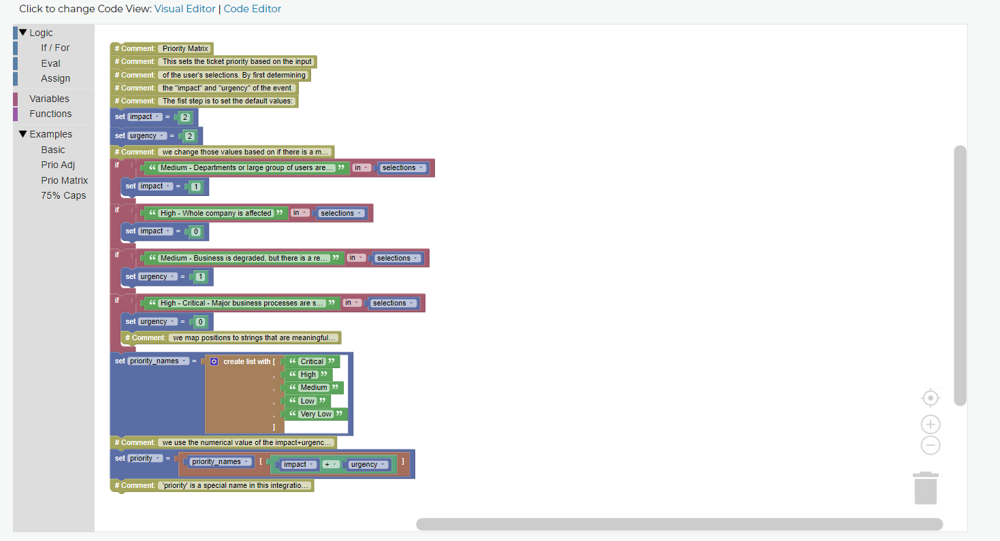

The Visual Editor has several features to make dealing with code a bit more friendly. The most useful functions and variables are already populated 
and there is example code to play with by dragging and dropping  onto the sandbox area. Pieces snap together to make sure the code works properly, 
and most of the variables and functions can be right-clicked for help about what they are and how they work.

Code Editor
""""""""""""""""""""""""""""""

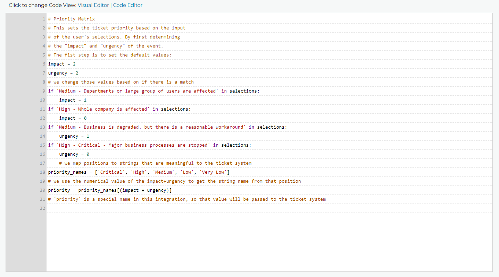

The Code Editor assumes you know what you are doing so all you see is the code and the line numbers.

Test Rules
^^^^^^^^^^^^^^

You can also test these rules by imputting test data and running the rules against that data. All variables will be outputted so you can see how the rules change them.
If there is a syntax error in the rules we will let you know where, you can also click the link to see the error in the Code Editor.

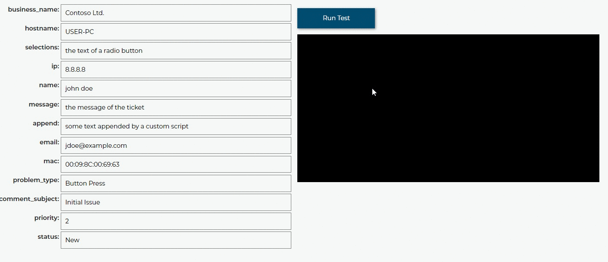

Save Rules
^^^^^^^^^^^^^^

Make sure to save the changes to your rules! The code will be tested to make sure there are no syntax errors, and you will get a message letting you know if it was successful.

 .. image:: images/save.png

Variables
^^^^^^^^^^^^^^

The first thing you need to know when writing a rule is which variables you have available to you. This varies from
from one ticket system to another, but for this example, we will be using Syncro. At the time of writing, we have the following variables
available to Syncro rules. 

You can see the variables available to your integration in the Visual Editor of the Dispatcher rules or in your 
corresponding integration documentation on this site.

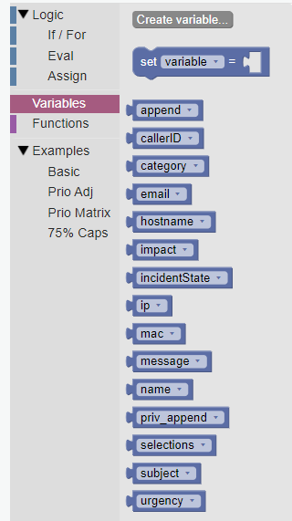

Basic Examples
^^^^^^^^^^^^^^^^^^^^^^^^^^^^^^

To show how powerful this can be and give you an idea of how to use it, we came up with a few example rules here:

Parse Selections
""""""""""""""""""""""""""""""""""""

First off, "selections" is the text that makes up which radio buttons and checkboxes were selected by the user in the GUI.
So let's assume you have a checkbox that says "This is an emergency" and you want that check box to cause a high priority
ticket. In Syncro, lower priority numbers mean higher priority, so priority '0' is an emergency. Therefore, this is what that rule
would look like:

.. code-block:: python

	if 'This is an emergency' in selections: 
		priority = 0

Prepend Ticket Subject
"""""""""""""""""""""""""""""""""""""

As another example, let's assume you want to draw extra attention to emergency tickets by prepending the text "\*\*EMERGENCY\*\*"
to the front of any emergency tickets. Here is what that rule would look like:

.. code-block:: python

	if priority is 0: 
		subject = '**EMERGENCY** ' + subject

VIP Client
"""""""""""""""""""""""""""""""""""""

Now lets say you have a VIP client named 'Contoso Ltd.' which sould always get a little bit more prioirty than the other 
companies you support. Here is an example rule that increases the priority of any Contoso by one point:

.. code-block:: python

	if business_name is 'Contoso Ltd.': 
		priority = priority - 1

VIP User
"""""""""""""""""""""""""""""""""""""
Dan Jump is the CEO of Contoso, So we want to make sure all his tickets are highest priority:

.. code-block:: python

	if name is 'Dan Jump': 
		priority = 0

Exclamations
"""""""""""""""""""""""""""""""""""""

Now lets say you want to increase the priority if people are yelling in their message to you. Here is a
rule that increases the priority if there is an exclamation point in the message:

.. code-block:: python

	if '!' in message: 
		priority = priority - 1

You need to be careful with rules like these, because you might end up where the priory moves into a negative number
at some point, which might cause the ticket to fail to go in altogether. To prevent that we should add a rule like this:

.. code-block:: python

	if priority < 0: 
		priority = 0
	
Append
"""""""""""""""""""""""""""""""""""""

You may have noticed that 'append' is one of the variables you have access to. This is data that got appended to the ticket
from custom scripts. This means that your custom scripts can be made to impact your ticket attributes using rules. Let's
assume you have a custom script that was able to read through the logs of an MRI machine software and determine that there
is a calibration issue with that machine. It has already appended the error to the ticket, and attached the log file, but
now we want to take it a step further and set the ticket 'problem_type' attribute to 'MRI' so that it gets assigned to the
team at your company that manages MRI issues. Here is a rule for that:

.. code-block:: python

	if 'calibration_issue' in append: 
		problem_type = 'MRI'

Custom Exceptions
"""""""""""""""""""""""""""""""""""""

There is another special purpose variable that is available for all integrations. This is the 'exception'
variable. It is unset by default, and if you set it, then the ticket will fail to go in and will show an error message to
the end user. But the error message it shows will have this exception text on the error page. We set this automatically for
you if your python code throws an exception so that you know what went wrong, but you can also set it yourself if you want
to halt a ticket submission using a rule.

On that note, let's assume you have a customer, 'Fabrikam, Inc.', that has a past due balance and you want to stop tickets
from that account from being able to come in and display the message "Ticket submission disabled until payment."when anyone 
tries to put in a ticket.
Here is what that rule looks like:

.. code-block:: python

	if business_name is 'Fabrikam, Inc.': 
		exception = 'Ticket submission disabled until payment.'

Now let's pretend that you have been instructed by management at Contoso to not accept tickets from Karen because she
has not been following protocol and contacting internal IT first. Here is what that rule might look like:

.. code-block:: python

	if business_name is 'Contoso Ltd.' and name is 'Karen': 
		exception = 'Sorry Karen, you are not allowed to put in tickets anymore.'

75% Caps
"""""""""""""""""""""""""""""""""""""

as you can see, using very simple Python syntax you can make very powerful and practical rules. But don't let these simple
examples fool you. As mentioned, you have the full power of Python at your disposal. You can take that as far as you would
like to go. Here is an example rule that sets the priority of a ticket high if the ticket message is more than 75% capital 
letters.

.. code-block:: python

	if sum(1 for c in message if c.isupper())/len(message) > 0.75: 
		priority = 0

Each of these examples should be viewable in the Visual Editor.

Practical Example: Impact/Urgency Priority Matrix
^^^^^^^^^^^^^^^^^^^^^^^^^^^^^^^^^^^^^^^^^^^^^^^^^^^

Here is a larger example that showcases some of the power of this system.

This example will assume your PSA does not already have a functional impact/urgency correlation to priority.

These choices represent a 3x3 matrix. This means we have 4-5 priority levels. In my example, I will use 5 levels  and number them like so
Critical = 0, High = 1, Medium = 2, Low = 3 and Very Low = 4

When the grid is filled out with these numbers it looks like this:

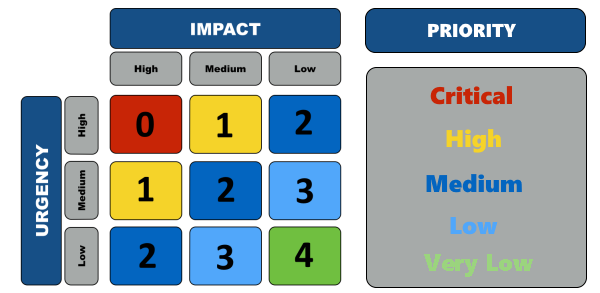

If we assign a number to each impact and urgency (High =0, Medium = 1, Low = 2)

We can simply use the sum of impact and urgency to find the priority.  For example High Impact (0) + High Urgency (0) =  Critical Priority (0)
and Low Urgency (2) + Medium Impact (1) = Low Priority (3)

Now to code it up. Let's use these values for the selection text on the GUI.

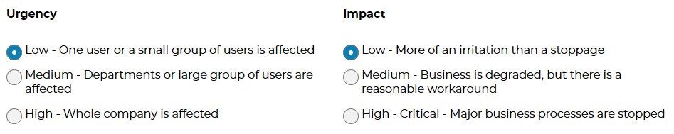

For each impact and urgency phrase, we want to set the numerical value so we can sum them at the end.

We will need a line of code for each option:

.. code-block:: python
	
	# We set some default values for if there is no match
	impact = 2
	urgency = 2
	# we change those values based on if there is a match
	if 'Medium - Departments or large group of users are affected' in selections: impact = 1
	if 'High - Whole company is affected' in selections: impact = 0
	if 'Medium - Business is degraded, but there is a reasonable workaround' in selections: urgency = 1
	if 'High - Critical - Major business processes are stopped' in selections: urgency = 0
	

Once we have all six lines set we can make our list of priorities:

This names of each vary based on your PSA, but we will go with the 5 listed above for this example.

.. code-block:: python

	priority_names = ['Critical', 'High', 'Medium', 'Low', 'Very Low']

Now all we have to do is set the variable for the priority, (priority) to be equal the correct entry in the priorities list.

.. code-block:: python

	priority = priority_names[impact+urgency]
	
Here is what it would look like all together:

.. code-block:: python
	
	# We set some default values for if there is no match.
	impact = 2
	urgency = 2
	# we change those values based on if there is a match
	if 'Medium - Departments or large group of users are affected' in selections: impact = 1
	if 'High - Whole company is affected' in selections: impact = 0
	if 'Medium - Business is degraded, but there is a reasonable workaround' in selections: urgency = 1
	if 'High - Critical - Major business processes are stopped' in selections: urgency = 0
	# we map positions to strings that are meaningful to the ticket system
	priority_names = ['Critical', 'High', 'Medium', 'Low', 'Very Low']
	# we use the numerical value of the impact+urgency to get the string name from that position
	priority = priority_names[impact+urgency]
	# 'priority' is a special name in this integration, so that value will be passed to the ticket system

Universally Available Variables
^^^^^^^^^^^^^^^^^^^^^^^^^^^^^^^^^

When designing the custom rules, there are certain variables which will always be available to you because they correspond with input from
our application and not from the ticket system integration being used. They are outlined as follows.

*selections*
""""""""""""

	**Refers to the checkboxes/radio buttons the end-user chose when creating the ticket:**

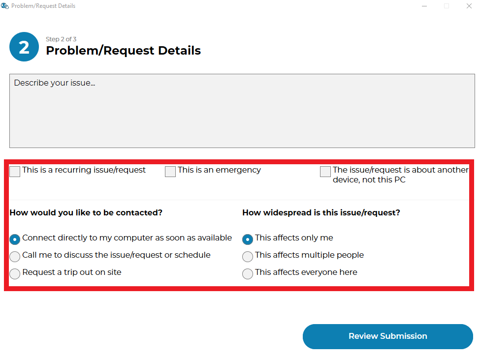

|
|

*hostname*
""""""""""

	**The hostname of the computer from which the end-user submitted the ticket:**

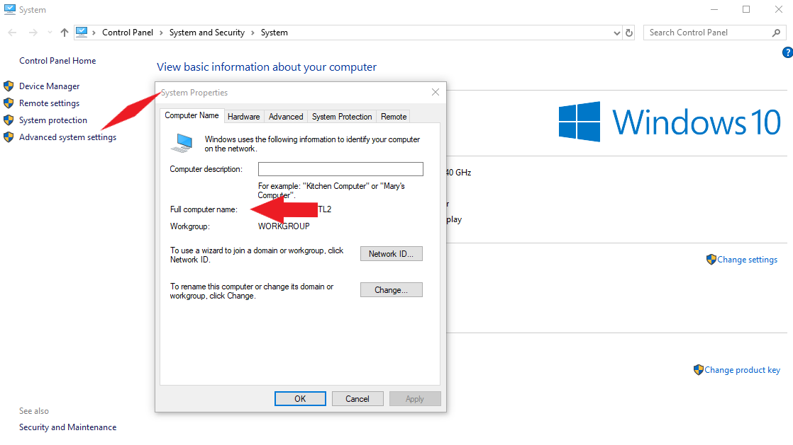

|
|

*email*
"""""""

	**The email address the end-user entered to submit the ticket:**

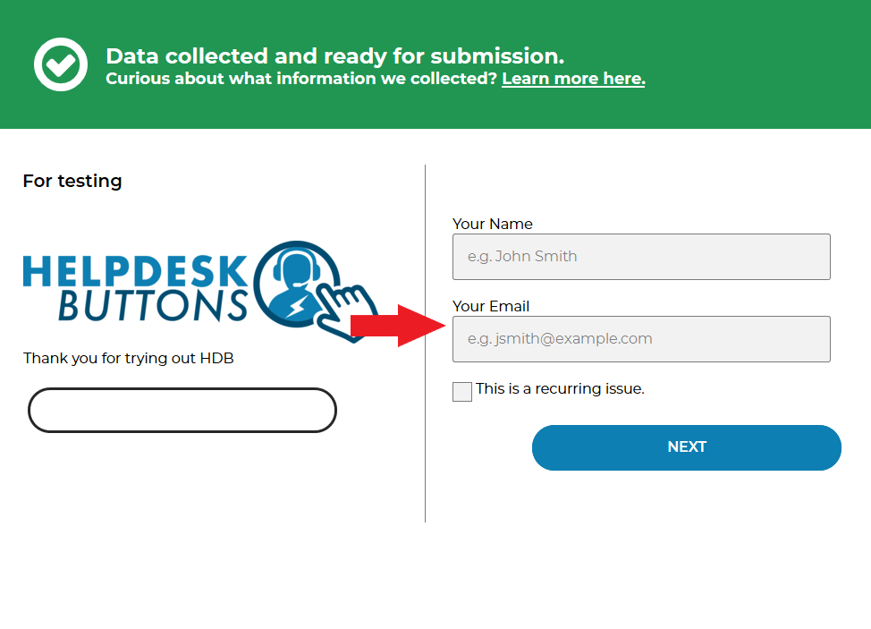

|
|

*name*
""""""

	**The end-user's name. This may be the name they entered into the input field or what the ticket system says is the name for that email address:**

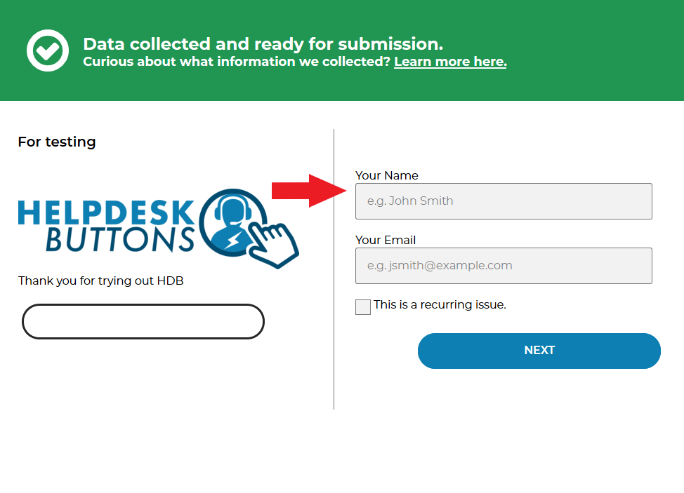

|
|

*ip*
""""

	**The IP address of the computer from which the end-user submitted the ticket:**

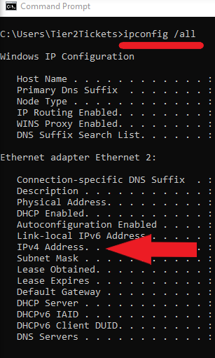

|
|

*mac*
"""""

	**The MAC address of the computer from which the end-user submitted the ticket:**

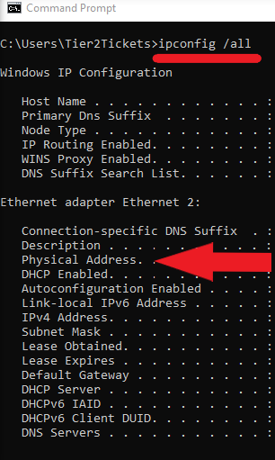

|
|

*message*
"""""""""

	**The message which the end-user typed to generate this ticket:**

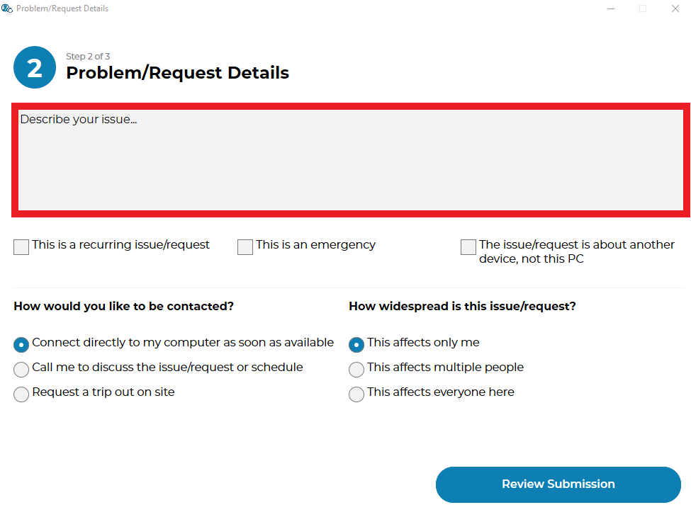

|
|

*subject*
"""""""""

	**Refers to what will become the ticket title. Since the GUI does not prompt for a subject, it generates one from the first few words of the message:**

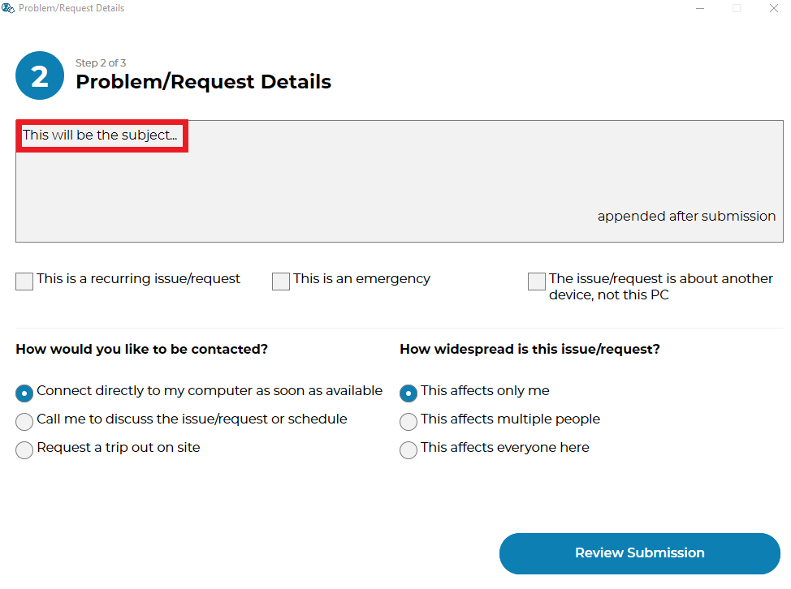

|
|

*append*
""""""""""""""

	**Refers to some text that will be appended to the message. This typically will have been generated by a** :ref:`Tier2Script <content/automations/tier2scripts:_append.txt>` **:**

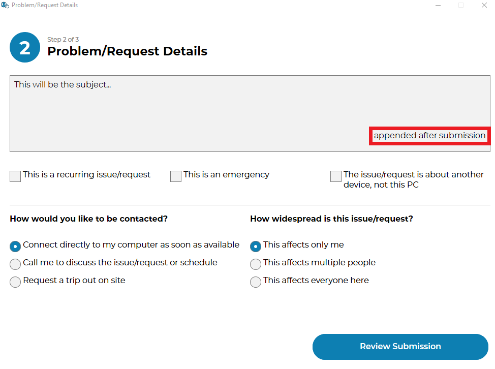

|
|

Submission Errors
^^^^^^^^^^^^^^^^^^^^^

If you make a mistake and a rule or default changes a value to something invalid, the ticket will probably still be submitted. 
In these cases, a section will be added to the internal note of the ticket, displaying the Submission Errors.

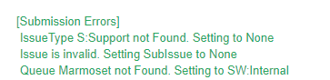
