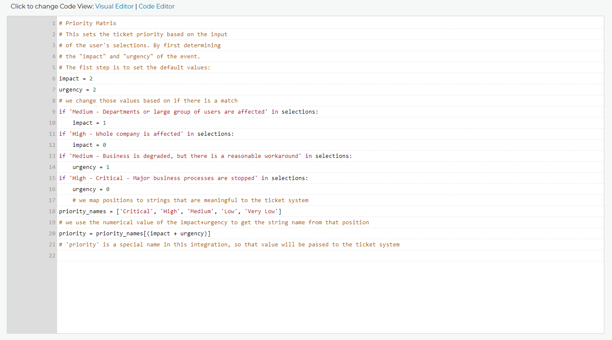
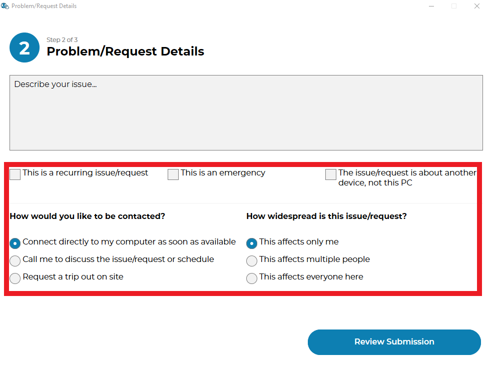
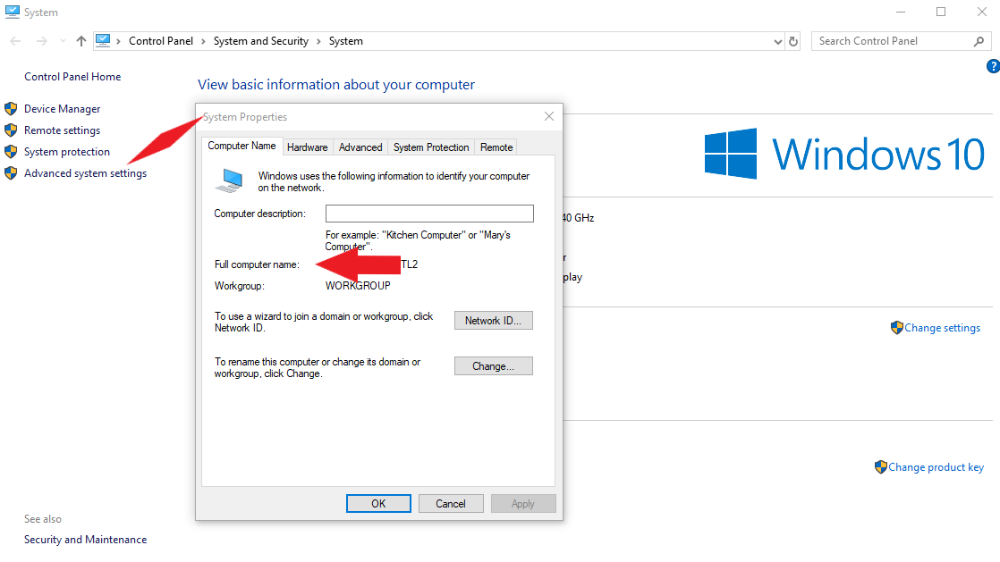
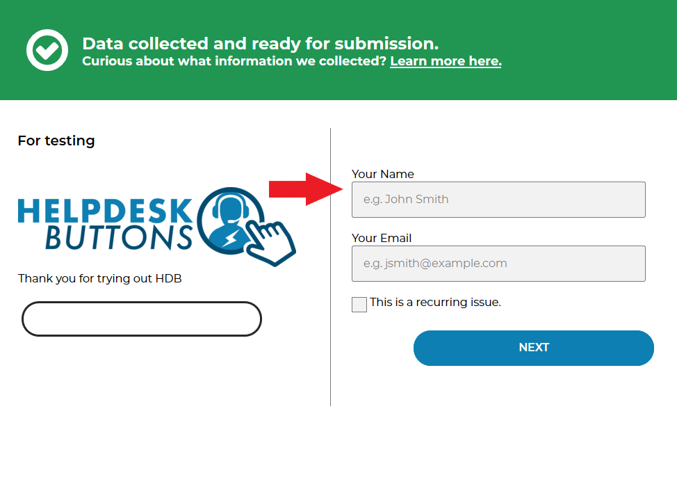
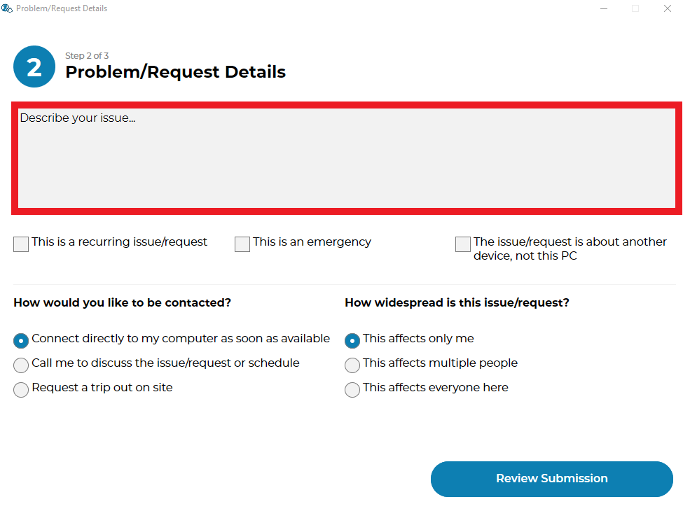
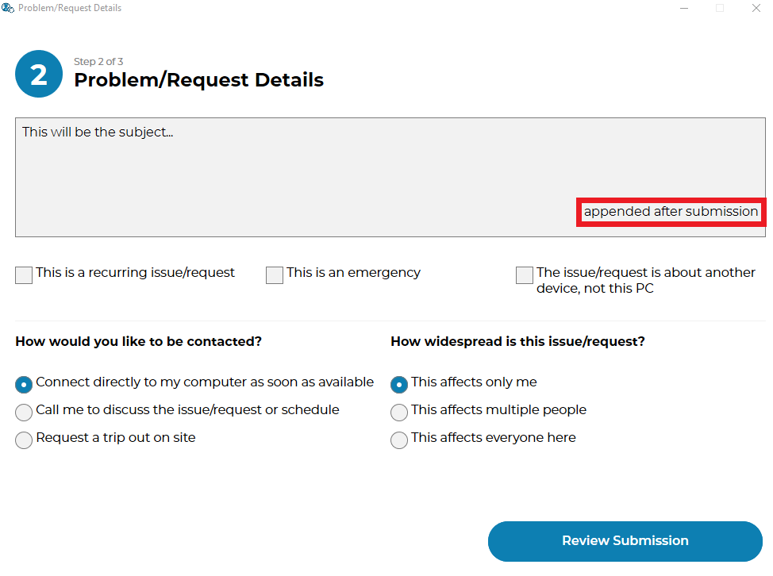

*BETA* Tier2Assist
=========================

.. raw:: html

    

        <iframe width="560" height="315" src="https://www.youtube.com/embed/PYqzBX2YuzQ" frameborder="0" allow="accelerometer; autoplay; encrypted-media; gyroscope; picture-in-picture" allowfullscreen></iframe>
    

The basic premise of the design is that after we submit the ticket to your PSA, we give you access to the information and 
allow you to suggest additional steps to the user.

These suggestions are made through series of if statements which use Python syntax. The commands you write are literally
interpreted by Python 3 on the users computer, so you have a full fledged programming language at your disposal to
make your rules.

Edit Tier2Assist
^^^^^^^^^^^^^^^^^^^^^^^^^^^^^^

There are two views for these rules:

Visual Editor
""""""""""""""""""""""""""""""

.. image:: images/visual.png

The Visual Editor has several features to make dealing with code a bit more friendly. The most useful functions and variables are already populated 
and there is example code to play with by dragging and dropping  onto the sandbox area. Pieces snap together to make sure the code works properly, 
and most of the variables and functions can be right-clicked for help about what they are and how they work.

Code Editor
""""""""""""""""""""""""""""""

The Code Editor assumes you know what you are doing so all you see is the code and the line numbers.

Test Rules
^^^^^^^^^^^^^^

You can also test these rules by imputting test data and running the rules against that data. All variables will be outputted so you can see how the rules change them.
If there is a syntax error in the rules we will let you know where, you can also click the link to see the error in the Code Editor.

The test shows everything in a raw format for people who want to know everything about what is happening.  You don't have to worry about things like repeating identical
actions appearing on the clients side. 

.. image:: images/test2.gif

Save Rules
^^^^^^^^^^^^^^

Make sure to save the changes to your rules! The code will be tested to make sure there are no syntax errors, and you will get a message letting you know if it was successful.

 .. image:: images/save.png

Variables
^^^^^^^^^^^^^^

The first thing you need to know when writing a rule is which variables you have available to you. These variables are fixed and should be available to any integration. 

You can see the variables available in the Visual Editor of the Tier2Assist but here they are for reference. For more information take a look at the 
:ref:`A deeper dive into Variables <content/automations/tier2assist:A deeper dive into Variables>` section below

.. image:: images/variables2.png

Special Functions
^^^^^^^^^^^^^^^^^^^^^^^^^^^^

The majority of the functions provided are built into python, but there are a few special functions we wrote that might be useful to you for bulding out your Tier2Assist Rules. 

You can see this list in the Visual Editor of the Tier2Assist but here they are for reference. For more information take a look at the 
:ref:`A deeper dive into Functions <content/automations/tier2assist:A deeper dive into Functions>` section below

What the user sees
^^^^^^^^^^^^^^^^^^^^^^

This is what the user will see after submitting a ticket, if the rules determine a Tier2Assist should be shown.

A Tier2assist consists of a message (the text that shows up beside the button) and an action (the command run on the users machine if they click the button).

Examples
^^^^^^^^^^^^^^^^^^^^^^^^^^^^^^

To show how powerful this can be and give you an idea of how to use it, we came up with a few example rules here:

Running Tier2Assists before ticket submission
"""""""""""""""""""""""""""""""""""""""""""""""""""""""""""""""""""""""

The variable "is_before_ticket_submit" allows you to schedule Tier2Assists before or after ticket subbmission. The variable is true when before the submission and false after. The default behavior is to always run after the ticket submisson. If you want to do somethings before ticket submission and others after you will need to use this variable to separate your code

.. code-block:: python
    
    if is_before_ticket_submit:
        tier2assist.append({'msg': 'THIS TIER2ASSIST WILL SHOW UP BEFORE THE TICKET IS SUBMITTED', 'action': 'https://www.google.com/search?q=before'})
    if not is_before_ticket_submit:
        tier2assist.append({'msg': 'THIS TIER2ASSIST WILL SHOW UP AFTER THE TICKET IS SUBMITTED', 'action': 'https://www.google.com/search?q=after'})

Chat
"""""""""""""

First off, "selections" is the text that makes up which radio buttons and checkboxes were selected by the user in the GUI.
So let's assume you have a checkbox that says "Chat with us" and you want that check box to cause an option to open a direct chat via tawk.to. This is what that rule
would look like:

.. code-block:: python

	if 'chat' in selections:
		tier2assist.append({'msg': 'You mentioned "chat". We can chat with you right now!', 'action': 'https://tawk.to/chat/5e9ef98435bcbb0c9ab343d5/default'})

Reboot
"""""""""""""""""""""""""""""""""""""

As another example, let's assume you want to always show an option for the user to reboot thier machine. Here is what that rule would look like:

.. code-block:: python

	tier2assist.append({'msg': 'Sometimes a reboot alone will resolve issues, would you like to reboot now?', 'action': 'cmd /c title Preparing to reboot...^&color 4f^&echo. ^&echo Preparing to reboot. To cancel, close this window.^&ping -n 9 127.0.0.1^>nul^&shutdown -r -f -t 0'})

Google Forms
"""""""""""""""""""""""""""""""""""""

Now lets say you have a form that needs to be filled out upon new employees being hired.  If you want to show an option to fill out this form based on the keywords hiring, hire, and new employee appearing in the message,
here is what that rule might look like:

.. code-block:: python

	 categories = [{'new hire'}]
     result = ai_categorize(msg, categories)
     if result['best_match'] == 'new hire':
        tier2assist.append({'msg': 'If you are looking to add a new employee please fill out this form.', 'action': 'YOUR_FORM_URL_HERE' + ticketID})

Additionally we have some special integrations with google forms :ref:`Tier2Forms <content/automations/tier2forms:Link Google Forms with Helpdesk Buttons>` to allow the information from a submission of such a form to the ticket that was just created.

Cognito Forms
"""""""""""""""""""""""""""""""""""""

Now lets say you have a form that needs to be filled out upon new employees being hired.  If you want to show an option to fill out this form based on the keywords hiring, hire, and new employee appearing in the message,
here is what that rule might look like:

.. code-block:: python

	categories = [{'new hire'}]
    result = ai_categorize(msg, categories)
    if result['best_match'] == 'new hire':
			tier2assist.append({'msg': 'If you are looking to add a new employee please fill out this form.', 'action': (('https://www.cognitoforms.com/Tier2Technologies1/SimpleForm' + '?entry={"TicketID":"') + ticketID) + '"}'})

Additionally we have some special integrations with google forms :ref:`Tier2Forms <content/automations/tier2forms:Link Cognito Forms with Helpdesk Buttons>` to allow the information from a submission of such a form to the ticket that was just created.

Password Reset
"""""""""""""""""""""""""""""""""""""
If you wanted to show a password reset link if both office and password were included in the ticket message, a rule like this may be appropriate:

.. code-block:: python

	if 'password' in msg and 'office' in msg:
		tier2assist.append({'msg': 'Click here to reset your office password.', 'action': 'https://account.live.com/password/reset'})

Shedule and appointment
"""""""""""""""""""""""""""""""""""""

Now lets say you want to allow a user to schedule and appointment. Here is a
rule that does this if they select a checkbox that contains the word schedule:

.. code-block:: python

	if 'schedule' in selections:
		tier2assist.append({'msg': 'You mentioned "schedule". Let\'s get that scheduled for you.', 'action': 'https://tier2tickets.syncromsp.com/bookings?calendar=101601'})
		
	
External API:  Example Activity
"""""""""""""""""""""""""""""""""""""

We also allow connecting to external APIs. This is a fun API that suggests activities if someone is bored. It is an open API that does not require an API KEY

.. code-block:: python

	activity = json_get('https://www.boredapi.com/api/activity')
	tier2assist.append({'msg': 'Activity of the day: ' + activity['activity'], 'action': 'https://google.com/search?q=' + activity['activity']})

External API:  Example Slack (Using Slack APPS)
""""""""""""""""""""""""""""""""""""""""""""""""""""""""""""""""

This method requires that you have set up an app in slack with an Incoming Webhook, a bot, and give the bot permissions to post in the channel

.. code-block:: python

		postURL = 'PUT_WEBHOOK_URL_HERE'
		post_result = json_post(postURL, {'text': 'New ticket created. Ticket number: ' + ticketNumber})

Random
"""""""""""""""""""""""""""""""""""""

Sometimes it is best to have an option show up randomly (Customer Satisfaction surveys for instance). This rule will show up randomly (around 50% of the time) to give the user a random Wikipedia article:

.. code-block:: python

	if random.random() <= 0.5:
		tier2assist.append({'msg': 'this is something random', 'action': 'https://en.wikipedia.org/wiki/Wikipedia:Random'})

Big Example
"""""""""""""""""""""""""""""""""""""

Each of the previous examples should be viewable in the Visual Editor, but if you would rather, you can copy and paste this set of examples directly into the code editor and start playing around.

.. code-block:: python

     categories = ["new hire", "broken computer"]
     result = ai_categorize(msg, categories)

    #anything listed under here will only happen before the ticket subbmission process
    if is_before_ticket_submit:
        
        tier2assist.append({'msg': 'THIS TIER2ASSIST WILL SHOW UP BEFORE THE TICKET IS SUBMITTED', 'action': 'https://www.google.com/search?q=before'})
            
        #this will show a random article on wikipedia 50% of the time
        if random.random() <= 0.5:
            tier2assist.append({'msg': 'this is something random', 'action': 'https://en.wikipedia.org/wiki/Wikipedia:Random'})

        #this will ask the user to click a button to reboot the machine
        tier2assist.append({'msg': 'Sometimes a reboot alone will resolve issues, would you like to reboot now?', 'action': 'cmd /c title Preparing to reboot...^&color 4f^&echo. ^&echo Preparing to reboot. To cancel, close this window.^&ping -n 9 127.0.0.1^>nul^&shutdown -r -f -t 0'})
        
        #this will prompt the user to open a google search if the AI thinks the message is about a broken computer
        if result['scores']['broken_computer'] >94:
            tier2assist.append({'msg':'It looks like you are having a computer problem...', 'action':'http://google.com/search?q=how+to+fix+computer'})
        
    #anything listed under here will only happen after the ticket subbmission process    
    if not is_before_ticket_submit:
        tier2assist.append({'msg': 'THIS TIER2ASSIST WILL SHOW UP AFTER THE TICKET IS SUBMITTED', 'action': 'https://www.google.com/search?q=after'})
            
        #this will pull an activity from the boredapi and show the results for it in a google search
        activity = json_get('https://www.boredapi.com/api/activity')
        tier2assist.append({'msg': 'Activity of the day: ' + activity['activity'], 'action': 'https://google.com/search?q=' + activity['activity']})
            
        #this will prompt the user to schedule an appointment, if they click on anything that has the word schedule in it
        if 'schedule' in selections:
            tier2assist.append({'msg': 'You mentioned "schedule". Let\'s get that scheduled for you.', 'action': 'https://tier2tickets.syncromsp.com/bookings?calendar=101601'})
                
        #this will prompt the user to fill out a form if the AI thinks the message is about a new hire and add the responses from the form to the ticket notes
        if result['best_match'] == 'new hire':
            tier2assist.append({'msg': 'If you are looking to add a new employee please fill out this form.', 'action': (('https://www.cognitoforms.com/Tier2Technologies1/SimpleForm' + '?entry={"TicketID":"') + ticketID) + '"}'})

        

A deeper dive into Functions
^^^^^^^^^^^^^^^^^^^^^^^^^^^^^^^^^

There are a few special fucntions written by our team to provide additional functionality within Tier2Assist Rules.

*tier2assist.append*
""""""""""""""""""""""""""""""""""""""""

.. code-block:: python
    
    tier2assist.append({'msg': 'ADD TIER2ASSIST MESSAGE HERE', 'action': 'ADD ACTION HERE'})

This is a really important one. It allows you to add A Tier2Assist. Combine this with if statements to show only the assists the end user may find helpful.

*run*
""""""""""""""""""""""""""""""""""""""""
.. code-block:: python

    run('PUT COMMAND HERE')

This function allows you to run a command on the users machine. It works similarly to the RUN command in windows.

*json_get*
""""""""""""""""""""""""""""""""""""""""

.. code-block:: python

    json_get('PUT URL HERE')

This function allows you to access and external API or website using a GET.
    

*json_post*
""""""""""""""""""""""""""""""""""""""""

.. code-block:: python
    
    json_post('URL TO POST TO', {'FIELD NAME 1': 'DATA FOR FIELD NAME 1', 'FIELD NAME 2': 'DATA FOR FIELD NAME 2', 'FIELD NAME 3': 'DATA FOR FIELD NAME 3'})

This function allows you to access and external API or website using a POST.
    

*ai_categorize*
""""""""""""""""""""""""""""""""""""""""

.. code-block:: python
    
    ai_categorize('TEXT OR VARIABLE HERE', ['CATEGORY 1', 'CATEGORY 2', 'CATEGORY 3'])

This function gives you access to our :ref:`Tier2AI <content/automations/tier2ai:*BETA* tier2ai>`

A deeper dive into Variables
^^^^^^^^^^^^^^^^^^^^^^^^^^^^^^^^^

When designing these custom rules, there are certain variables which will always be available to you because they correspond with input from
our application and not from the ticket system integration being used. They are outlined as follows.

*selections*
""""""""""""

	**Refers to the checkboxes/radio buttons the end-user chose when creating the ticket:**

|
|

*hostname*
""""""""""""""""""""""

	**The hostname of the computer from which the end-user submitted the ticket:**

|
|

*email*
"""""""

	**The email address the end-user entered to submit the ticket:**

.. image:: images/advanced-email.png
   :target: https://docs.tier2tickets.com/_images/advanced-email.png

|
|

*name*
""""""

	**The end-user's name. This may be the name they entered into the input field or what the ticket system says is the name for that email address:**

|
|

*sourceIp*
""""""""""""""""""""""""""""""""""""

	**The WAN IP address from which the end-user submitted the ticket**

|
|

*mac*
""""""""""""""""""""

	**The MAC address of the computer from which the end-user submitted the ticket:**

.. image:: images/advanced-mac.png
   :target: https://docs.tier2tickets.com/_images/advanced-mac.png

|
|

*msg*
"""""""""

	**The message which the end-user typed to generate this ticket:**

|
|

*append*
""""""""""""""

	**Refers to some text that has been appended to the message. This typically will have been generated by a** :ref:`Tier2Script <content/automations/tier2scripts:_append.txt>` **:**

|
|

*ticketID*
""""""""""""""
	
	**The internal ticket ID the PSA uses to identify each ticket (often different from the ticket number)**
	
*ticketNumber*
""""""""""""""""""""""""""""
	
	**The ticket number the uiser will most likely see to identify a ticket (often different from the ticket id)**
	

*username*
""""""""""""""""""""""""""""

	**The username of the windows account that submitted the current ticket.**
	

*version*
""""""""""""""""""""""""""""

	**The version number of the HDB software**
