*BETA* Tier2Forms
========================

.. raw:: html

    

        <iframe width="560" height="315" src="https://www.youtube.com/embed/PYqzBX2YuzQ" frameborder="0" allow="accelerometer; autoplay; encrypted-media; gyroscope; picture-in-picture" allowfullscreen></iframe>
    

Tier2Forms is a special integration we designed to allow user-defined Google Forms to submit additional information into existing tickets
in your ticket system. Once a Google Form is connected to the Tier2Forms system, then any time that form is submitted, the data is posted
to our API where we append it as a private note onto the existing ticket. If the submission does not include a valid ticket id, a new ticket will
be created containing the submission data instead. Using the Tier2Assist automations, you can provide the Google Form
to your end-user at the time of ticket creation to prompt for more details from the end-user.

Link Forms with Helpdesk Buttons
--------------------------------

Required in the form
^^^^^^^^^^^^^^^^^^^^

Form must have a short answer question with "Ticket ID" in the question for example "Ticket ID (Do Not Edit)" would be a good choice.

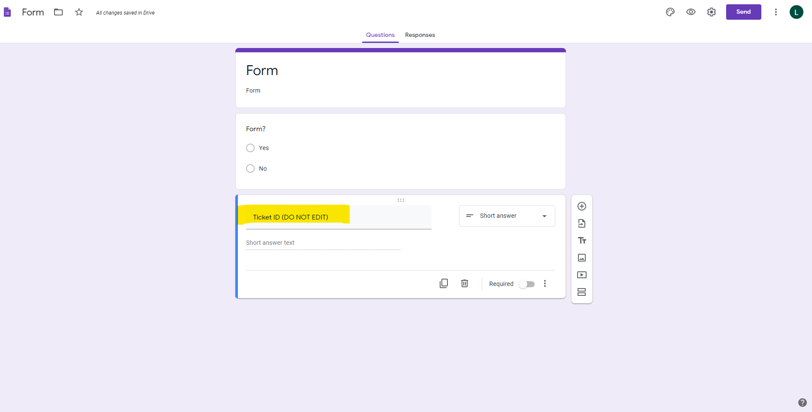

|

Link form with your account
^^^^^^^^^^^^^^^^^^^^^^^^^^^

In your HDB account navigate to "Tier2Forms", under "Automations"

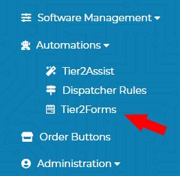

|

Click the "Link A Form" button then copy/paste the URL from your form and click "OK"
You will need to be logged into the google account in which the form was created.
You will be prompted to allow accesss to edit forms which you will need to allow.

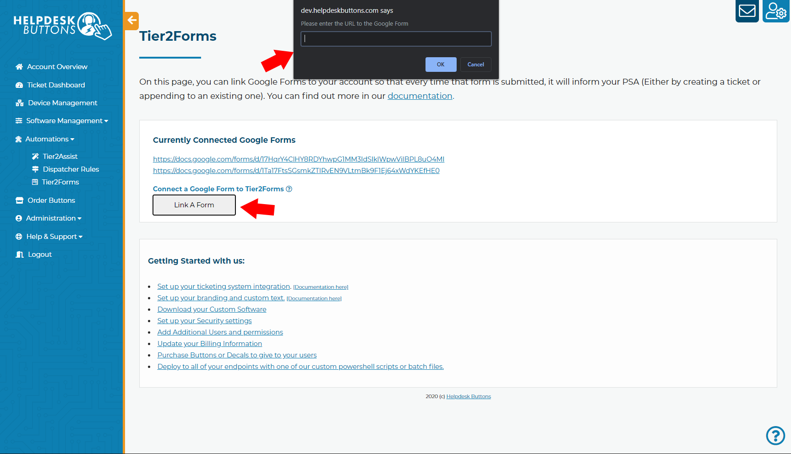

|

A window will pop up to tell you if was successfully linked or not. 

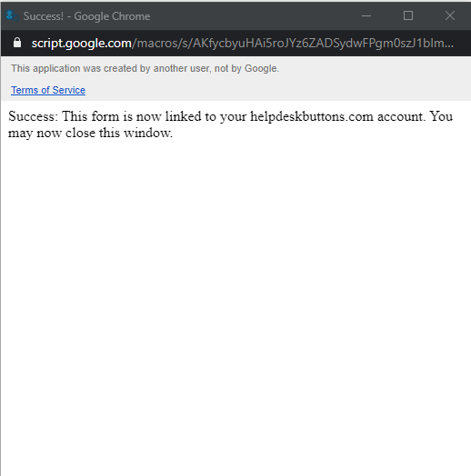

The page should also display any currently linked forms.

|
|

Generate a pre-filled link
^^^^^^^^^^^^^^^^^^^^^^^^^^

When editing a form you click the "More" option in the top right and select "Get pre-fill link"

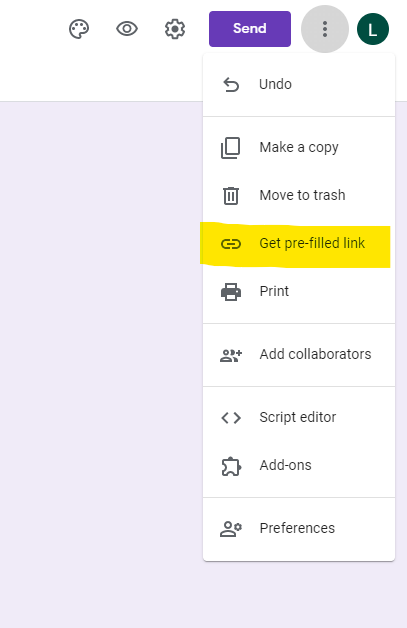

|

Fill in an answer for the "Ticket ID" with any text "replace_me" for example, anything will do, the text will be replaced later.

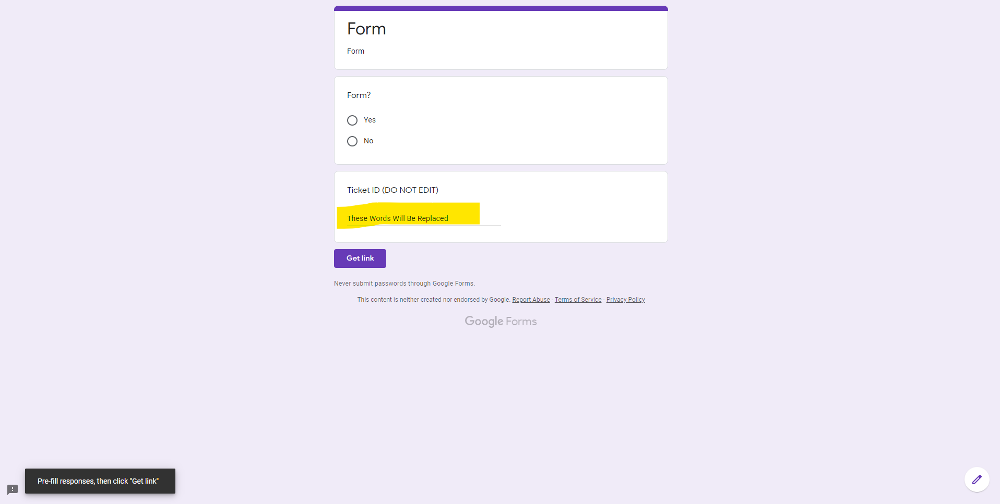

|

Click "Get link" then click the "COPY LINK" that pops up at the bottom of the page.

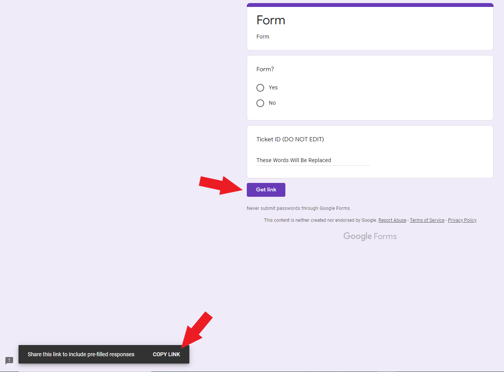

|
|

Setting up your script
^^^^^^^^^^^^^^^^^^^^^^

In your HDB account navigate to "Tier2Assist" under "Automations"

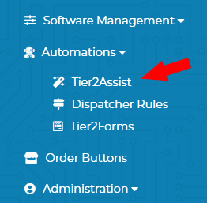

|

To quickly add in the script you need you can use one of our Examples as the ground work. Add the "Forms" example.

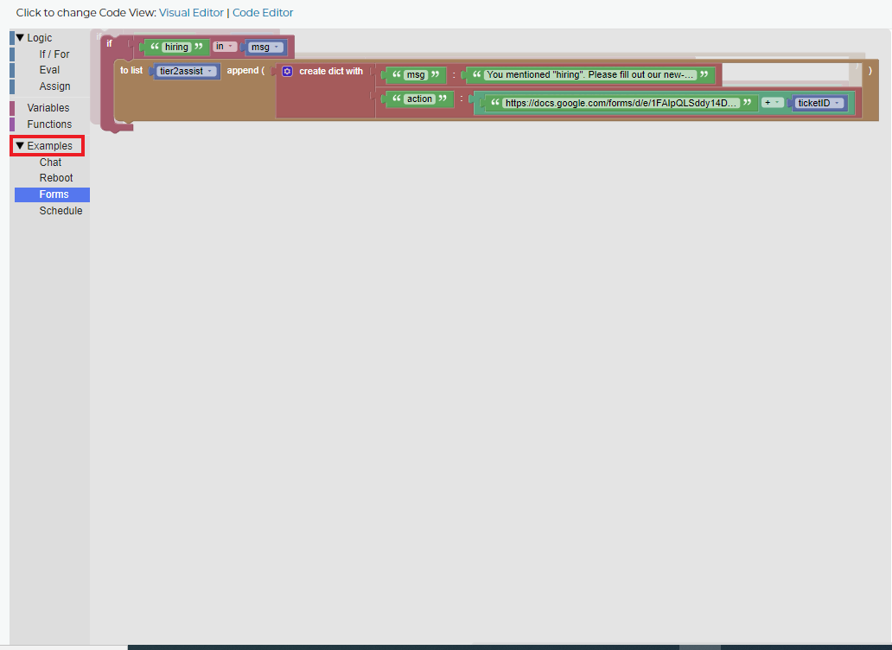

|

Adjust the "if" trigger to best suit your form.

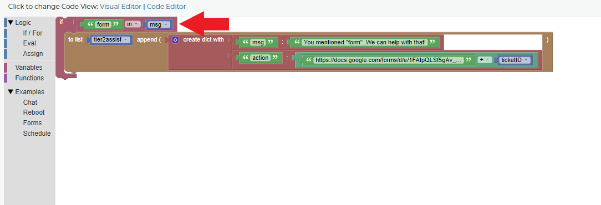

|

Adjust the message to best direct people to your form.

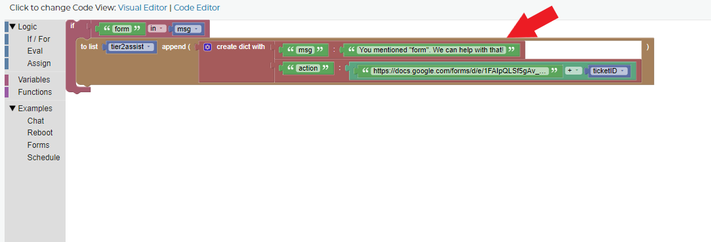

|

Replace what is in the string to the left of the "+" with the Pre-filled Link URL.
**At the end of this URL is your pre-filled the Ticket ID answer to be, delete this part of the URL**. (Everything after the last "=")

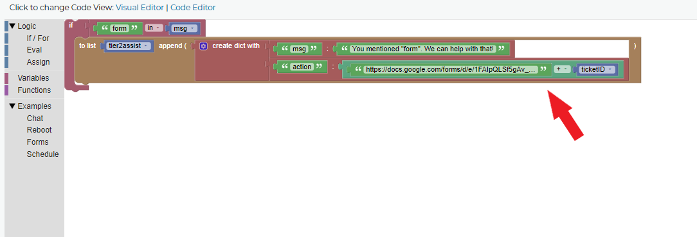

|

Click the Save Rules and test the HDB software to make sure it works as intended.

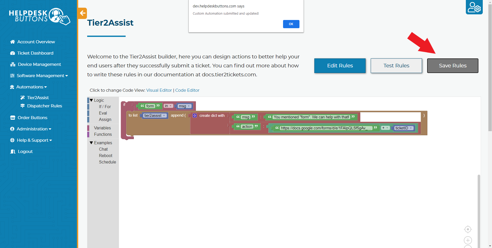

|
|

Tier2Forms Limited Use Disclosure
---------------------------

Tier2Forms' use of information received from [Google APIs will adhere to the Google API Services User Data Policy](https://developers.google.com/terms/api-services-user-data-policy#additional_requirements_for_specific_api_scopes), including the Limited Use requirements.

Tier2Forms Terms Of Service
---------------------------

These license terms are an agreement between helpdeskbuttons.com and you. Please read them.
BY USING THE SOFTWARE, YOU ACCEPT THESE TERMS.  IF YOU DO NOT ACCEPT THEM, DO NOT USE THE SOFTWARE.

We, helpdeskbuttons.com LLC, Macon, Georgia, USA have developed the Tier2Forms integration to allow companies who have an account with
helpdeskbuttons.com to easily allow their end-users to submit additional information into a trouble ticket created through the helpdeskbuttons.com
software using Google Forms. The Tier2Forms integration is free to use for this purpose and this purpose only.

Disclaimer of Warranty.
^^^^^^^^^^^^^^^^^^^^^^^

THERE IS NO WARRANTY FOR THE PROGRAM, TO THE EXTENT PERMITTED BY APPLICABLE LAW. EXCEPT WHEN OTHERWISE STATED IN WRITING THE COPYRIGHT HOLDERS
AND/OR OTHER PARTIES PROVIDE THE PROGRAM “AS IS” WITHOUT WARRANTY OF ANY KIND, EITHER EXPRESSED OR IMPLIED, INCLUDING, BUT NOT LIMITED TO,
THE IMPLIED WARRANTIES OF MERCHANTABILITY AND FITNESS FOR A PARTICULAR PURPOSE. THE ENTIRE RISK AS TO THE QUALITY AND PERFORMANCE OF THE
PROGRAM IS WITH YOU. SHOULD THE PROGRAM PROVE DEFECTIVE, YOU ASSUME THE COST OF ALL NECESSARY SERVICING, REPAIR OR CORRECTION.

Limitation of Liability.
^^^^^^^^^^^^^^^^^^^^^^^^

IN NO EVENT UNLESS REQUIRED BY APPLICABLE LAW OR AGREED TO IN WRITING WILL ANY COPYRIGHT HOLDER, OR ANY OTHER PARTY WHO MODIFIES AND/OR
CONVEYS THE PROGRAM AS PERMITTED ABOVE, BE LIABLE TO YOU FOR DAMAGES, INCLUDING ANY GENERAL, SPECIAL, INCIDENTAL OR CONSEQUENTIAL
DAMAGES ARISING OUT OF THE USE OR INABILITY TO USE THE PROGRAM (INCLUDING BUT NOT LIMITED TO LOSS OF DATA OR DATA BEING RENDERED
INACCURATE OR LOSSES SUSTAINED BY YOU OR THIRD PARTIES OR A FAILURE OF THE PROGRAM TO OPERATE WITH ANY OTHER PROGRAMS), EVEN IF SUCH
HOLDER OR OTHER PARTY HAS BEEN ADVISED OF THE POSSIBILITY OF SUCH DAMAGES.

Tier2Forms Privacy Policy
---------------------------

What data is collected.
^^^^^^^^^^^^^^^^^^^^^^^

The data collected by the Tier2Forms integration is only the data which is submitted in the Google Form itself. If you wish to exclude data from
collection, simply do not connect a Google Form which collects that data with the Tier2Forms integration.

How data is being collected.
^^^^^^^^^^^^^^^^^^^^^^^^^^^^

The data is collected at the time that the Google Form is submitted by the end-user of the form itself. At the moment of submission of the form,
the entire contents of the form and all corresponding responses are passed to our web API and stored in our database.

What we are doing with the data.
^^^^^^^^^^^^^^^^^^^^^^^^^^^^^^^^

The data is used solely to append additional information to a support ticket previously created by the form user, or to create a new support
ticket if a previous support ticket cannot be located. The data is stored for as long as the ticket is in our system. 
We will never sell, rent or share information submitted via Tier2Forms with a 3rd party, especially your email addresses and phone numbers,
without your express permission, unless required by law.

How customers can control their data.
^^^^^^^^^^^^^^^^^^^^^^^^^^^^^^^^^^^^^

In accordance with GDPR regulations, other similar regulations, and good-faith, upon request by the owner of such data
by email to support@helpdeskbuttons.com, we will purge private/identifiable data from our systems within 30 days.

 
How we protect the data.
^^^^^^^^^^^^^^^^^^^^^^^^

Personal data shall be subject to additional safeguards to ensure this data is processed securely. For example, we ensure data is encrypted when in
transit and storage inside of our platform. Although we will do our best to protect your personal data, we cannot guarantee the security of your
data transmitted via third parties; any transmission is at your own risk. Once we have received your information, we will use strict procedures
and security features to try to prevent unauthorized access. When possible, encryption is used, both in transit and storage. Access controls
within the organization limit who may access information.

