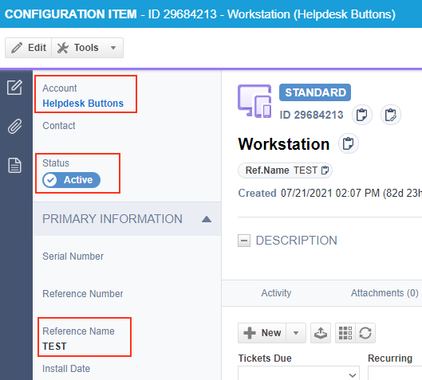

Assets
=============

Some of our integrations will automatically find and add assets that match the hostname of the computer that put in the tickets or the contact that entered the ticket. 
Below is the list of such integrations as well as what the integration requires for the selection to be successful. 

Autotask: Configuration Items
-------------------------------

The first configuration that is found matching these critera will be added to the account:

- the configuration is part of the same company as the user who submitted the ticket
- the configuration's name OR reference title match the computer hostname 
- the configuration is active

Connectwise Manage: Configurations
------------------------------------

The first configuration that is found matching these critera will be added to the account:

- the configuration is part of the same company as the user who submitted the ticket
- the configuration's name OR device identifier match the computer hostname 
- the configuration is active

Syncro: Assets
------------------

The first configuration that is found matching these critera will be added to the account:

- the asset is part of the same company as the user who submitted the ticket
- the asset's name matches the computer hostname

