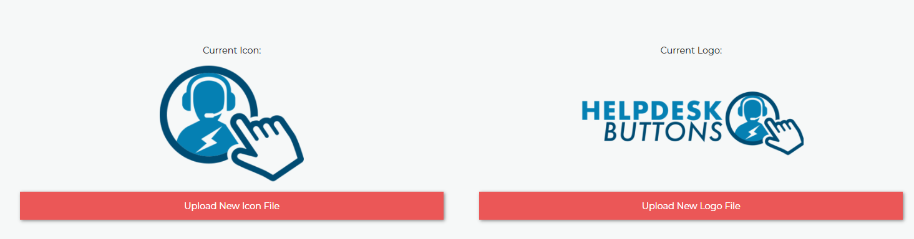
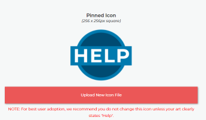
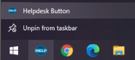

Branding
=============

Logos, Icons
^^^^^^^^^^^^^^^^^

You can customize the appearance of the software by uploading three files: 
	* landscape logo (400 x 125 pixel PNG) - for splash screen and landing page
	* square icon (256 x 256 pixel PNG) - for desktop icon, active software icon in taskbar, title bar icon, and toast alerts
	* square icon with HELP (256 x 256 pixel PNG) - for your automatically pinned to taskbar icon.

If you don’t have your images in the right format or size, they will be automatically converted, but may be distorted. We recommend using transparent backgrounds for best appearance.

Make sure to `rebuild <https://account.helpdeskbuttons.com/builds.php>`_ your MSI after uploading. Rebuilding the MSI will make sure to package the branding into the installer so we can register the application with your newly updated branded icon. After your MSI has been rebuilt you can deploy freely via our `deployment scripts <https://docs.tier2tickets.com/content/deployment/scripts/>`_ or `push out updates to your existing endpoints <http://docs.tier2tickets.com/content/deployment/updating/>`_. 

Clear Icon Cache
^^^^^^^^^^^^^^^^^^^^^^^^^^^^^^^^^^

If you have uploaded your icons, rebuilt your MSI, and updated your endpoints and your icons appear as the stock helpdesk buttons icon you may need to reset the windows icon cache. This can be accomplished with a few steps. (These steps should work for Windows 10 and 11)

Stop Windows Explorer via the Task Manager. 

Then in an elevated Command Prompt put in these commands:

.. code-block:: console

    cd /d <Path-to-User-Profile>\AppData\Local\Microsoft\Windows\Explorer
    attrib –h iconcache_*.db 
    del iconcache_*.db 
    start explorer

Note: Make sure to replace <Path-to-User-Profile> with the path to the user profile you wish to reset. (Normally C:\Users\<username>)

This will either delete the cached icons or flag them to be removed on the next log in. Either way you will need to log back in with that user to see the changes. 

Renaming Shortcuts
^^^^^^^^^^^^^^^^^^^^^^^^
If you are looking for a way to change the name of the Helpdesk Button shortcut we recommend the method in our documentation on 
`installations <https://docs.tier2tickets.com/content/general/installation/>`_ this method is used in our 
`deployment scripts <https://docs.tier2tickets.com/content/deployment/scripts/>`_.

Pin to Taskbar
^^^^^^^^^^^^^^^^^^^^^^^^

One of the ways to launch the software is via a shortcut that can be pinned to the taskbar. The icon for this shortcut is also configurable in the same way as the standard icon/logo. 
Take note: this icon is rendered significantly smaller than the standard icon while pinned. Using something easily recognizable such as our HELP logo is recommended.   

GUI Layout and Colors
^^^^^^^^^^^^^^^^^^^^^^^^^^^^
The layout and colors in the GUI can be modified by customizing the CSS. The CSS which controls most of the look and feel of the GUI is located at "C:\\Program Files (x86)\\Tier2Tickets\\resources\\style.css" in most cases.

The classes and variables in that file can be overridden by your own settings by putting them in a file named "custom.css" and `uploading it the same way as a custom script <https://docs.tier2tickets.com/content/customization/tier2scripts/>`_. 

Global Color Modification
+++++++++++++++++++++++++++++
This section is for if you'd like to modify colors globally (like if you don't like our general greens, reds, or teal!) As an example, here is a custom.css file which would change colors globally. In this case, making the GUI completely lime-green and pink and terrible:

.. code-block:: css

	@const color_01: #de69ac; 
	@const color_02: #e591c1; 
	@const color_03: #d8d8d8;
	@const color_04: #14a8a8; 
	@const color_05: #f2804d; 
	@const color_06: #ffb38e;
	@const color_07: #0dfd0d;
	@const color_08: #848484;
	@const color_09: #00f000;

Original Color Key for reference: 
	
.. code-block:: css

	color_01: #219653; hdb_green - success in general, .banner--good
	color_02: #1A6E3E; hdb_greendark
	color_03: #272727; hdb_black - headings
	color_04: #EB5757; hdb_red - errors and warnings
	color_05: #0d7fb2; hdb_teal - checkmark and radio buttons selected, next buttons, banner-question
	color_06: #004C71; hdb_tealdark
	color_07: #F2F2F2; hdb_grey - Checkmark and radiobuttons unselected
	color_08: #7b7b7b; hdb_greydark - text
	color_09: #ffffff; hdb_white */

Specific Element Modification
++++++++++++++++++++++++++++++++++++++++
If you would like to modify specific items, here are a few labelled to help you ID them. In general, you will be changing `background-color`. Be sure to override our inline settings with `!important`. The following would make the success banner red instead of green. 

.. code-block:: css 

	.banner--good {background-color: #EB5757 !important;} 

Here are the other main elements you may want to change colors of: 

.. code-block:: css

	.banner--good
	.banner--bad
	.banner--question
	.button-primary (this is the teal button)
	.button-secondary (This is the generally white button)
	.thinking (this is the cover overlay to the background when app is thinking)
