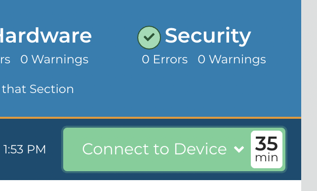

BETA Loginwith.me
============================

To help fill in the gaps in modern RMM/PSA stacks, Tier2Technologies created an optional, lightning-fast Remote Access and Remote Terminal tool, Loginwith.me

This tool is built on Apache Guacamole and is 100% optional. 

This service can be toggled on or off on the `Remote Access Options page. <https://account.helpdeskbuttons.com/remote>`_

Loginwith.me will be both an attended and unattended remote access tool.  

When a user submits a ticket, the technician may access Loginwith.me by clicking on the "Connect to Device" button on the top right hand side of the Tier2Tickets report. 

Select "Remote Access" to use Loginwith.me or Select "Remote Terminal" to use the fast remote terminal. 
