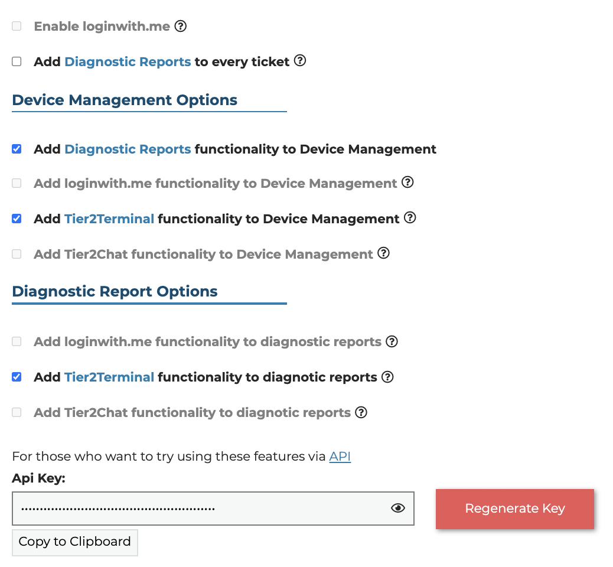

Remote Access Options
===============================

This page allows you to customize your remote access options.The following outlines each setting. Items that are greyed out are not currently active but will be available in future releases. 

Ethical Usage Agreement
--------------------------
To enable these options and the API, you will first have to accept our Ethical Usage Agreement. 
The agreement can be signed by anyone who has administrator permissions on the account. 

The page itself will prompt you to request an email from Hellosign. Check your email and sign the document via the link provided.
Once the document has been signed, you will get an email response. The page can then be reset to allow the use of these options.

Enable loginwith.me 
-----------------------
This will enable the loginwith.me integrations with Tier2Tickets once the feature is released.

Add Diagnostic Reports to Every ticket
----------------------------------------
When connected to a ticket system with webhooks, Tier2Tickets can be configured to append Diagnostic Reports on every ticket even if the ticket 
was not put in via Tier2Tickets software. The Diagnostic Report will not be exactly as the issue happened, but it will be as 
soon as the ticket system reports the ticket has been submitted. 

Device Management vs Diagnostic Report
--------------------------------------------
There are two main access points for these remote features, Diagnostic Reports and the Device Management Page. 
You can toggle adding each feature for each point of access.

Remote Access API
--------------------
Most if not all of these features will be available via an API that will require the API KEY posted on the 
Remote Access Options page. This will come with full API documentation.

Remote diagnostics via Powershell
----------------------------------

Additionally with the help of something that can run PowerShell commands remotely (such as an RMM) you can trigger a report to be started with a script. **Keep in mind that all of the fields in the input array are mandatory (they can be empty but they must exist)**.

Here are some examples:

Generate a report without submitting a ticket
^^^^^^^^^^^^^^^^^^^^^^^^^^^^^^^^^^^^^^^^^^^^^^

The ticket id and ticket number are randomly generated here so they should not collide with tickets you already have. Including the ticket number and ticket id will signal that the report is does not need to submit a ticket.

.. code-block:: shell

    # generating a random ticket ID
    $ticket_id = (1..4|%{[byte](Get-Random -Max 256)}|foreach ToString X2) -join ''

    $input = @{
      "type"= "back_ticket"; # don't edit this line
      "target"= "console"; # this can be "console" or "all"
      "kwargs"= @{ # the kwargs fields can be edited to change the information on the ticket.
        "back_ticket_uuid" = (1..32|%{[byte](Get-Random -Max 256)}|foreach ToString X2) -join ''; # don't edit this line
        "ttl" = 0; # manually setting a ttl allows making a ticket report expire and auto-delete, 0 means as long as the account permits
        "ticket_number"= "M.$ticket_id"; # if non-null, will not create a ticket in the PSA. Must be non-null if ticket_id is non-null
        "ticket_id"= "M.$ticket_id"; # if non-null, will not create a ticket in the PSA. Must be non-null if ticket_number is non-null
        "name"= "example name";
        "business"= "example business";
        "email"= "test@example.com";
        "message"= "example message";
        "phone_mobile"= "example phone_mobile";
        "phone_bussiness"= "example phone_bussiness";
        "phone_extension"= "example phone_extension";
        "selection1"= "example selection1";
        "selection2"= "example selection2";
      }
    }

    $properties = Get-ItemProperty HKLM:\Software\Microsoft\Windows\CurrentVersion\Uninstall\helpDeskButtons.com_main_is1 -ErrorAction SilentlyContinue

    if (-Not $properties) {
        $properties = Get-ItemProperty HKLM:\Software\Wow6432Node\Microsoft\Windows\CurrentVersion\Uninstall\helpDeskButtons.com_main_is1 -ErrorAction Stop
    }

    cd $properties.InstallLocation

    $input_encoded = [Convert]::ToBase64String(([System.Text.Encoding]::Unicode.GetBytes(($input | ConvertTo-Json -Compress))))

    $ver = (Get-Content -Path 'version.txt').Split('.')
    if ($ver[0] -ge 1 -And $ver[1] -ge 1 -And $ver[3] -ge 24){
        if (Test-Path -Path 'guiTrigger.exe' -PathType Leaf){
            .\guiTrigger.exe $input_encoded
        } else {
            python.exe guiTrigger.py $input_encoded
        }
    }

Generating a report while submitting a ticket
^^^^^^^^^^^^^^^^^^^^^^^^^^^^^^^^^^^^^^^^^^^

The only difference between the example above and this one is that no ticket id and number are generated. Set these to empty to tell the software to submit a ticket.

.. code-block:: shell

    $input = @{
      "type"= "back_ticket"; # don't edit this line
      "target"= "console"; # this can be "console" or "all"
      "kwargs"= @{ # the kwargs fields can be edited to change the information on the ticket.
        "back_ticket_uuid" = (1..32|%{[byte](Get-Random -Max 256)}|foreach ToString X2) -join ''; # don't edit this line
        "ttl" = 0; # manually setting a ttl allows making a ticket report expire and auto-delete, 0 means as long as the account permits
        "ticket_number"= ""; # if non-null, will not create a ticket in the PSA. Must be non-null if ticket_id is non-null
        "ticket_id"= ""; # if non-null, will not create a ticket in the PSA. Must be non-null if ticket_number is non-null
        "name"= "example name";
        "business"= "example business";
        "email"= "test@example.com";
        "message"= "example message";
        "phone_mobile"= "example phone_mobile";
        "phone_bussiness"= "example phone_bussiness";
        "phone_extension"= "example phone_extension";
        "selection1"= "example selection1";
        "selection2"= "example selection2";
      }
    }

    $properties = Get-ItemProperty HKLM:\Software\Microsoft\Windows\CurrentVersion\Uninstall\helpDeskButtons.com_main_is1 -ErrorAction SilentlyContinue

    if (-Not $properties) {
        $properties = Get-ItemProperty HKLM:\Software\Wow6432Node\Microsoft\Windows\CurrentVersion\Uninstall\helpDeskButtons.com_main_is1 -ErrorAction Stop
    }

    cd $properties.InstallLocation

    $input_encoded = [Convert]::ToBase64String(([System.Text.Encoding]::Unicode.GetBytes(($input | ConvertTo-Json -Compress))))

    $ver = (Get-Content -Path 'version.txt').Split('.')
    if ($ver[0] -ge 1 -And $ver[1] -ge 1 -And $ver[3] -ge 24){
        if (Test-Path -Path 'guiTrigger.exe' -PathType Leaf){
            .\guiTrigger.exe $input_encoded
        } else {
            python.exe guiTrigger.py $input_encoded
        }
    }