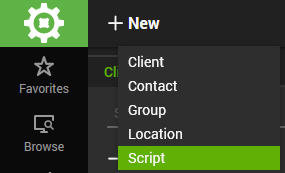
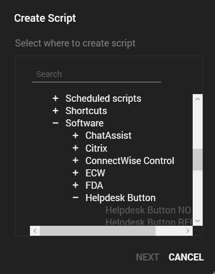
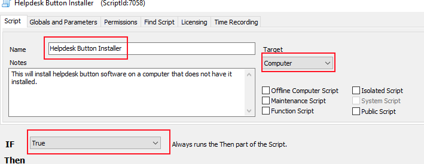
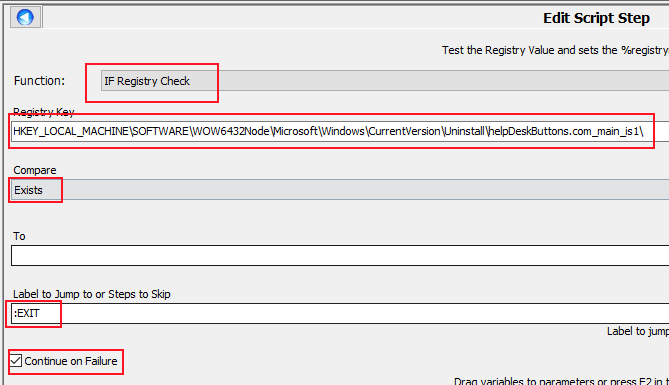
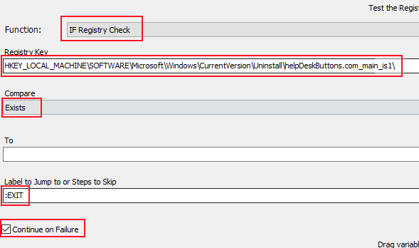
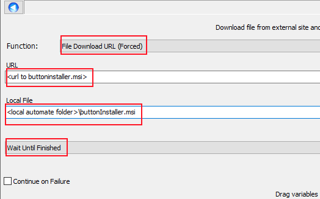
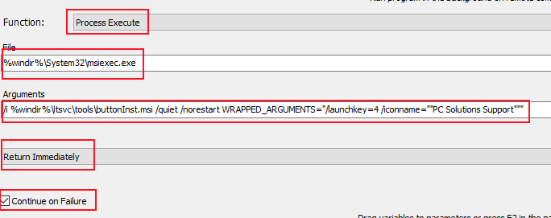
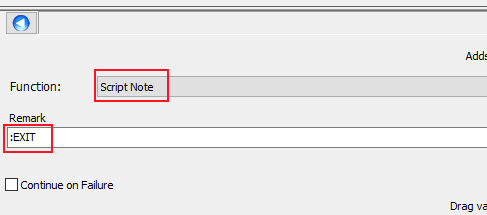
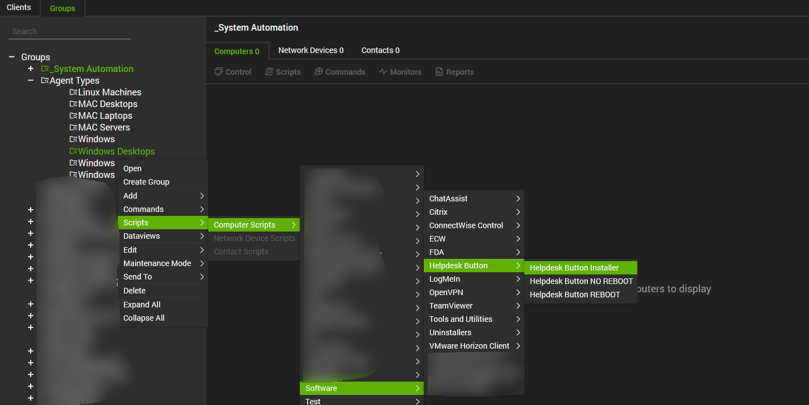
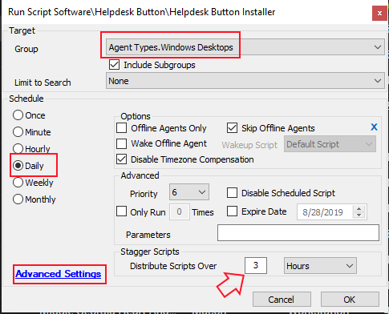

Connectwise Automate Instructions
==================================

This guide will show you how to set up deployment for a build of Helpdesk Button Software through Connectwise Automate. You will need an administrative login for Automate.

Create a Script
----------------

This script will be run on individual machines as that gives the most flexibility. It will check a registry key to make sure the software is not installed before it attempts to install it. 

Click New -> Script

Select the Location to add the script and click next.

Name the script, add a note if you like, make sure the target is Computer, set the forst condition to true. (This will make sense later)

The next couple of conditions in this script are to make sure we cover both 32bit and 64bit installs of the software as both are supported since the registry keys location depends on the architecture.

Let's look at the 64bit version first.

Right click in the Then window and select Add.

Select IF Registry Check as the function, put in this key:

.. code-block:: bash

	HKEY_LOCAL_MACHINE\SOFTWARE\WOW6432Node\Microsoft\Windows\CurrentVersion\Uninstall\helpDeskButtons.com_main_is1\
	
Compare should be set to Exists, To should be blank, and we will add a jump to label :EXIT (We will be adding this label near the end of the script)

Check continue on failure and click Save

Now lets handle the 32bit Registry check.

Right click in the Then window and select Add.

Select IF Registry Check as the function, put in this key:
	
.. code-block:: bash
	
	HKEY_LOCAL_MACHINE\SOFTWARE\Microsoft\Windows\CurrentVersion\Uninstall\helpDeskButtons.com_main_is1\
	
Compare should be set to Exists, To should be blank, and we will add a jump to label :EXIT

**Make sure to check continue on failure** and click Save

The next line will download the msi.

Right click in the Then window and select Add.

Select File Download URL (Forced) as the function

Replace the url with a path to the installer, and specify the local location to save.

Select Wait Until Finished and Save. **Keep that local path in mind for the next step** 

The next line will execute the file that was just downloaded.

Right click in the Then window and select Add.

Select Process Execute as the function and set the File to be:

.. code-block:: bash

	%windir%\System32\msiexec.exe
	
and the Arguments to be something like:

.. code-block:: bash

	/i %windir%\ltsvc\tools\buttonInst.msi /quiet /norestart WRAPPED_ARGUMENTS="/launchkey=4 /iconname=""PC Solutions Support"""
	
For more information about the parameters, check out our `Installation Guide <https://docs.tier2tickets.com/content/general/installation/>`_

Select Return Immediately and check Continue on Failure and Save

The final line is where we add the label that allows us to skip the download and execute steps if the software is installed. 

Right click in the Then window and select Add.

Select Script Note as the Function

Set :EXIT as the Remark and Save

Click save and we should have a functioning script that will install to a single endpoint.

Deployment of the script
---------------------

Select Browse from the main bar on the left, then the Groups tab.

Select the group to which you want to Deploy the software, right click and highlight scripts. Navigate to the location the script is in and select it.

The group we chose for this example was Windows Desktops

We recomend having the script run at least daily, but make sure to click Advanced Settings and Stagger the script. Automate will attempt to run them all simultaneously if not.

Click OK.

You should now have automated deployment of our software through Connectwise Automate.