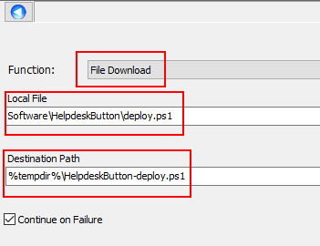
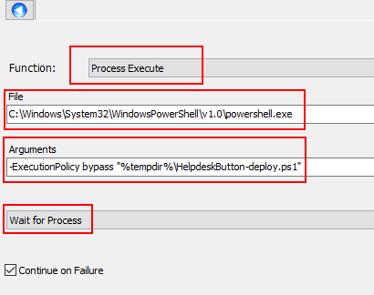
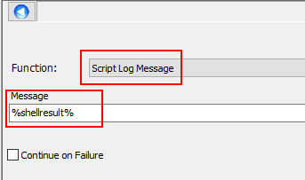
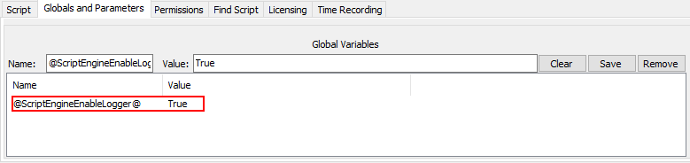
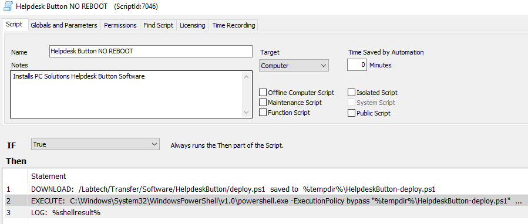
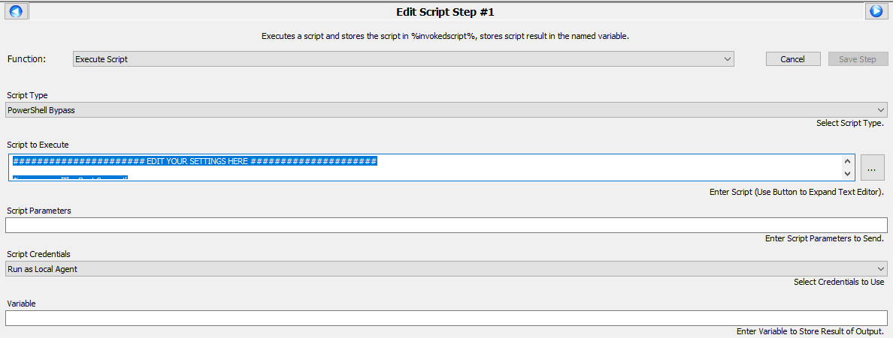
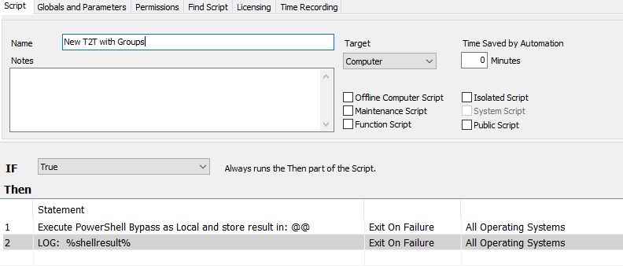
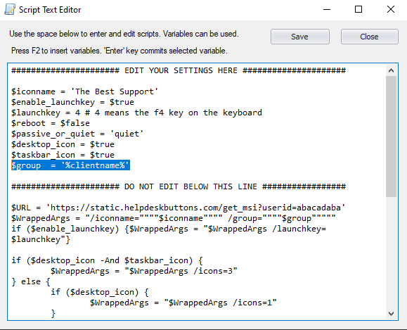

Connectwise Automate Instructions
==================================

This guide will show you how to set up deployment for a build of Helpdesk Button Software through Connectwise Automate. You will need an administrative login for Automate.

Create a Script
----------------

This script will be run on individual machines as that gives the most flexibility. Our custom generated Powershell script can be downloaded from the site directly on the Builds page.

Click New -> Script

.. image:: images/CW01-Script.png

Select the Location to add the script and click next.

.. image:: images/CW02-Location.png

Name the script, add a note if you like, make sure the target is Computer, set the first condition to true.

.. image:: images/CW03-NewScript.png

There are two methods that can be used for this: Saving the script in a file in Automate or Running the script directly. We recommend the latter ince you have more control over the script later.

Save the script in Automate (Old Method)
---------------------------------

This guide assumes it has beed downloaded and placed somewhere in the LTShare\Transfer directory.

Add a new command and select File Download. Set the Local File line to the location of the script and the destination to wherever you like on the endpoint machine. 

we use:

.. code-block:: bash
 
	%tempdir%\HelpdeskButton-deploy.ps1

Add a Process Execute command.

We are using the PowerShell deployment script so we will execute it with PowerShell.

.. code-block:: bash

	C:\Windows\System32\WindowsPowerShell\v1.0\powershell.exe

we use the arguments:

.. code-block:: bash 

	-ExecutionPolicy bypass "%tempdir%\HelpdeskButton-deploy.ps1"

make sure to put the directory you specified in the destination above.

We add like to check on these from time to time so we have the script log its actions.

.. code-block:: bash
 
	%shellresult%

To enable the log you need to add this Global Variable

.. code-block:: bash
 
	@ScriptEngineEnableLogger@   True

Finally Save the Script and you are done! Here is what it looks like completed.

Execute script directly in Automate (New Method)
-------------------------------------

This method that direct control of the Powershell within the Automate script. This is necessary for grouping and the script can be more easily manupulated in the future. 

Select Execute Script as the function and select Powershell Bypass as the script type. 

We add like to check on these from time to time so we have the script log its actions.

.. code-block:: bash
 
	%shellresult%

To enable the log you need to add this Global Variable

.. code-block:: bash
 
	@ScriptEngineEnableLogger@   True

Finally Save the Script and you are done! Here is what it looks like completed.

Copy and paste the powershell script generated on the Download and Deploy page.

If you want to automatically set the T2T group to be the client name in Automate, make sure to change the groupline to match this:

Deployment of the script
------------------------

Select Browse from the main bar on the left, then the Groups tab.

Select the group to which you want to Deploy the software, right click and highlight scripts. Navigate to the location the script is in and select it.

.. image:: images/CW09-Group.png

The group we chose for this example was Windows Desktops

We recommend having the script run at least daily, but make sure to click Advanced Settings and Stagger the script. Automate will attempt to run them all simultaneously if not.

Click OK.

.. image:: images/CW10-Deployment.png

You should now have automated deployment of our software through Connectwise Automate.