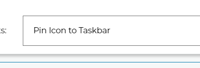
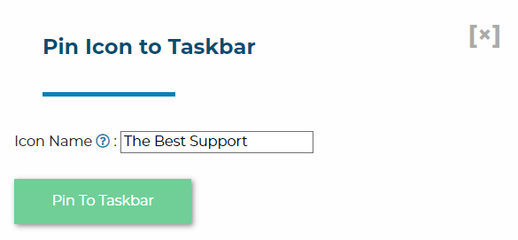
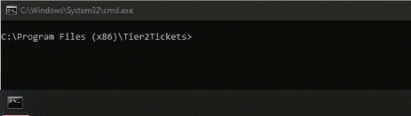

# Software Installation and Configuration Guide

The software is packaged as an MSI which you build on the [Download and Deployment page](https://account.helpdeskbuttons.com/builds.php). Here, you can download the MSI or copy a URL that will always link to the most recent build of your custom software.

You can customize and deploy by using one of our Custom-built-for-you Batch files or PowerShell files that you will find on your Software [Download and Deployment page](https://account.helpdeskbuttons.com/builds.php), or follow one of our RMM deployment guides, or you can create your own custom installation using this page as a reference.

More information on:

- [Custom Batch and PowerShell Deployment files](https://docs.tier2tickets.com/content/deployment/scripts/)
- [Auto-Updating](https://docs.tier2tickets.com/content/deployment/auto-update/)
- [Set Shortcut](https://docs.tier2tickets.com/content/deployment/shortcut/)
- [Installing Tier2Tickets on Microsoft RDP](https://docs.tier2tickets.com/content/deployment/rdp/)
- [Uninstalling and Duplicates Handling](https://docs.tier2tickets.com/content/deployment/uninstall/)
- [ConnectWise Automate](https://docs.tier2tickets.com/content/deployment/automate/)
- [NinjaRMM](https://docs.tier2tickets.com/content/deployment/ninjarmm/)
- [Syncro](https://docs.tier2tickets.com/content/deployment/syncro/)

## Customizing and Installing Without Command Line Arguments

If installing the software by starting the MSI without any Command Line options, you will get a default shortcut name: "Helpdesk Button" and the MSI will allow you to select the launch key. You can use our Tier2Scripts system to change this icon on install by using the script listed [here.](https://docs.tier2tickets.com/content/customization/tier2scripts/#update-shortcut-icons-on-install).

## Installing by Command Line

As an MSI, our software supports all the typical Command Line options. For example:

### passive

The following command would install the software with minimal user interface visible to the user and no cancel button and then reboot the computer.

```
msiexec /i buttonInst.msi /passive
```

### quiet and no restart

The following would install the software with no user interface and would not reboot the computer.

```
msiexec /i buttonInst.msi /quiet /norestart
```

We have some Command Line options that would allow you to customize settings specific to our software.

### F1 - F11 Launch Key

If you install the software the GUI way, but just running it with no options you will see that we offer the ability to bind the software to a F-Key so that pressing that key launches the app. We also have Command Line options to allow the same. If you wanted to bind the program to F4, for example, you would use use the following Command Line param.

```
WRAPPED_ARGUMENTS="/launchkey=4"
```

### Desktop Icon Name

By default, the desktop icon is named "Helpdesk Button"; however, can customize this name. For example, if you wanted to have the icon named "PC Solutions Support", this would get you there:

```
WRAPPED_ARGUMENTS="/iconname=""PC Solutions Support"""
```

#### Renaming your Desktop Icon Example

If you'd like to rename your Helpdesk Button desktop icon to My Name, you can do so by running the following:

```
ren "C:\Users\Public\Desktop\Helpdesk Button.lnk" "My Name.lnk"
```

### Launch key with Icon Name

Putting those things together, you would end up with a command like this:

```
msiexec /i "buttonInst.msi" WRAPPED_ARGUMENTS="/launchkey=4 /iconname=""PC Solutions Support"""
```

For more information on how to rename the shortcut after installation, [visit our documentation here](https://docs.tier2tickets.com/content/deployment/shortcut).

### Pin to Taskbar

As of version `1.1.x.14`, the installer supports automatically pinning the icon to the taskbar of every user in addition to, or in place of, a standard desktop icon. That is also broken out into the wrapped argument `icons` which can be a number `1`, `2`, or `3`. Setting it to `1` would create a desktop icon but no taskbar icon, setting it to `2` would make a taskbar icon but no desktop icon, and setting it to 3 will enable both icons.

The default is /icons=3 but if you just want a desktop icon and not a taskbar icon, then you can expand the above command to:

```
msiexec /i "buttonInst.msi" WRAPPED_ARGUMENTS="/launchkey=4 /iconname=""PC Solutions Support"" /icons=1"
```

If the install is performed behind the scenes, a log out and log in may be required for the pin to take effect.

#### Re-Pin to Taskbar

##### Via Device Management
We can try to repin the icon to the taskbar on one or more online endpoints via the Device management page.




##### Repin on reboot
The software can also be forced to initiate a re-pin if this file: `%localappdata%\tier2tickets\pttb.pref` is deleted. Doing this will cause the software to re-pin itself to the taskbar when the user logs in.

##### Manually pinning via PTTB.exe
Running `pttb.exe "<shortcut name>" (Helpdesk Button is the default)` as the logged-in user will also pin the icon to taskbar on demand.



Keep in mind that your installation folder could be "Helpdesk Buttons." The software was formally renamed in [1.1.x.10](https://docs.tier2tickets.com/content/general/changelog/#x-10) so installs that predate this may have the older folder structure.

## **Note to PowerShell users**:

PowerShell requires an extra single quote around the WRAPPED_ARGUMENTS value. So the PowerShell equivalent command looks like this:

```
msiexec /i "buttonInst.msi" WRAPPED_ARGUMENTS='"/launchkey=4 /iconname=""PC Solutions Support"""'
```

Make sure you are aware that this reboots the computer! Don't push out that command en mass during business hours. A better option during business hours is as follows.

```
msiexec /i "buttonInst.msi" /norestart WRAPPED_ARGUMENTS="/launchkey=4 /iconname=""PC Solutions Support"""
```

You would still need to reboot after hours though, the software does actually need a reboot most of the time.
