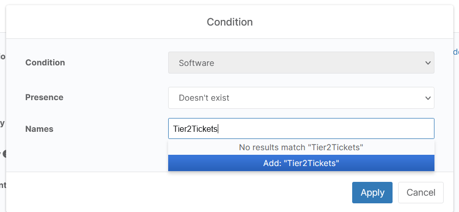
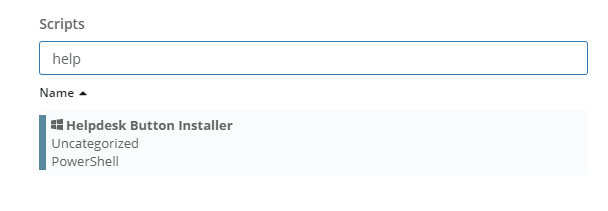

Ninja RMM Instructions
=======================

This guide will show you how to set up deployment for a build of Helpdesk Button Software through Ninja RMM. You will need an administrative login for Ninja RMM.

Create a Script
----------------

Click Configuration

Click Scripting

Click Create New Script and Fill out the Settings. Most of them can be whatever you like, but the Language should be Powershell, and it is probably best to leave the Architecture as ALL.

The script need only be a single line like this:

.. code-block:: bash

	msiexec /i "http://example.com/downloads/buttonInst.msi" /passive /norestart WRAPPED_ARGUMENTS='"/launchkey=4 /iconname=""PC Solutions Support"""'
	
Put in your own url in place of buttonInst.msi, in addition to a custom launchkey, and iconname. Remember that your `Download and Deploy  <https://account.helpdeskbuttons.com>/builds>`_ page has a magic link for you. 

For more information about the parameters, check out our `Installation Guide <https://docs.tier2tickets.com/content/general/installation/>`_

Save the script. 

Automate script based on Condition
-----------------------------------

Let's say we want to automate our script based on it not being installed on an endpoint. 

To do this click Configuration -> Policies.

Create or Select a configuration to use.

Click Add a Condition, select a condition. Now select Software from the Conditions list, Doesn't exist from the Presence list, and set the Name to Helpdesk Button. **Be sure to click Add "Tier2Tickets"**

Click Apply 

Now to add the script. Click add Script and select the Helpdesk Button Installer script. Click Add.

Click Save to save the configuration.

Thanks to David Bell at `preemptIT <https://www.preemptit.com>`_ for his great assistance creating this deployment document.
Thanks to 'Gaispace <https://giaspace.com>'_ for help updating the docs. 