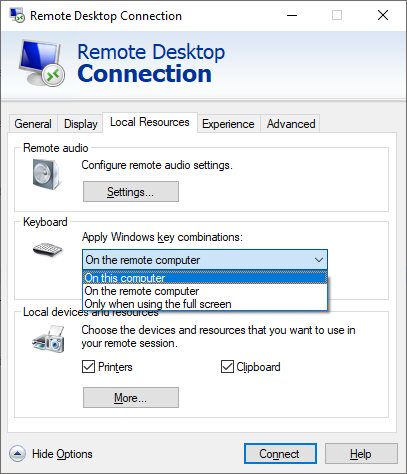

# Setting up Microsoft Remote Desktop

In general, the software and hardware work fine with most remote desktop software. For Microsoft's RDP make sure key combinations are set to propagate to the proper machine based on the configuration.

If the software is installed locally and you simply want screenshots of the RDP, select on this computer. If the software is installed on the server, select on the remote computer.
