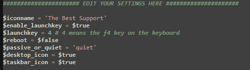

Deployment Scripts
=======================

For deploying the software en-mass, we offer two flavors of deployment script: a `Powershell script <https://account.helpdeskbuttons.com/deploy.php?type=ps1>`_ and a `batch file <https://account.helpdeskbuttons.com/deploy.php?type=cmd>`_.
Each script is custom made for your account. You can get to them any time from your `builds page <https://account.helpdeskbuttons.com/builds.php>`_

Each time the script is run, it first checks to see if the software is already installed and exits if it is.
This means that you cannot use the scripts to update the software, only to install it. But it also means that you can
just push the script out globally on a reoccurring basis without worrying about high resource consumption. We reccomend running the script at least daily to ensure all your users have the software installed.
If you want to know how to update the software en-mass refer to the :ref:`auto update documentation <content/deployment/updating:Updating your endpoints>`.

If the script sees that the software is not installed, then it downloads the latest build from your account.
This means that the same script that you used to deploy version 1.2.3.4 of the software will also deploy 2.3.4.5 without modification.
To see which version of the software will be deployed, just look at which version you currently have built on the `builds page <https://account.helpdeskbuttons.com/builds.php>`_.

