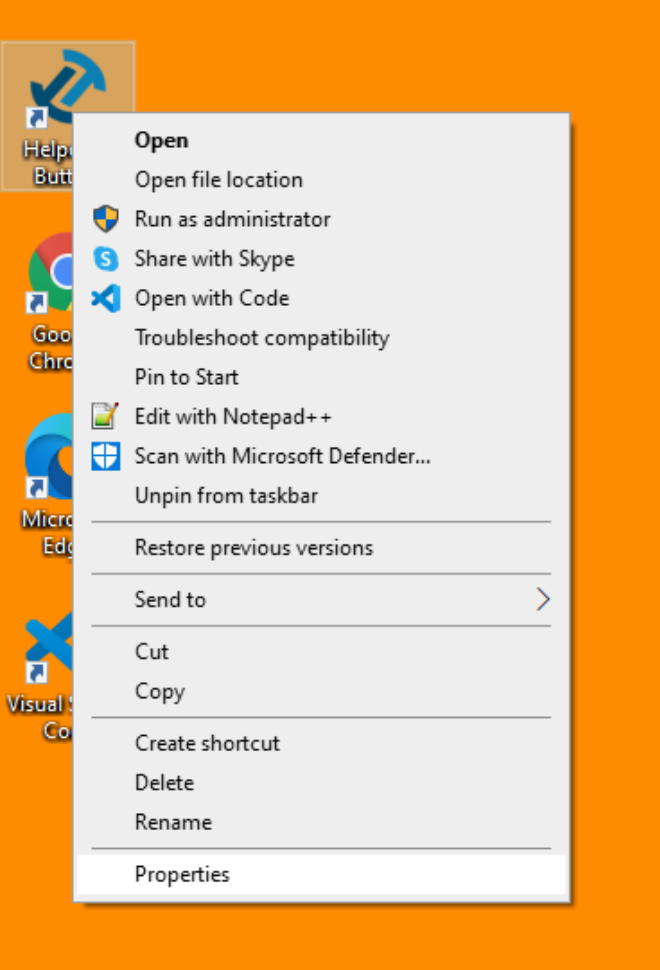
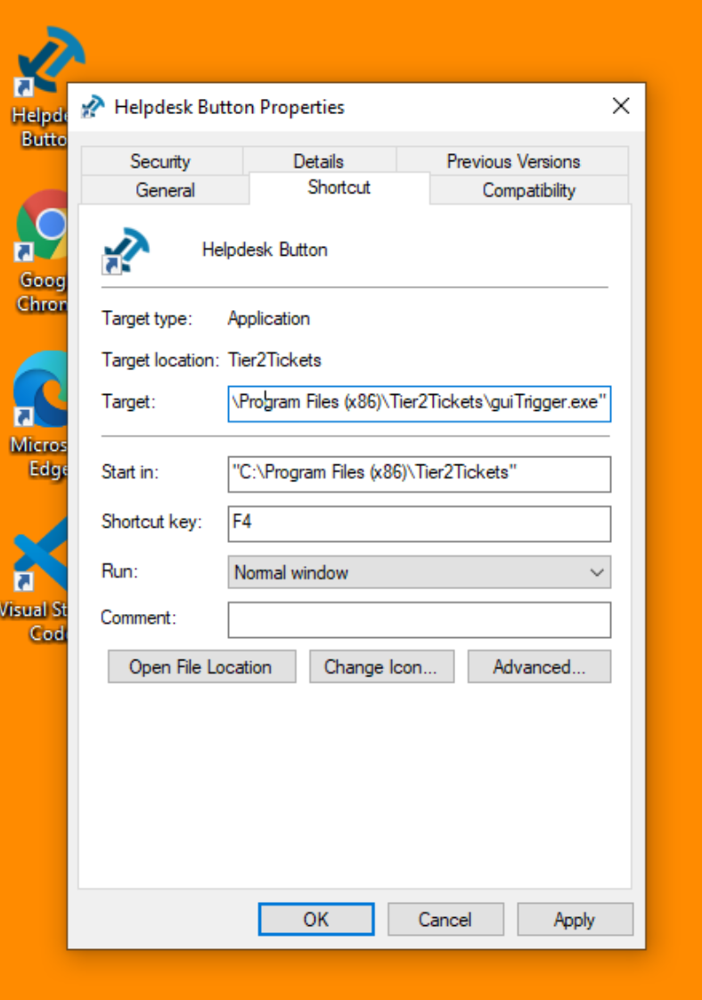
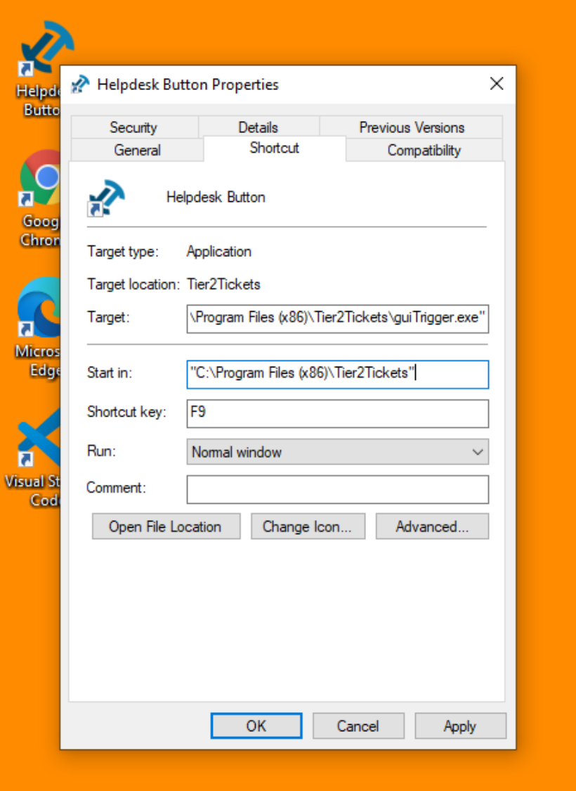

# Set Shortcut

You can set the shortcut via commandline as you install the Tier2Tickets/Helpdesk Buttons software. If you need to update after deployment, these are some methods for doing so.

## For a Single Device (Manual)

If your predetermined shortcut key isn't working for a specific user, you can change that combination in the Desktop Shortcut Properties menu.







## For Multiple Devices (Powershell)

The syntax for this PowerShell function is simple: You just list the things you want to change about a shortcut after passing in the shortcut path, i.e. :

`Set-Shortcut linkPath hotkey location arguments targetPath`

If you only want to change the shortcut you can leave the rest blank so the command will look like this:

`Set-Shortcut C:\Users\Public\Desktop\"Helpdesk Button.lnk" f11`

```
function Set-Shortcut {
  param(
  [Parameter(ValueFromPipelineByPropertyName=$true)]
  $LinkPath,
  $Hotkey,
  $IconLocation,
  $Arguments,
  $TargetPath
  )
  begin {
	$shell = New-Object -ComObject WScript.Shell
  }

  process {
	$link = $shell.CreateShortcut($LinkPath)

	$PSCmdlet.MyInvocation.BoundParameters.GetEnumerator() |
	  Where-Object { $_.key -ne 'LinkPath' } |
	  ForEach-Object { $link.$($_.key) = $_.value }
	$link.Save()
  }
}

```


## From the Device Management Page

You can find a tool that will send a command to change your shortcuts on the users desktop on our Device Management page.