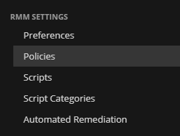
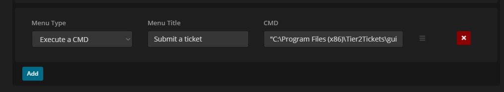

Syncro RMM Instructions
=======================

This guide will show you how to set up deployment of Tier2Tickets with Syncro.

Add Helpdesk Buttons to your Syncro System Tray Icon
-----------
Navigate to the Policies area of Syncro's RMM settings.

You can create a new policy or edit an existing one. Once you have the policy you wish to configure scroll down to the section entitled: Device System Tray Menu

In that section, you want to create a new menu option of type Execute a CMD. The Menu Title is whatever you want the text of the option to be.

Finally set the CMD to "C:\Program Files (x86)\Tier2Tickets\guiTrigger.exe".

Once you save those changes and Syncro updates its endpoints the users should be able to launch the software via a richt-click on the Syncro icon in the notification area and a left-click on the option you just set up.