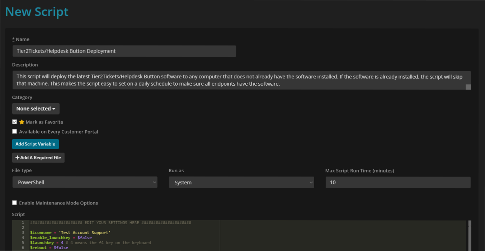
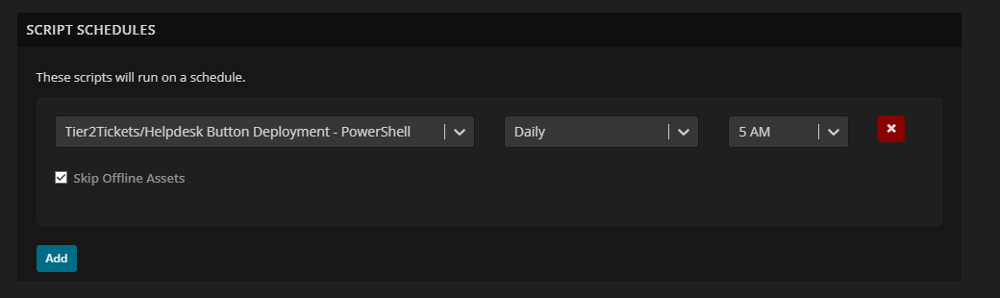

Syncro RMM Instructions
=======================

This guide will show you how to set up deployment of Tier2Tickets with Syncro.

Add a script in Syncro
--------------------------
Navigate to the New Script section of Syncro (Scripts > New Script).

You can name the script anything you want and give it a short description. 

Make sure the File type is either PowerShell or Batch (depending on which flavor of custom :ref:`deplyment script <content/deployment/scripts:deployment scripts>` you choose)

The script should run as System and the max runtime will not exceed the default of 10 minutes.

Finally paste the script in to the script box and double check your settings listed at the top of the script. For more information on these settings check out the :ref:`installation documentation <content/deployment/installation:Installing by Command Line>` .  

Schedule a script with Syncro
-------------------------------
Navigate to the Policies area of Syncro's RMM settings.

You can create a new policy or edit an existing one. Once you have the policy you wish to configure scroll down to the section entitled: Scrit Schedules

In this sectio you want to create a schedule that will run the script we made in the previous step on a set schedule. We recommend daily in the early morning or late at night. 

Once you save those changes, the software should deploy itself to all endpoints that use this policy. 

Add Helpdesk Buttons to your Syncro System Tray Icon
-----------------------------------------------------------------------------
Navigate to the Policies area of Syncro's RMM settings.

You can create a new policy or edit an existing one. Once you have the policy you wish to configure scroll down to the section entitled: Device System Tray Menu

In that section, you want to create a new menu option of type Execute a CMD. The Menu Title is whatever you want the text of the option to be.

Finally set the CMD to "C:\\Program Files (x86)\\Tier2Tickets\\guiTrigger.exe".

.. image:: images/Syncro-Execute-CMD.png

Once you save those changes and Syncro updates its endpoints the users should be able to launch the software via a richt-click on the Syncro icon in the notification area and a left-click on the option you just set up.