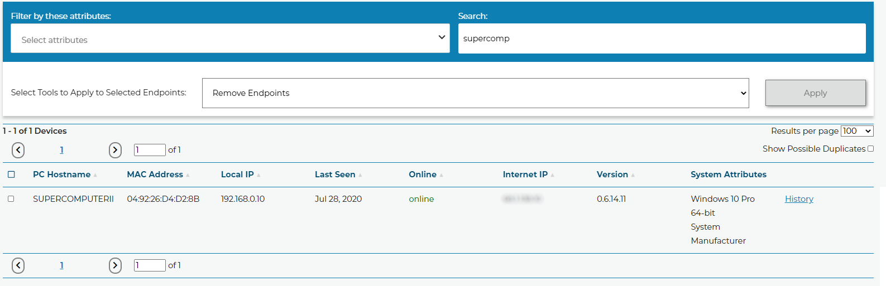
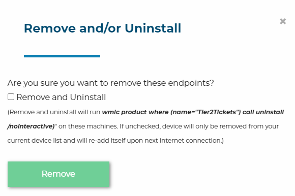
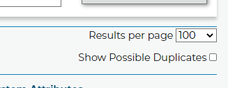

# Duplicates and Uninstalling

## Uninstalling via Helpdesk Buttons

To make this process a bit simpler we have added the ability to uninstall endpoints remotely this feature will only work on endpoints with version 0.6.x or newer.

Select the endpoint(s) you wish to remove, select Remove Endpoints and click Apply.

The next popup confirms the remove and gives the option to run the uninstall command on the endpoints chosen.

## Uninstalling Manually

Since the package is an MSI, you can use WMI to uninstall it. Here is an example command to uninstall it silently:

`wmic product where (name="Tier2Tickets") call uninstall /nointeractive`

NOTE: if you get back "ReturnValue = 1603;" from this command, then the removal failed because you are not in an elevated command prompt.

## Managing Duplicate Endpoints

There is a checkbox on the Device Management page that will filter the list of endpoints for duplicate hostnames. For the most part it is rare for a duplicate to appear, but fully uninstalling and reinstalling the software will create a duplicate endpoint. Replacing the hard drive or the motherboard in a PC running the software will also create a duplicate. Upgrading the software will not.

## Automatically Trim Licenses

To help manage Licenses, you may want to automatically remove endpoints that aren't in use. On the [integrations page](https://account.helpdeskbuttons.com/backend.php), you can opt in to automatically trim endpoints and devices that don't check in for three months with be removed from your licensing. Just tic the checkbox that reads `Auto-Remove endpoints that fail to check-in for 90 days`.

If, at any point, the device comes back online and subsequently checks back in, it will be re-added.
