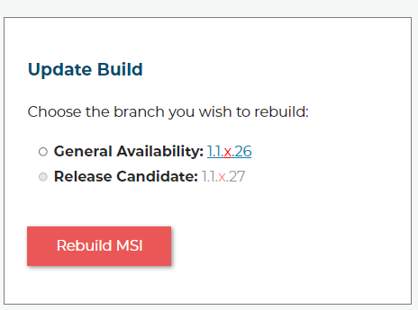
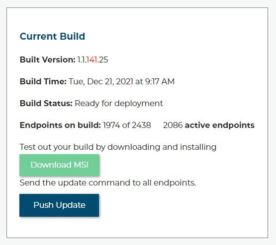
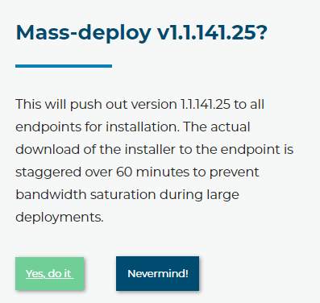

Updating your endpoints
===========================

The normal workflow would be like this: you have already deployed the software to thousands of computers using our
:ref:`deployment script <content/deployment/scripts:Deployment Scripts>` and there is now a new version that has a
feature or bug fix that you want. 

First, build that version. 

Test it yourself ato make sure you feel happy with it, then click the box that says "Push Updates". 

You should then see a window that confirms your command. 

Click yes to proceed.

It's that easy. The update command will be pushed to all your online endpoints and be queued for anything offline.
