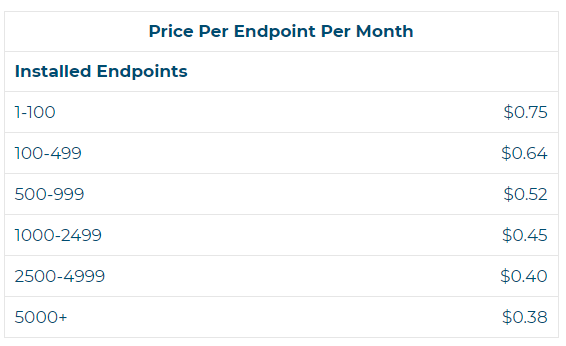

# How does billing work?

Your rate is based on your number of licenses (displayed in the chart below), tiered based on the total number you purchase.

When you install the software on a new computer, it will periodically check into our platform. You can see all the active software installations for which you are being billed on the [Device Management page](https://account.helpdeskbuttons.com/select_endpoints.php).

## Removing Endpoints

To stop being billed for an endpoint, you should first uninstall the software from the computer, and then delete it from the device management page. You may also want to evaluate the number of licenses you are purchasing monthly and modify that number on your [Billing Page](https://account.helpdeskbuttons.com/billing). You can remove a specific endpoint from your [Device Management page](https://account.helpdeskbuttons.com/select_endpoints.php).

## Autotrimming

To help manage your licenses, we do offer auto-trimming of endpoints that haven't checked in for over 90 days, which you can select with the checkbox on your [Integration Settings page](https://account.helpdeskbuttons.com/backend.php).

Please note: We bill in increments of 25 licenses, so if you're in need of 27 licenses, you'll automatically be billed for 50. If you're in need of 476 licenses, you will be prompted to order 500.

