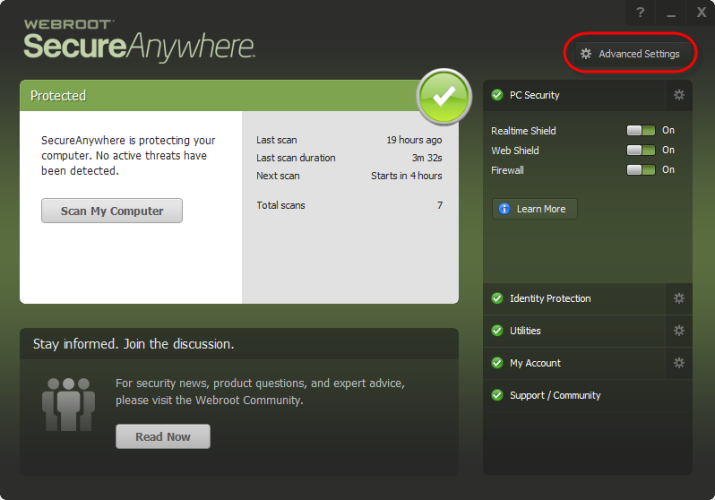
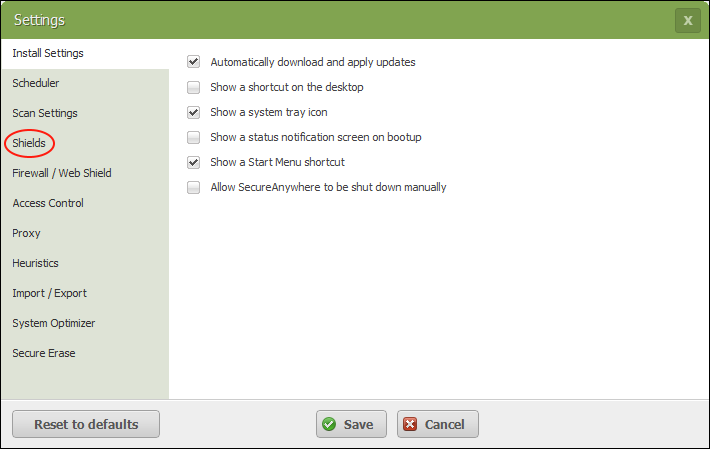
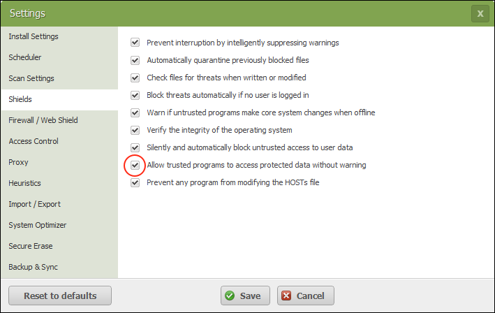

Security Software & Firewall Settings
======================================

There are two different scenarios where you might need to adjust settings on your firewall. One is for the inbound traffic to your ticket system, if your ticket system is hosted onsite. And the other is for outbound traffic coming from the button software on your client's PC

Inbound Ticket System Settings
------------------------------

In order to put tickets into your ticket system, our servers must communicate to your ticket system API. If you are using a Cloud-Hosted ticket ticket system, then there is probably nothing you need to do outside of what is listed your specific integration guide, but if you have a self-hosted ticket system, then you will need to set up port forwarding and firewall rules to expose your API to the internet. It's always a good security practice to apply the "Principle Of Least Privilege" and only allow those IPs which need to communicate with your API to have access to it through your firewall. For that reason, we send out all of our API requests through one of two two specific static IP addresses. They are as follows:

- 34.202.14.153
- 3.209.57.193

If you whitelist those two IPs in your firewall, then you should be good to go for our inbound API requests to your ticket system.

Outbound Client Software Settings
---------------------------------

In order for the client software to function, it makes outbound TCP connections to various servers. Many of these are servers which are edge optimized and therefore have multiple IP addresses per region, so make sure not to just whitelist the IP for the server because this changes based on region and server load. You must whitelist the hostname.

+------------------------------------+------------------------------------------------+-----------+
| Role                               | Hostname                                       | Port(s)   |
+====================================+================================================+===========+
| getconf, submit basic ticket data  | flu1pjyrr2.execute-api.us-east-1.amazonaws.com | 443       |
+------------------------------------+------------------------------------------------+-----------+
| If not self-hosting; our gatekeeper| kdwq222yo3.execute-api.us-east-1.amazonaws.com | 443       |
+------------------------------------+------------------------------------------------+-----------+
| Plugins (Auto update, T2terminal)  | e4rz8vlrg0.execute-api.us-east-1.amazonaws.com | 443       |
+------------------------------------+------------------------------------------------+-----------+
| upload diagnostic data/Images      | hdb-stuff.s3.amazonaws.com                     | 443       |
+------------------------------------+------------------------------------------------+-----------+
| request slot for TechConnect       | connect.helpdeskbuttons.com                    | 443       |
+------------------------------------+------------------------------------------------+-----------+
| establish TechConnect session      | connect.helpdeskbuttons.com                    | 2001-2500 |
+------------------------------------+------------------------------------------------+-----------+

Anti-Virus and AntiMalware Compatibility
-----------------------------------------
We collect a ton of in depth information that might be suspicious to a good security product.  Additionally, we dynamically compile the executable for every client which makes it a little bit difficult to proactively whitelist.  Having said that most antiviruses will not flag us and if you do find the software being flagged we can provide you with instructions on how to exempt it from your AV policy

It is not always necessary, but if you run into issues we recommend whitelisting the Tier2Tickets installation folder (C:\\Program Files(x86)\\Tier2Tickets). We regularly submit our code through VirusTotal to make sure we are not getting flagged, but almost all AV/M interactions cause some sort of failure. `Webroot <https://docs.tier2tickets.com/content/general/firewall/#webroot>`_ in particular can cause issues with screenshots.

AdGuard
^^^^^^^^

AdGuard seems to block the JavaScript that populates the Press View Reports. 

Webroot
^^^^^^^

Webroot will blank most programs from taking screenshots. Here is thier `documentation on how to allow a program to take screenshots.
<https://docs.webroot.com/us/en/home/wsa_pc_userguide/wsa_pc_userguide.htm#UsingIdentityProtection/ManagingProtectedApplications.htm%3FTocPath%3DUsing%2520Identity%2520Protection%7C_____2/>`_.

It may be necessary to allow applications to take screenshots without confirmation if you recieve popups about allowing screenshots.

ThreatLocker
^^^^^^^^^^^^

Here is the documentation from threatlocker on `setting a policy <https://threatlocker.kb.help/the-difference-between-an-application-and-a-policy/>`_. 

Issues and Explanations
-------------------------

These are some issues that you may see depending on how securely your systems are locked down. 

Suspicious registry key was created
^^^^^^^^^^^^^^^^^^^^^^^^^^^^^^^^^^^^^^^^^^

We do create several registry keys during install, including services and keys to allow the software to run at startup  

 

An obfuscated Command Prompt command was detected
^^^^^^^^^^^^^^^^^^^^^^^^^^^^^^^^^^^^^^^^^^^^^^^^^^^^^^^^^^^  

We use the powershell -EncodedCommand feature to run the update scripts

 

Indirect command was executed  
^^^^^^^^^^^^^^^^^^^^^^^^^^^^^^^^^^^^^^^^^^

This is again from the -EncodedCommand feature in powershell  

 

Code injection to a remote process, Code injection to other process memory space via Reflection, Library was injected to a remote process  
^^^^^^^^^^^^^^^^^^^^^^^^^^^^^^^^^^^^^^^^^^^^^^^^^^^^^^^^^^^^^^^^^^^^^^^^^^^^^^^^^^^^^^^^^^^^^^^^^^^^^^^^^^^^^^^^^^^^^^^^^^^^^^^^^^^^^^^^^^^^^^^^^^^

These are all true. The PTTB.exe process injects code into the running shell32.dll thread. That shell32.dll thread running inside of explorer.exe is the only windows process that can pin a shortcut to the taskbar. ("PTTB" starnd for "Pin To TaskBar"). since shell32.dll is the only thig that is allowed to pin a item to the taskbar, we inject code into shell32.dll in-memory and execute it so that the request will be coming from that process. This is the only way to pin a shortcut to the taskbar in Windows 10 and 11  

 

Powershell execution policy was changed  
^^^^^^^^^^^^^^^^^^^^^^^^^^^^^^^^^^^^^^^^^^^^^^^^^

That one shouldn't be persistent, I think it's just complaining that we run powershell with the "-ExecutionPolicy Bypass" flag so that the installer/updates still work when powershell is restricted  

 

User logged on  
^^^^^^^^^^^^^^^^^^^^^

This is just a process starting as the user "SYSTEM" to run the service  

 

Application registered itself to become persistent via an autorun  
^^^^^^^^^^^^^^^^^^^^^^^^^^^^^^^^^^^^^^^^^^^^^^^^^^^^^^^^^^^^^^^^^^^^^^^^^^^^^

Yes, the process that collects the screenshots needs to run when the user logs in  

 

Application registered itself to become persistent via service  
^^^^^^^^^^^^^^^^^^^^^^^^^^^^^^^^^^^^^^^^^^^^^^^^^^^^^^^^^^^^^^^

Yes, we install a windows service, like many applications  

 

Application registered itself to become persistent via scheduled task  
^^^^^^^^^^^^^^^^^^^^^^^^^^^^^^^^^^^^^^^^^^^^^^^^^^^^^^^^^^^^^^^^^^^^^^^^^^^^^

Again, we have processes that need to run persistently  

 

Keylogger Installation  
^^^^^^^^^^^^^^^^^^^^^^^^^^^^

We use keyboard and mouse inputs to build the slideshows but these are not "logged", they are just used to know when to take a screenshot  

 

A UPX packed process was detected, Process suspicious as packed:  
^^^^^^^^^^^^^^^^^^^^^^^^^^^^^^^^^^^^^^^^^^^^^^^^^^^^^^^^^^^^^^^^^^^^^^

Yes, we use pyinstaller to package the python scripts into executables:  

 

Detected suspicious shellcode API call  
^^^^^^^^^^^^^^^^^^^^^^^^^^^^^^^^^^^^^^^^^^^^^^^^^

Since shell32.dll is the only thing that is allowed to pin a item to the taskbar, we inject code into shell32.dll in-memory and execute it so that the request will be coming from that process. This is the only way to pin a shortcut to the taskbar in Windows 10 and 11

