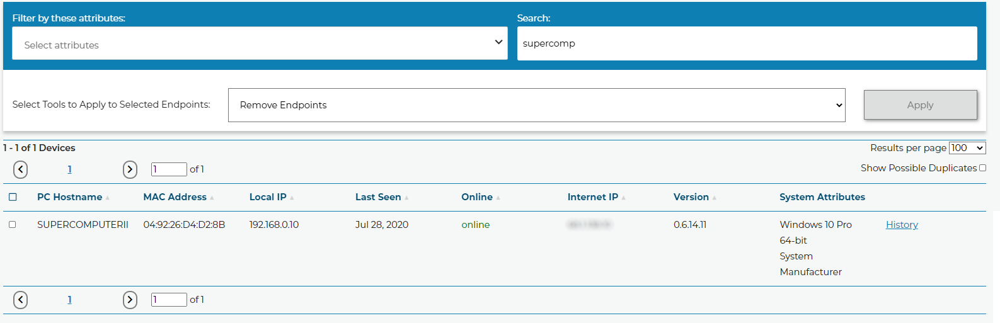
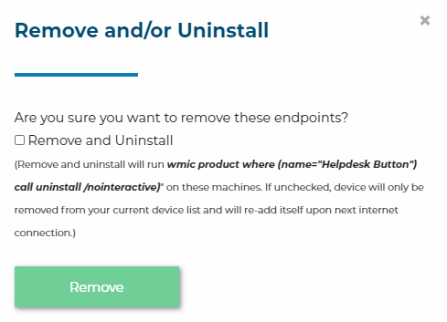
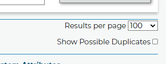
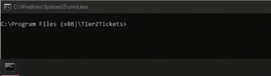
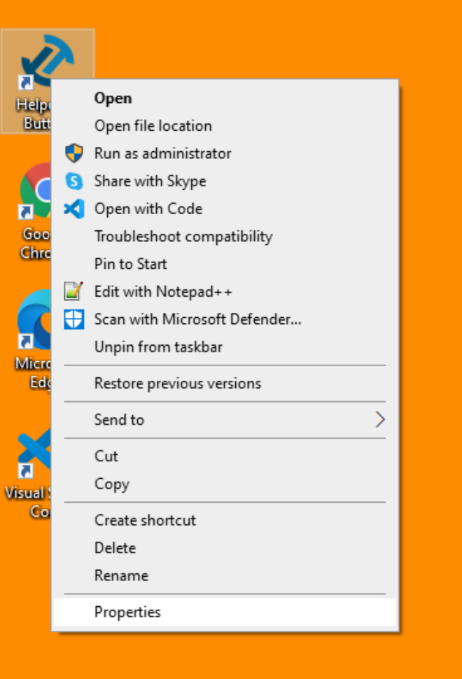
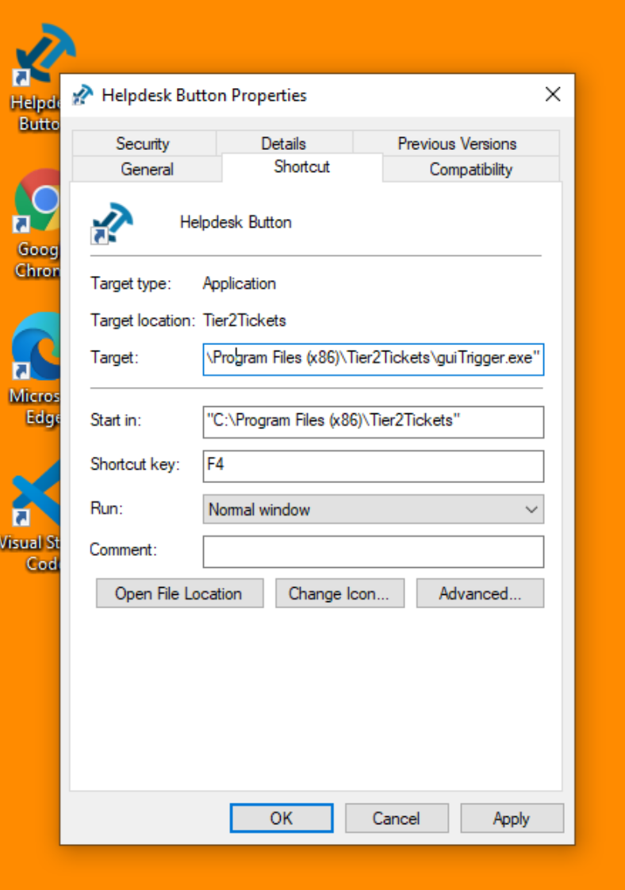
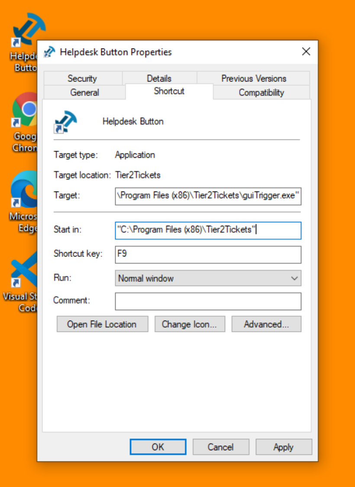
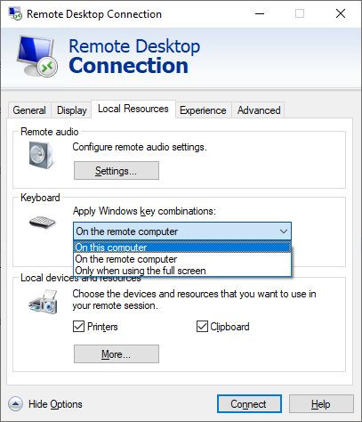

# Software Installation and Configuration Guide

**We recommend that you use one of our Custom-built-for-you Batch files or Powershell files that you will find on your Software [Download and Deployment page](https://account.helpdeskbuttons.com/builds.php) or follow one of our RMM deployment guides. But if you need to build a custom installation we have included this page for reference.**

## Installing

### Using Command line Arguments

The software is packaged as an MSI which you build on the custom builds page. It supports all the typical command line options of an MSI for example:

#### passive

The following command would install the software with minimal user interface visible to the user and no cancel button and then reboot the computer.

```
msiexec /i buttonInst.msi /passive
```

#### quiet and no restart

The following would install the software with no user interface and would not reboot the computer.

```
msiexec /i buttonInst.msi /quiet /norestart
```

We have some command line options that would allow you to customize settings specific to our software.

#### F1 - F11 Launch Key

If you install the software the GUI way, but just running it with no options you will see that we offer the ability to bind the software to a F-Key so that pressing that key launches the app. We also have command line options to allow the same. If you wanted to bind the program to F4, for example, you would use use the following command line param.

```
WRAPPED_ARGUMENTS="/launchkey=4"
```

#### Desktop Icon Name

You can also customize the name of the desktop icon. By default, it is named "Helpdesk Button" but if you wanted to have the icon named "PC Solutions Support", this would get you there.

```
WRAPPED_ARGUMENTS="/iconname=""PC Solutions Support"""
```

#### Launch key with Icon Name

Putting those things together, you would end up with a command like this:

```
msiexec /i "buttonInst.msi" WRAPPED_ARGUMENTS="/launchkey=4 /iconname=""PC Solutions Support"""
```

#### Pin to Taskbar

As of version `1.1.x.14`, the installer supports automatically pinning the icon to the taskbar of every user in addition to, or in place of, a standard desktop icon. That is also broken out into the wrapped argument `icons` which can be a number `1`, `2`, or `3`. Setting it to `1` would create a desktop icon but no taskbar icon, setting it to `2` would make a taskbar icon but no desktop icon, and setting it to 3 will enable both icons.

The default is /icons=3 but if you just want a desktop icon and not a taskbar icon, then you can expand the above command to:

```
msiexec /i "buttonInst.msi" WRAPPED_ARGUMENTS="/launchkey=4 /iconname=""PC Solutions Support"" /icons=1"
```

#### **Note to powershell users**:

powershell requires an extra single quote around the WRAPPED_ARGUMENTS value. So the powershell equivalent command looks like this:

```
msiexec /i "buttonInst.msi" WRAPPED_ARGUMENTS='"/launchkey=4 /iconname=""PC Solutions Support"""'
```

Make sure you are aware that this reboots the computer! Don't push out that command en mass during business hours. A better option during business hours is as follows.

```
msiexec /i "buttonInst.msi" /norestart WRAPPED_ARGUMENTS="/launchkey=4 /iconname=""PC Solutions Support"""
```

You would still need to reboot after hours though, the software does actually need a reboot most of the time.

### Without Command line Arguments

If installing the software by starting the MSI without any command line options you will get a default shortcut name: "Helpdesk Button" and the MSI will allow you to select the launch key. You can use our Tier2Scripts system to change this icon on install by using the script listed [here.](https://docs.tier2tickets.com/content/customization/tier2scripts/#update-shortcut-icons-on-install)

## Uninstalling

### Via the backend

To make this process a bit simpler we have added the ability to uninstall endpoints remotely this feature will only work on endpoints with version 0.6.x or newer.

Select the endpoint(s) you wish to remove, select Remove Endpoints and click Apply.



The next popup confirms the remove and gives the option to run the uninstall command on the endpoints chosen.



### Manually

Since the package is an MSI, you can use WMI to uninstall it. Here is an example command to uninstall it silently:

`wmic product where (name="Tier2Tickets") call uninstall /nointeractive`

NOTE: if you get back "ReturnValue = 1603;" from this command, then the removal failed because you are not in an elevated command prompt.

## Duplicate Endpoints

There is a checkbox on the Device Management page that will filter the list of endpoints for duplicate hostnames. For the most part it is rare for a duplicate to appear, but fully uninstalling and reinstalling the software will create a duplicate endpoint. Replacing the hard drive or the motherboard in a PC running the software will also create a duplicate. Upgrading the software will not.



## Additional Notes

### Re-Pin to Taskbar

The software can be forced to initiate a re-pin if this file: `%localappdata%\tier2tickets\pttb.pref` is deleted. Doing this will cause the software to re-pin itself to the taskbar when the user logs in.

Running `pttb.exe "Helpdesk Button"` as the logged-in user will also pin the icon to taskbar on demand.



Keep in mind that your installation folder could be "Helpdesk Buttons." The software was formally renamed in [1.1.x.10](https://docs.tier2tickets.com/content/general/changelog/#x-10).

### Set Shortcut Function

#### For a Single Device (Manual)

If your predetermined shortcut key isn't working for a specific user, you can change that combination in the Desktop Shortcut Properties menu.







#### For Multiple Devices (Powershell)

The syntax for this PowerShell function is simple: You just list the things you want to change about a shortcut after passing in the shortcut path, i.e. :

`Set-Shortcut linkPath hotkey location arguments targetPath`

If you only want to change the shortcut you can leave the rest blank so the command will look like this:

`Set-Shortcut C:\Users\Public\Desktop\"Helpdesk Button.lnk" f11`

```
function Set-Shortcut {
  param(
  [Parameter(ValueFromPipelineByPropertyName=$true)]
  $LinkPath,
  $Hotkey,
  $IconLocation,
  $Arguments,
  $TargetPath
  )
  begin {
	$shell = New-Object -ComObject WScript.Shell
  }

  process {
	$link = $shell.CreateShortcut($LinkPath)

	$PSCmdlet.MyInvocation.BoundParameters.GetEnumerator() |
	  Where-Object { $_.key -ne 'LinkPath' } |
	  ForEach-Object { $link.$($_.key) = $_.value }
	$link.Save()
  }
}

```

#### Microsoft Remote Desktop

In general the software and hardware work fine with most remote desktop software. For Microsoft's RDP make sure key combinations are set to propagate to the proper machine based on the configuration.



If the software is installed locally and you simply want screenshots of the RDP, select on this computer. If the software is installed on the server, select on the remote computer.
