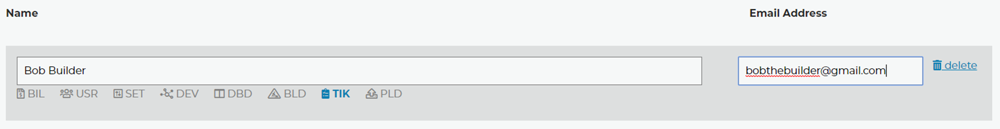

Sub-accounts
============

The Sub-account option is under the Settings tab. Once you add a new user to the list, they will receive an email notification with a link to set their password. If you have two factor authentication enabled on the account (as you should), then this will be enforced on all of the sub-accounts as well. The 2FA key is centrally managed on the main settings page. You will notice a new button there which allows you to view the 2FA key QR code. Distribute this QR code in a secure manner to your sub-accounts to allow them to log in. Should this key ever become compromised, you can reset it globally on the main settings page as well.

You can hover over the choices to see what they stand for, but this is the breakdown right now. The image above would be a typical tech that only needs to view ticket reports for instance.

- BIL: Billing
- USR: User Management
- SET: Account Settings
- DEV: Device Management
- DBD: Ticket Dashboard
- BLD: Builds Page
- TIK: Ticket Reports
- PLD: Payload Management

By default sub-accounts can only access the *account overview*, the *help and support* page, and of course everyone is allowed to buy our buttons. 

We do have plans to add some interface options for individual users to manage thier own passwords and email addresses.