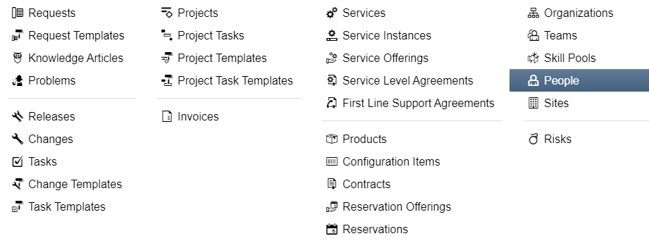
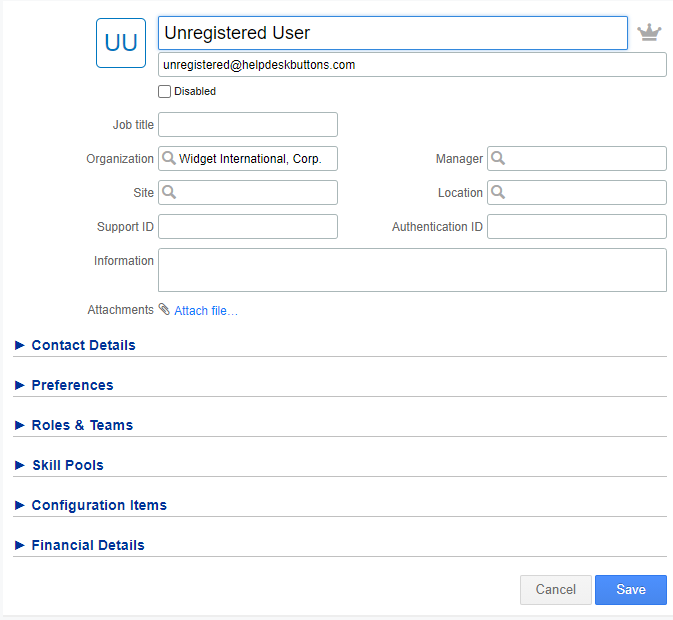
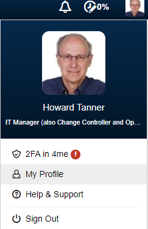
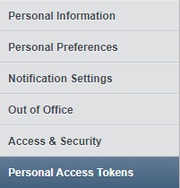
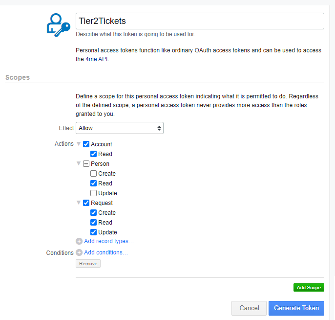
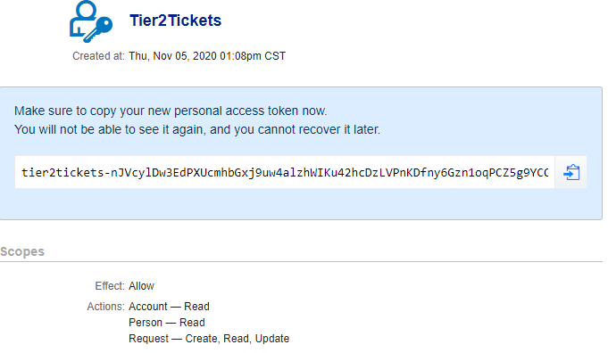

4me Documentation
=========================================================

This guide will show you how to set up your new Helpdesk Buttons with 4me in as few as 15 minutes.

Integration
--------------------------

4me integration requires three main parts:

`1) set up an unregistered user as a catchall account as a contact in your PSA <https://docs.tier2tickets.com/content/integration/4me/#unregistered-user>`_

`2) set up an access token. <https://docs.tier2tickets.com/content/integration/4me/#create-an-access-token>`_

`3) configure helpdeskbuttons account. <https://docs.tier2tickets.com/content/integration/4me/#helpdeskbuttons-com-settings>`_

Video Walkthrough
^^^^^^^^^^^^^^^^^^^^^^^^^^^^^^^^^^
.. raw:: html

    <!--

        <iframe width="560" height="315" src="https://www.youtube.com/embed/n7gDwhauMbY" frameborder="0" allow="accelerometer; autoplay; encrypted-media; gyroscope; picture-in-picture" allowfullscreen></iframe>
    
-->

.. image:: images/coming_soon.png

1) Unregistered User
^^^^^^^^^^^^^^^^^^^^^^^^^^^^^^^^^^

To start you will need to set up a "Catch all" contact for users not aleady in your system.

Click on the Third Icon and select People

and Click Add user in the top left corner and fill out the Name and email address of the users

You can name the contact whatever you want, but the email address needs to be:

unregistered@helpdeskbuttons.com

The user you create does not need any roles or team memberships and the Timezone of the user (Preferences -> Timezone) will be the timezone default for tickets that don't match a customer.

2) Create an Access Token
^^^^^^^^^^^^^^^^^^^^^^^^^^^^^^^^^^

*Make sure to do this on an account that has access to all tickets* 
To do this click the user icon in the top right corner and select My Profile: 

Next click on Personal Access Tokens

Click New and add a name and permissions to the key as shown:

-Account -> Read Only
-Person -> Read Only
-Requeest -> Create, Read, Update

Now click generate. The final screen will show you the key needed for the integration. This cannot be recovered so keep it in a safe place

3) Helpdeskbuttons.com Settings
^^^^^^^^^^^^^^^^^^^^^^^^^^^^^^^^^^

Enter your Ticket System API endpoint as shown (do not add add https:// or the path after the url)

*eg: api.4me-demo.com or api.4me.com*

The api key will be of this form:

*account:key*

The account refers to the part of 4me with access to requests (in the demo this is "wdc" for widget data center). The key is what we generated in the steps above.

the example we just made looks like this:

wdc:tier2tickets-nJVcylD...

Click Update to save your changes

The Integration Test button can send in a test ticket to test to make sure everything works. 

Anti-Virus and AntiMalware
----------------------------------------------------------------------------
It is not always necessary, but we recommend whitelisting the tier2tickets installation folder (C:\\Program Files(x86)\\tier2tickets). We regularly submit our code through VirusTotal to make sure we are not getting flagged, but almost all AV/M interactions cause some sort of failure. `Webroot <https://docs.tier2tickets.com/content/general/firewall/#webroot>`_ in particular can cause issues with screenshots.

Dispatcher Rules
----------------------------------------------------------------------------

This is the list of variables that can be accessed when using the :ref:`Dispatcher Rules <content/automations/dispatcher:*BETA* Dispatcher Rules>`. 

.. image:: images/coming_soon.png

Webhook Walkthrough
----------------------------------------------------------------------------

.. image:: images/coming_soon.png
