Accelo Integration
===================

Unregistered User
------------------

To start you will need to set up a "Catch all" contact for users not aleady in your system.

Click on the Contacts Tab

and Click Add user in the top left corner

Fill out the form. You can name the contact whatever you want, but the email address needs to be:

unregistered@helpdeskbuttons.com

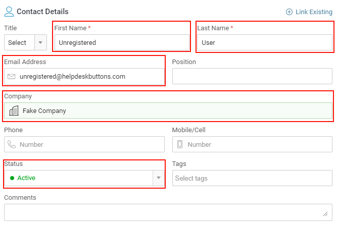

Create an Application User
--------------------------

To do this click the Configuration Gear in the botton left corner: 

Next click on the API tab and Register Application

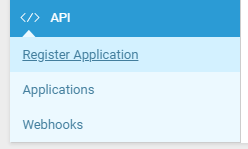

Fill out this next screen with whatever information you want, we only need to make sure that the Application Type is Service

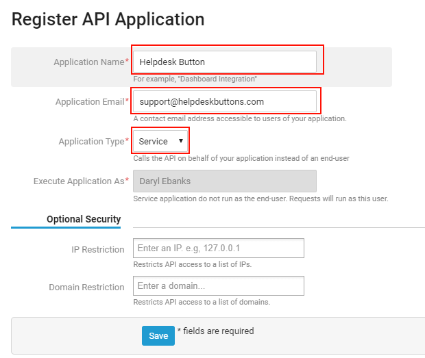

The final screen will show you the API user and API secret for the integration. You will need these for the next step.

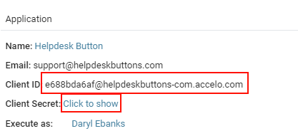

Helpdeskbuttons.com Settings
-------------------------------

Enter your Ticket System API endpoint as shown (do not add add https:// or the path after the url)

*business_name.api.accelo.com*

Your API key is formatted as shown 

*client_id:client_secret*

Click Update and the Integration Test button to send a test ticket. 

Some additional setup may be necessary in the :ref:`Advanced Integration Options <content/integration/advanced:Defaults>`.

Anti-Virus and AntiMalware
-----------------------------
It is not always necessary, but we recommend whitelisting the helpdeskbuttons installation folder (C:\\Program Files(x86)\\Helpdesk Button). We regularly submit our code through VirusTotal to make sure we are not getting flagged, but almost all AV/M interactions cause some sort of failure. `Webroot <https://docs.tier2tickets.com/content/general/firewall/#webroot>`_ in particular can cause issues with screenshots.

Advanced Integration Options
------------------------------

Defaults
^^^^^^^^

Please note that defaults for priority, type, and standing must be set for this integration to work properly.

Custom Rules
^^^^^^^^^^^^^

This is the list of variables that can be accessed when using the :ref:`Custom Rules <content/integration/advanced:Custom Rules>`. 

+---------------------------------------------------+------------------------------------------------------------+
| Read/Write                                        | Read Only                                                  |
+===================================================+============================================================+
| :ref:`content/integration/accelo:*priority*`      | :ref:`content/integration/advanced:*selections*`           |
+---------------------------------------------------+------------------------------------------------------------+
| :ref:`content/integration/accelo:*type*`          | :ref:`content/integration/advanced:*hostname*`             |
+---------------------------------------------------+------------------------------------------------------------+
| :ref:`content/integration/accelo:*standing*`      | :ref:`content/integration/advanced:*name*`                 |
+---------------------------------------------------+------------------------------------------------------------+
| :ref:`content/integration/accelo:*priv_append*`   | :ref:`content/integration/advanced:*email*`                |
+---------------------------------------------------+------------------------------------------------------------+
| :ref:`content/integration/advanced:*message*`     | :ref:`content/integration/advanced:*ip*`                   |
+---------------------------------------------------+------------------------------------------------------------+
| :ref:`content/integration/advanced:*subject*`     | :ref:`content/integration/advanced:*mac*`                  | 
+---------------------------------------------------+------------------------------------------------------------+
| :ref:`content/integration/advanced:*append*`      | :ref:`input_cell<content/integration/accelo:*input_**>`    | 
+---------------------------------------------------+------------------------------------------------------------+
|                                                   | .. raw:: html                                              |
|                                                   |                                                            |
|                                                   |    <i>                                                     |
|                                                   |                                                            |
| :ref:`content/integration/accelo:*assignee*`      | :ref:`input_phone<content/integration/accelo:*input_**>`   | 
|                                                   |                                                            |
+---------------------------------------------------+------------------------------------------------------------+
| :ref:`content/integration/accelo:*class*`         | :ref:`input_company<content/integration/accelo:*input_**>` | 
+---------------------------------------------------+------------------------------------------------------------+
|                                                   | :ref:`input_email<content/integration/accelo:*input_**>`   | 
+---------------------------------------------------+------------------------------------------------------------+
|                                                   | :ref:`input_name<content/integration/accelo:*input_**>`    | 
+---------------------------------------------------+------------------------------------------------------------+

Field Definitions
^^^^^^^^^^^^^^^^^

*priority*
""""""""""

	**The ticket priority level (Urgent, Low, ect):**
   
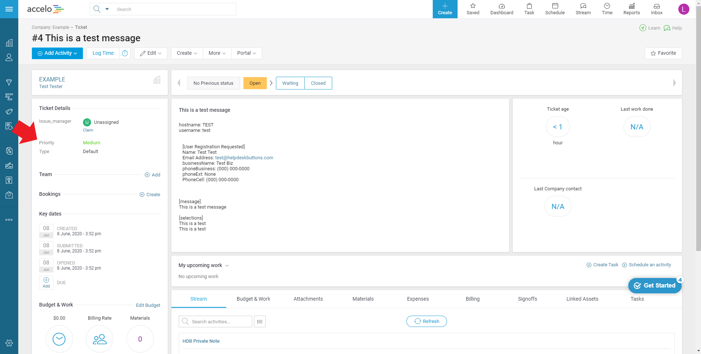
   

*standing*
"""""""""""

	**Refers to the ticket status (New, In Progress, etc):**

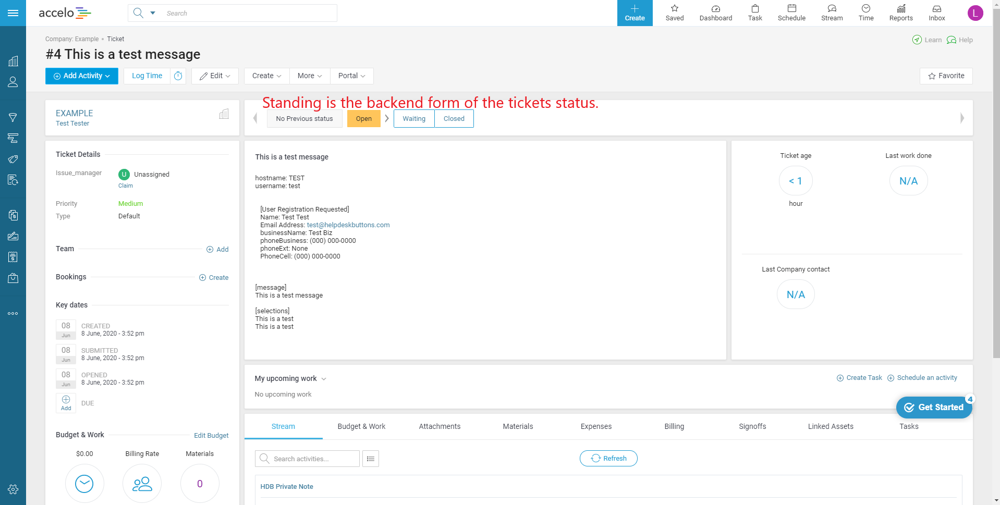

*type*
""""""""

	**The issue type (Service Request, Incident, Problem, Alert):**

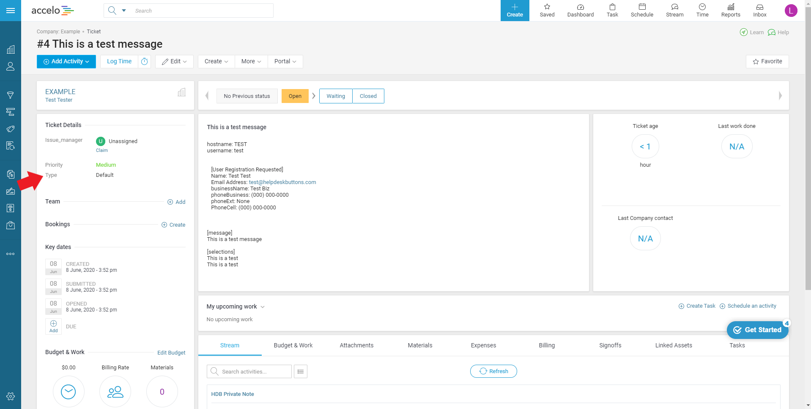

*assignee*
""""""""""

	**The agent that will be assigned this ticket:**

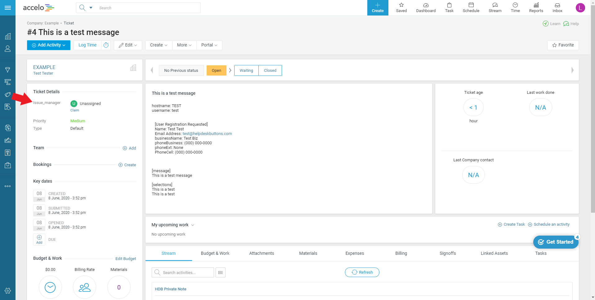

*class*
"""""""""

	**The tickets class (Accounts/Renewals, E-commerce):**

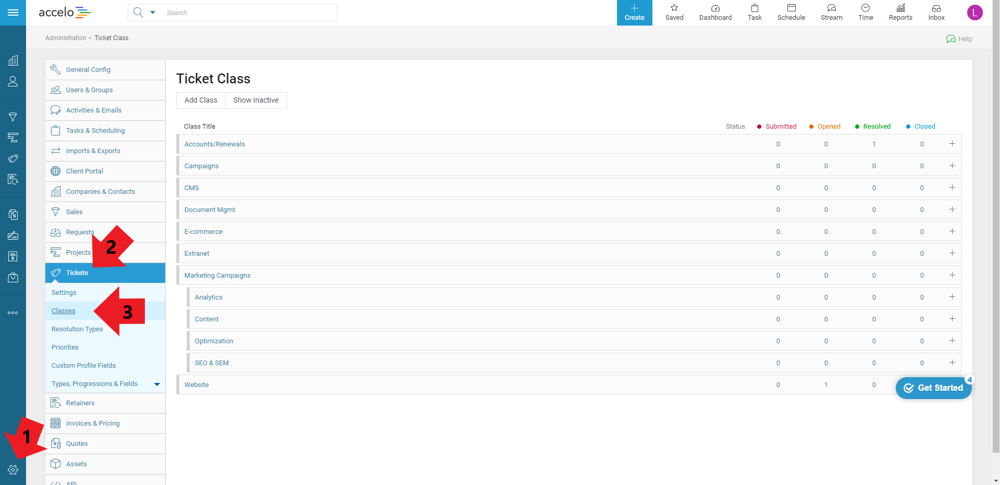

*priv_append*
"""""""""""""

	**Allows you to append information to the internal ticket note:**

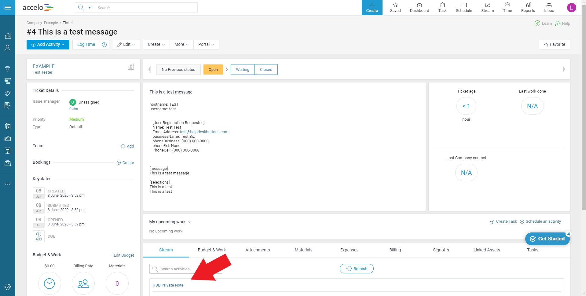

*input_**
"""""""""

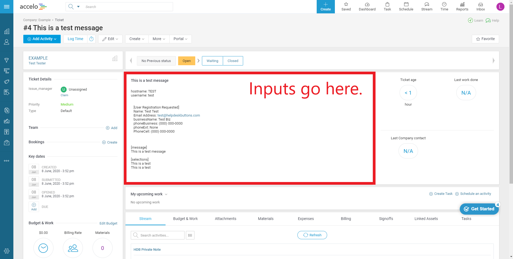

*other*
"""""""

There are additional variables which are common to all integrations. Those are documented :ref:`here <content/integration/advanced:Universally Available Variables>`

The fields labeled input_* contain information typed by the user only in the event that they are not found in the PSA
