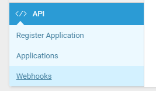
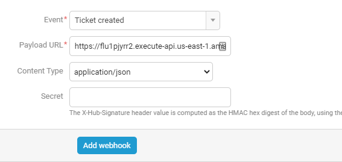

Accelo Documentation
==============================

This guide will show you how to set up your new Helpdesk Buttons with Accelo in as few as 15 minutes.

Integration
--------------------------------------

Accelo integration requires three main parts:

`1) set up an unregistered user as a catchall account as a contact in your PSA <https://docs.tier2tickets.com/content/integration/accelo/#unregistered-user>`_

`2) set up an application user. <https://docs.tier2tickets.com/content/integration/accelo/#create-an-application-user>`_

`3) configure helpdeskbuttons account. <https://docs.tier2tickets.com/content/integration/accelo/#helpdeskbuttons-com-settings>`_

Video Walkthrough
^^^^^^^^^^^^^^^^^^^^^^^^^^^^^^^^^^

.. raw:: html

    

        <iframe width="560" height="315" src="https://www.youtube.com/embed/n7gDwhauMbY" frameborder="0" allow="accelerometer; autoplay; encrypted-media; gyroscope; picture-in-picture" allowfullscreen></iframe>
    

1) Unregistered User
^^^^^^^^^^^^^^^^^^^^^^^^^^^^^^^^^^

To start you will need to set up a "Catch all" contact for users not already in your system.

Click on the Contacts Tab

and Click Add user in the top left corner

.. image:: images/accelo6.png

Fill out the form. You can name the contact whatever you want, but the email address needs to be:

unregistered@helpdeskbuttons.com

.. image:: images/accelo7.png

2) Create an Application User
^^^^^^^^^^^^^^^^^^^^^^^^^^^^^^^^^^

To do this click the Configuration Gear in the bottom left corner: 

.. image:: images/accelo1.png

Next click on the API tab and Register Application

Fill out this next screen with whatever information you want, we only need to make sure that the Application Type is Service

.. image:: images/accelo3.png

The final screen will show you the API user and API secret for the integration. You will need these for the next step.

.. image:: images/accelo4.png

3) Helpdeskbuttons.com Settings
^^^^^^^^^^^^^^^^^^^^^^^^^^^^^^^^^^

Enter your Ticket System API endpoint as shown (do not add add https:// or the path after the url)

*business_name.api.accelo.com*

Your API key is formatted as shown 

*client_id:client_secret*

Click Update and the Integration Test button to send a test ticket. 

Integration Defaults
"""""""""""""""""""""""""""""""""""""""""""

For most integrations you can leave these blank and the PSA/Ticket System will fill in some defaults.

Please note that defaults for priority, type, and standing must be set for this integration to work properly.

Anti-Virus and AntiMalware
--------------------------------------
It is not always necessary, but we recommend whitelisting the tier2tickets installation folder (C:\\Program Files(x86)\\tier2tickets). We regularly submit our code through VirusTotal to make sure we are not getting flagged, but almost all AV/M interactions cause some sort of failure. `Webroot <https://docs.tier2tickets.com/content/general/firewall/#webroot>`_ in particular can cause issues with screenshots.

Dispatcher Rules
--------------------------------------

This is the list of variables that can be accessed when using the :ref:`Dispatcher Rules <content/automations/dispatcher:Dispatcher Rules>`. 

+---------------------------------------------------+-------------------------------------------------------------+
| Read/Write                                        | Read Only                                                   |
+===================================================+=============================================================+
| :ref:`content/integration/accelo:*priority*`      | :ref:`content/automations/dispatcher:*selections*`          |
+---------------------------------------------------+-------------------------------------------------------------+
| :ref:`content/integration/accelo:*type*`          | :ref:`content/automations/dispatcher:*hostname*`            |
+---------------------------------------------------+-------------------------------------------------------------+
| :ref:`content/integration/accelo:*standing*`      | :ref:`content/automations/dispatcher:*name*`                |
+---------------------------------------------------+-------------------------------------------------------------+
| :ref:`content/integration/accelo:*priv_append*`   | :ref:`content/automations/dispatcher:*email*`               |
+---------------------------------------------------+-------------------------------------------------------------+
| :ref:`content/automations/dispatcher:*msg*`       | :ref:`content/automations/dispatcher:*ip*`                  |
+---------------------------------------------------+-------------------------------------------------------------+
| :ref:`content/automations/dispatcher:*subject*`   | :ref:`content/automations/dispatcher:*mac*`                 | 
+---------------------------------------------------+-------------------------------------------------------------+
|                                                   | .. raw:: html                                               |
|                                                   |                                                             |
|                                                   |    <i>                                                      |
|                                                   |                                                             |
| :ref:`content/automations/dispatcher:*append*`    | :ref:`input_cell<content/integration/accelo:*input_**>`     | 
+---------------------------------------------------+-------------------------------------------------------------+
|                                                   | .. raw:: html                                               |
|                                                   |                                                             |
|                                                   |    <i>                                                      |
|                                                   |                                                             |
| :ref:`content/integration/accelo:*assignee*`      | :ref:`input_phone<content/integration/accelo:*input_**>`    | 
|                                                   |                                                             |
+---------------------------------------------------+-------------------------------------------------------------+
|                                                   | .. raw:: html                                               |
|                                                   |                                                             |
|                                                   |    <i>                                                      |
|                                                   |                                                             |
| :ref:`content/integration/accelo:*class*`         | :ref:`input_company<content/integration/accelo:*input_**>`  | 
+---------------------------------------------------+-------------------------------------------------------------+
|                                                   | .. raw:: html                                               |
|                                                   |                                                             |
|                                                   |    <i>                                                      |
|                                                   |                                                             |
|                                                   | :ref:`input_email<content/integration/accelo:*input_**>`    | 
+---------------------------------------------------+-------------------------------------------------------------+
|                                                   | .. raw:: html                                               |
|                                                   |                                                             |
|                                                   |    <i>                                                      |
|                                                   |                                                             |
|                                                   | :ref:`input_name<content/integration/accelo:*input_**>`     | 
+---------------------------------------------------+-------------------------------------------------------------+

Field Definitions
^^^^^^^^^^^^^^^^^

*priority*
""""""""""

	**The ticket priority level (Urgent, Low, ect):**
   
.. image:: images/accelo-priority.png
   :target: https://docs.tier2tickets.com/_images/accelo-priority.png
   
|
|

*standing*
"""""""""""

	**Refers to the ticket status (New, In Progress, etc):**

.. image:: images/accelo-standing.png
   :target: https://docs.tier2tickets.com/_images/accelo-standing.png

|
|

*type*
""""""""

	**The issue type (Service Request, Incident, Problem, Alert):**

.. image:: images/accelo-type.png
   :target: https://docs.tier2tickets.com/_images/accelo-type.png

|
|

*assignee*
""""""""""

	**The agent that will be assigned this ticket:**

.. image:: images/accelo-assignee.png
   :target: https://docs.tier2tickets.com/_images/accelo-assignee.png

|
|

*class*
"""""""""

	**The tickets class (Accounts/Renewals, E-commerce):**

|
|

*priv_append*
"""""""""""""

	**Allows you to append information to the internal ticket note:**

.. image:: images/accelo-priv_append.png
   :target: https://docs.tier2tickets.com/_images/accelo-priv_append.png

|
|

*input_**
"""""""""

|
|

*other*
"""""""

There are additional variables which are common to all integrations. Those are documented :ref:`here <content/automations/dispatcher:Universally Available Variables>`

The fields labeled input_* contain information typed by the user only in the event that they are not found in the PSA

Webhook Walkthrough (Notifications)
-----------------------------------------------

In order to get Ticket Creation/Update Notifications set up for your Tier2Tickets integration, we need to know when tickets are created/updated. The way we do this is via webhooks from the ticket system. 

To do this in Accelo, go to Settings-> API -> Webhooks

Ticket Create Webhook
^^^^^^^^^^^^^^^^^^^^^^^^^^^^^^^^^^

Once here, you can setup webhooks to send on ticket creation. 

 - Select the event "Ticket created"
 - URL should be listed on your `Integration Settings Page. <https://dev.helpdeskbuttons.com/backend.php>`_ under the Ticket Notification section.
 - Set Content-Type to "application/json"

Ticket Update Webhook
^^^^^^^^^^^^^^^^^^^^^^^^^^^^^^^^^^

 - Select the event "Ticket updated"
 - URL should be listed on your `Integration Settings Page. <https://dev.helpdeskbuttons.com/backend.php>`_ under the Ticket Notification section.
 - Set Content-Type to "application/json"
 
 

