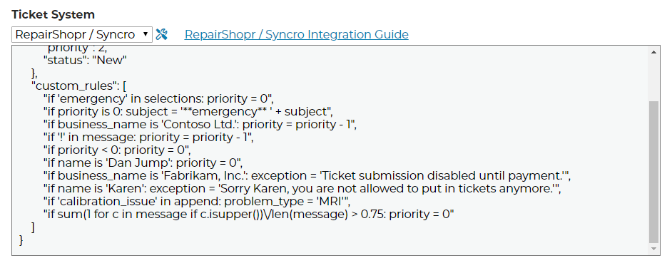

Advanced Options
================================

If you want finer control over integrations you can use the advanced options button on the Settings page beside your integration dropdown.

.. image:: images/advanced.png

Once opened, your options will look something like this:

.. image:: images/advanced-open.png

You can reset this field to default by submitting a blank field. 

Defaults
------------

As of version :ref:`0.5.x.2 <content/general/changelog:0.5.x.2>` of the helpdesk buttons software, we support defaults for fields. 
As new integration features are added, this section will be filled with default data. These defaults allow you to set the normal operation of 
the integration and will depend on your PSA. 

Custom Rules
--------------

As of version :ref:`0.5.x.2 <content/general/changelog:0.5.x.2>` of the helpdesk buttons software, we support custom
rules on tickets; which can modify the behavior of the ticket system integrations at a fundamental level. Custom rules
are part of the :ref:`Advanced Options <content/integration/advanced:Advanced Options>` and are added by using the *custom_rules*
attribute

The basic premise of the design is that before we submit the ticket to your PSA, we give you access to the information and 
allow you to modify what actually gets submitted.

These modifications are made through series of if statements which use Python syntax. The commands you write are literally
interpreted by Python 3 inside of a sandbox, so you have a full fledged programming language as your disposal to
make your custom rules.

To show how powerful this can be and give you an idea of how to use it, we came up with a few example rules here.

The first thing you need to know when writing a custom rule is which variables you have available to you. This varies from
from one ticket system to another, but for this example, we will be using Syncro. At the time of writing, we have the following variables
available to Syncro rules:

+-----------------+---------------+
| Read/Write      | Read Only     |
+=================+===============+
| priority        | selections    |
+-----------------+---------------+
| status          | name          |
+-----------------+---------------+
| comment_subject | email         |
+-----------------+---------------+
| problem_type    | business_name |
+-----------------+---------------+
| message         |               |
+-----------------+---------------+
| subject         |               | 
+-----------------+---------------+

Using this info, we can write some rules to modify tickets now. Here are some examples:

First off, "selections" is the text that makes up which radio buttons and checkboxes were selected by the user in the GUI.
So let's assume you have a checkbox that says "This is an emergency" and you want that check box to cause a high priority
ticket. In Syncro, lower priority numbers mean higher priority, so priority '0' is an emergency. Therefore, this is what that rule
would look like:

.. code-block:: python

	if 'This is an emergency' in selections: priority = 0

As another example, let's assume you want to draw extra attention to emergency tickets by prepending the text "\*\*EMERGENCY\*\*"
to the front of any emergency tickets. Here is what that rule would look like:

.. code-block:: python

	if priority is 0: subject = '**EMERGENCY** ' + subject

Now lets say you have a VIP client named 'Contoso Ltd.' which sould always get a little bit more prioirty than the other 
companies you support. Here is an example rule that increases the priority of any Contoso by one point:

.. code-block:: python

	if business_name is 'Contoso Ltd.': priority = priority - 1

Dan Jump is the CEO of Contoso, So we want to make sure all his tickets are highest priority:

.. code-block:: python

	if name is 'Dan Jump': priority = 0

Now lets say you want to increase the priority if people are yelling in their message to you. Here is a
rule that increases the priority if there is an exclamation point in the message:

.. code-block:: python

	if '!' in message: priority = priority - 1

You need to be careful with rules like these, because you might end up where the priory moves into a negative number
at some point, which might cause the ticket to fail to go in altogether. To prevent that we should add a rule like this:

.. code-block:: python

	if priority < 0: priority = 0

You may have noticed that 'append' is one of the variables you have access to. This is data that got appended to the ticket
from custom scripts. This means that your custom scripts can be made to impact your ticket attributes using rules. Let's
assume you have a custom script that was able to read through the logs of an MRI machine software and determine that there
is a calibration issue with that machine. It has already appended the error to the ticket, and attached the log file, but
now we want to take it a step further and set the ticket 'problem_type' attribute to 'MRI' so that it gets assigned to the
team at your company that manages MRI issues. Here is a rule for that:

.. code-block:: python

	if 'calibration_issue' in append: problem_type = 'MRI'

There is another special purpose variable that is available for all integrations. This is the 'exception'
variable. It is unset by default, and if you set it, then the ticket will fail to go in and will show an error message to
the end user. But the error message it shows will have this exception text on the error page. We set this automatically for
you if your python code throws an exception so that you know what went wrong, but you can also set it yourself if you want
to halt a ticket submission using a rule.

On that note, let's assume you have a customer, 'Fabrikam, Inc.', that has a past due balance and you want to stop tickets
from that account from being able to come in and display the message "Ticket submission disabled until payment."when anyone 
tries to put in a ticket.
Here is what that rule looks like:

.. code-block:: python

	if business_name is 'Fabrikam, Inc.': exception = 'Ticket submission disabled until payment.'

Now let's pretend that you have been instructed by management at Contoso to not accept tickets from Karen because she
has not been following protocol and contacting internal IT first. Here is what that rule might look like:

.. code-block:: python

	if business_name is 'Contoso Ltd.' and name is 'Karen': exception = 'Sorry Karen, you are not allowed to put in tickets anymore.'

as you can see, using very simple Python syntax you can make very powerful and practical rules. But don't let these simple
examples fool you. As mentioned, you have the full power of Python at your disposal. You can take that as far as you would
like to go. Here is an example rule that sets the priority of a ticket high if the ticket message is more than 75% capital 
letters.

.. code-block:: python

	if sum(1 for c in message if c.isupper())/len(message) > 0.75: priority = 0

Putting it all together, here is what those rules look like when put into the :ref:`Advanced Options <content/integration/advanced:Advanced Options>` box as JSON:

To learn which variables you have at your disposal for your specific ticket system, visit the integration guide for that system

