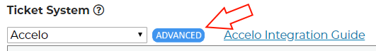
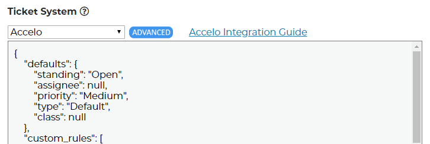

Advanced Options
================================

If you want finer control over integrations you can use the advanced options button.

Click here to open the menu.

This is what it looks like opened.

As new features and integrations are added this section will be filled with default data. The field names should be self explanitory but anything we get asked about will get explained here. 