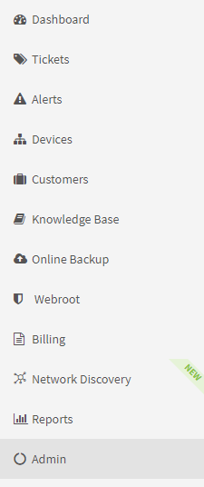
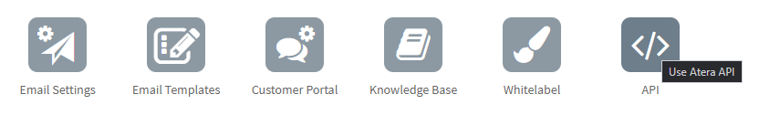
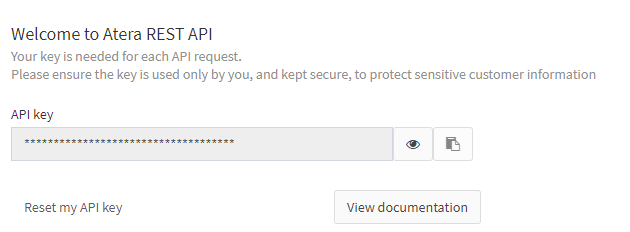
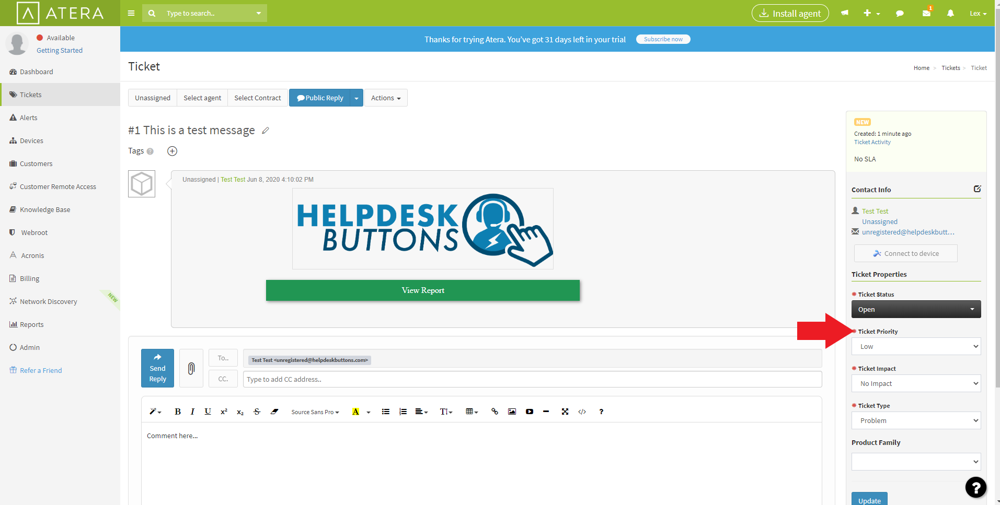
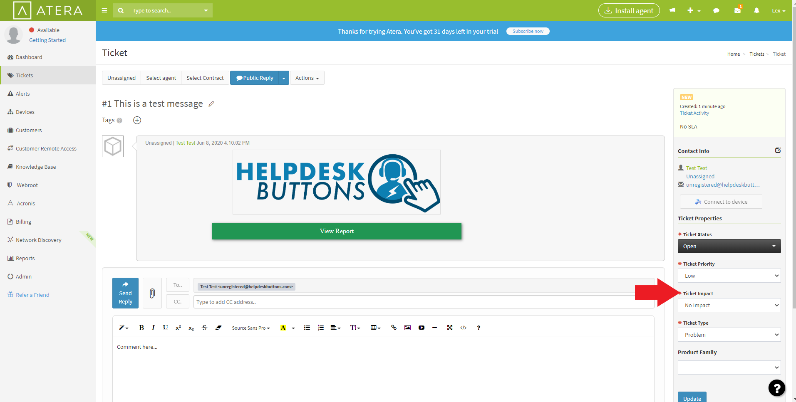
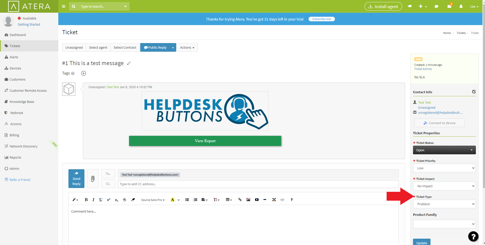

Atera Integration
===================

Get API Key
--------------------------

Click the Admin Tab

Next click on the API Tile in the Customer Facing Section

You can view the key by clicking the eye symbol or copy the key to the clipboard using the copy symbol.

Helpdeskbuttons.com Settings
-------------------------------

Select Atera as the ticket system. 

Enter your Ticket System API endpoint as shown (do not add add https:// or the path after the url)

*app.atera.com*

Paste your key into the API Key section

Click Update and the Integration Test button to send a test ticket. 

Some additional setup may be necessary in the :ref:`Advanced Integration Options <content/integration/advanced:Defaults>`.

Anti-Virus and AntiMalware
-----------------------------
It is not always necessary, but we recommend whitelisting the helpdeskbuttons installation folder (C:\\Program Files(x86)\\Helpdesk Button). We regularly submit our code through VirusTotal to make sure we are not getting flagged, but almost all AV/M interactions cause some sort of failure. `Webroot <https://docs.tier2tickets.com/content/general/firewall/#webroot>`_ in particular can cause issues with screenshots.

Advanced Integration Options
------------------------------

Defaults
^^^^^^^^

Please note that defaults for priority, type, and standing must be set for this integration to work properly.

Custom Rules
^^^^^^^^^^^^^

This is the list of variables that can be accessed when using the :ref:`Custom Rules <content/integration/advanced:Custom Rules>`. 

+-----------------------------------------------+--------------------------------------------------+
| Read/Write                                    | Read Only                                        |
+===============================================+==================================================+
| :ref:`content/integration/atera:*priority*`   | :ref:`content/integration/advanced:*selections*` |
+-----------------------------------------------+--------------------------------------------------+
| :ref:`content/integration/atera:*type*`       | :ref:`content/integration/advanced:*hostname*`   |
+-----------------------------------------------+--------------------------------------------------+
| :ref:`content/integration/atera:*impact*`     | :ref:`content/integration/advanced:*name*`       |
+-----------------------------------------------+--------------------------------------------------+
| :ref:`content/integration/advanced:*append*`  | :ref:`content/integration/advanced:*email*`      |
+-----------------------------------------------+--------------------------------------------------+
| :ref:`content/integration/advanced:*message*` | :ref:`content/integration/advanced:*ip*`         |
+-----------------------------------------------+--------------------------------------------------+
| :ref:`content/integration/advanced:*subject*` | :ref:`content/integration/advanced:*mac*`        | 
+-----------------------------------------------+--------------------------------------------------+

Field Definitions
^^^^^^^^^^^^^^^^^

*priority*
""""""""""

	**The ticket priority level (Urgent, Low, ect):**

|
|

*impact*
"""""""""

	**The ticket impact (No impact, Site Down, Crisis):**

|
|

*type*
"""""""

	**The issue type (Service Request, Incident, Problem, Alert):**

|
|

*other*
"""""""

There are additional variables which are common to all integrations. Those are documented :ref:`here <content/integration/advanced:Universally Available Variables>`

The fields labeled input_* contain information typed by the user only in the event that they are not found in the PSA