Autotask Documentation
=========================

This guide will show you how to set up your new Helpdesk Buttons with Autotask in as few as 15 minutes. 
You will need an administrative login for Autotask. 

Integration
--------------------------

Autotask integration requires three main parts:

`1) set up the API integration. <https://docs.tier2tickets.com/content/integration/autotask/#api-user>`_ 

`2) set up an unregistered user as a catchall account as a contact in your PSA <https://docs.tier2tickets.com/content/integration/autotask/#unregistered-user>`_

`3) configure helpdeskbuttons account. <https://docs.tier2tickets.com/content/integration/autotask/#helpdeskbuttons-com-settings>`_

Video Walkthrough
^^^^^^^^^^^^^^^^^^^^^^^^^^^^^^^^^^

.. raw:: html

    

        <iframe width="560" height="315" src="https://www.youtube.com/embed/096i4ZVAThQ" frameborder="0" allow="accelerometer; autoplay; encrypted-media; gyroscope; picture-in-picture" allowfullscreen></iframe>
    

1) API User
^^^^^^^^^^^^^^^^^^^^^^^^^^^^^^^^^^
The first step involves configuring an API user in Autotask. 

In the main Autotask menu, select Admin and then Resources. 

.. image:: images/at-image-9.png

Click the ‘New’ button to open the new user window.

Set up the account as normal. Make sure that the Security Level is set to 'API User (System)', and the 
Integration Vendor in the API Tracking Identifier section is set to 'Helpdesk Buttons - Tier2Tickets'. 
Also take note of the username and the password since you will need them later.

.. image:: images/at-image-04.png

2) Unregistered User
^^^^^^^^^^^^^^^^^^^^^^^^^^^^^^^^^^

You will also have to create a contact for any unregistered users to show up as when they submit a ticket.

Open the contacts page. 

.. image:: images/at-image-14.png

Click the ‘New’ button to create this contact.

Set the First name to be ‘Unregistered’ and the last name to be ‘User’ like shown 

Also set the Email Address for this contact to be ‘unregistered@helpdeskbuttons.com’ like shown 

.. image:: images/at-image-10.png

When you are finished, click ‘Save and Close’.

With that finished, now you will need to configure your information on the Helpdesk Button website. 

3) Helpdeskbuttons.com Settings
^^^^^^^^^^^^^^^^^^^^^^^^^^^^^^^^^^

Log into your account and browse to Settings or go to https://account.helpdeskbuttons.com/settings.php 

Under the Ticket System dropdown, select Autotask 

.. image:: images/at-image-13.png

Enter your Ticket System API endpoint as shown (do not add add https:// or the path after the url) 

Your Ticket System API key is in the format of ‘username@domain:password’ 

For instance in our example, the username for the API account we created earlier is tier2tickets@alexspcsandbox.com 
and we set the password to 1SuperSecurePassword@MG. 

This would result in the Ticket System API key being formatted like 

tier2tickets@alexspcsandbox.com:1SuperSecurePassword@MG

Once you have entered this information, click Update. 

At this point, the integration should be working. You can test this by pressing the button and submitting a ticket.

If you have trouble, give us a call and we can remote in and help you (833) 328-8866

API Access Settings
^^^^^^^^^^^^^^^^^^^^^^^^^^^^^^^^^^

For those of you who want to restrict the access the API user has, here is the security access we need: 
(a custom security level will need to be created and assigned to us with these permissions):

- CRM/Customer & Cancelations/Permission - All (For checking user and company data like address and email addresses)
- Service Desk/Tickets/View 	- All 
- Service Desk/Tickets/Add 	- Yes (Creating tickets)
- Service Desk/Tickets/Edit 	- Yes (Adding Notes to tickets)

Anti-Virus and AntiMalware
-----------------------------
It is not always necessary, but we recommend whitelisting the tier2tickets installation folder 
(C:\\Program Files(x86)\\tier2tickets). We regularly submit our code through VirusTotal to make sure we are not getting 
flagged, but almost all AV/M interactions cause some sort of failure. 
`Webroot <https://docs.tier2tickets.com/content/general/firewall/#webroot>`_ in particular can cause issues with screenshots.  

Dispatcher Rules
-----------------------------------------------

This is the list of variables that can be accessed when using the 
:ref:`Dispatcher Rules <content/automations/dispatcher:Dispatcher Rules>`.

Unless otherwise stated, using the plain text exactly as it appears on the ticket should work for setting the variables in the dispatcher rules. 

+----------------------------------------------------+-----------------------------------------------------+
| Read/Write                                         | Read Only                                           |
+====================================================+=====================================================+
| :ref:`content/integration/autotask:*priority*`     | :ref:`content/automations/dispatcher:*selections*`  |
+----------------------------------------------------+-----------------------------------------------------+
| :ref:`content/integration/autotask:*ticketStatus*` | :ref:`content/integration/autotask:*contactName*`   |
+----------------------------------------------------+-----------------------------------------------------+
| :ref:`content/integration/autotask:*queue*`        | :ref:`content/automations/dispatcher:*email*`       |
+----------------------------------------------------+-----------------------------------------------------+
| :ref:`content/integration/autotask:*type*`         | :ref:`content/automations/dispatcher:*ip*`          |
+----------------------------------------------------+-----------------------------------------------------+
| :ref:`content/automations/dispatcher:*msg*`        | :ref:`content/automations/dispatcher:*mac*`         |
+----------------------------------------------------+-----------------------------------------------------+
| :ref:`content/automations/dispatcher:*subject*`    | :ref:`content/automations/dispatcher:*hostname*`    | 
+----------------------------------------------------+-----------------------------------------------------+
| :ref:`content/automations/dispatcher:*append*`     | :ref:`content/integration/autotask:*businessName*`  | 
+----------------------------------------------------+-----------------------------------------------------+
| :ref:`content/integration/autotask:*priv_append*`  |                                                     | 
+----------------------------------------------------+-----------------------------------------------------+
| :ref:`content/integration/autotask:*source*`       |                                                     | 
+----------------------------------------------------+-----------------------------------------------------+
| :ref:`content/integration/autotask:*issue*`        |                                                     | 
+----------------------------------------------------+-----------------------------------------------------+
| :ref:`content/integration/autotask:*subIssue*`     |                                                     |
+----------------------------------------------------+-----------------------------------------------------+ 
| :ref:`content/integration/autotask:*worktype*`     |                                                     |
+----------------------------------------------------+-----------------------------------------------------+

Rule Field Definitions
^^^^^^^^^^^^^^^^^^^^^^^^^^^^^^^^^^^^^^^^^^^^

*priority*
""""""""""

	**The ticket priority level (Urgent, Low, ect):**

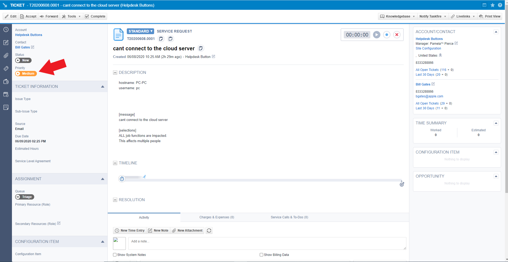

|
|

*businessName*
""""""""""""""""""""""

	**The name of the company the contact belongs to:**

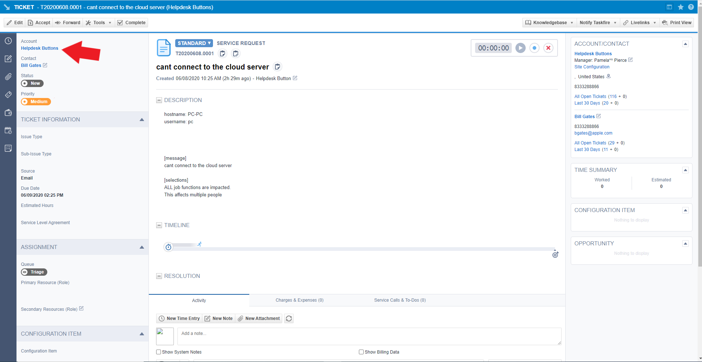

|
|

*ticketStatus*
""""""""""""""""

	**The ticket status (New, In Progress, etc):**

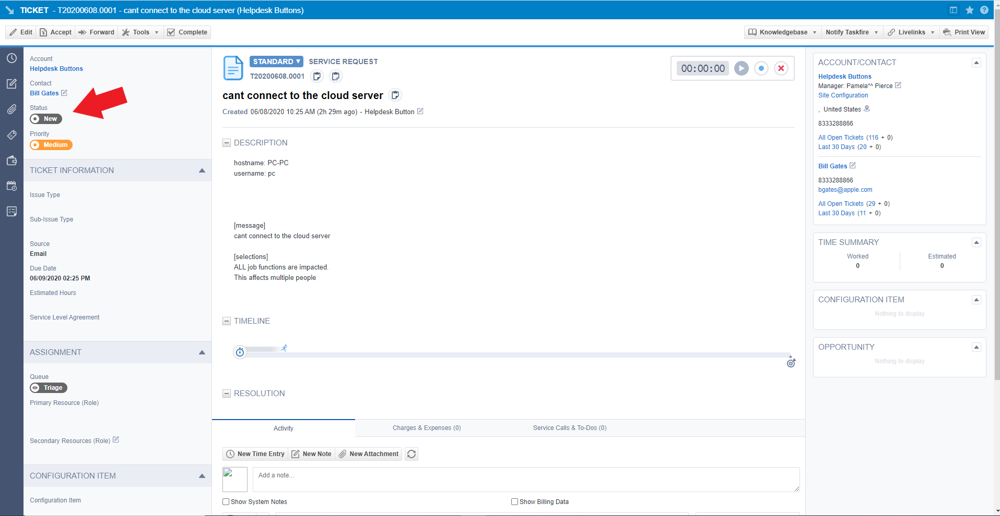

|
|

*queue*
"""""""

	**The queue the ticket will be put in:**

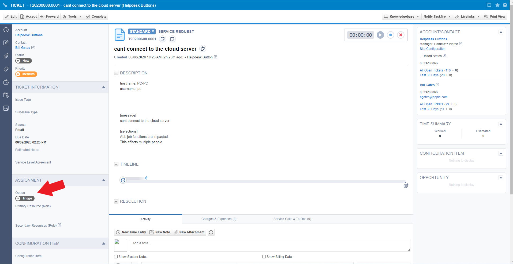

|
|

*type*
""""""

	**The issue type (Service Request, Incident, Problem, Alert):**

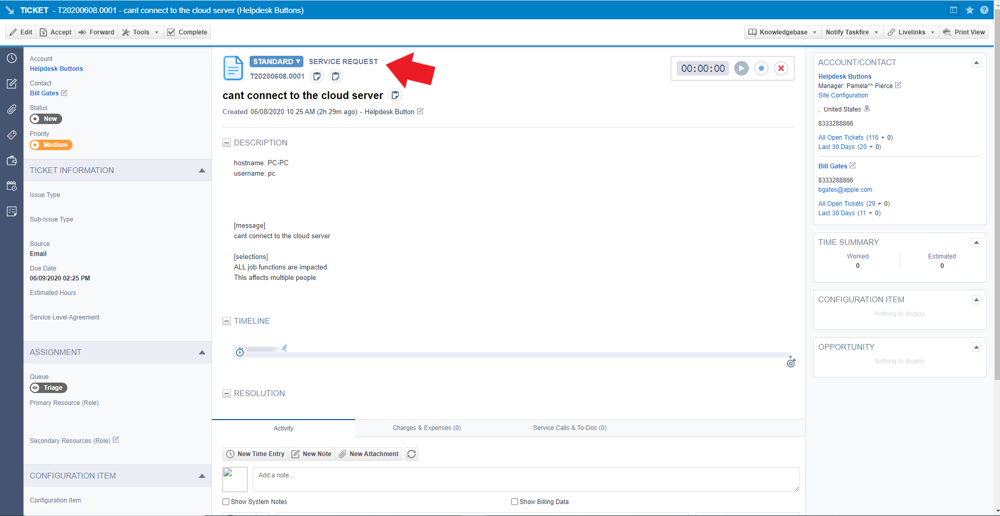

|
|

*source*
""""""""

	**The ticket source (Web Portal, Phone, Other):**

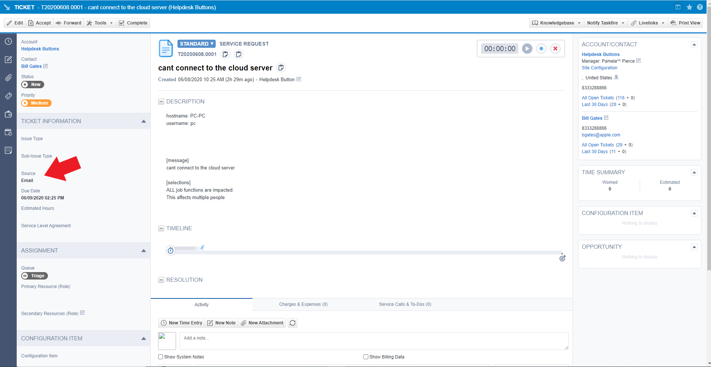

|
|

*priv_append*
"""""""""""""

	**Allows you to append information to the internal ticket note:**

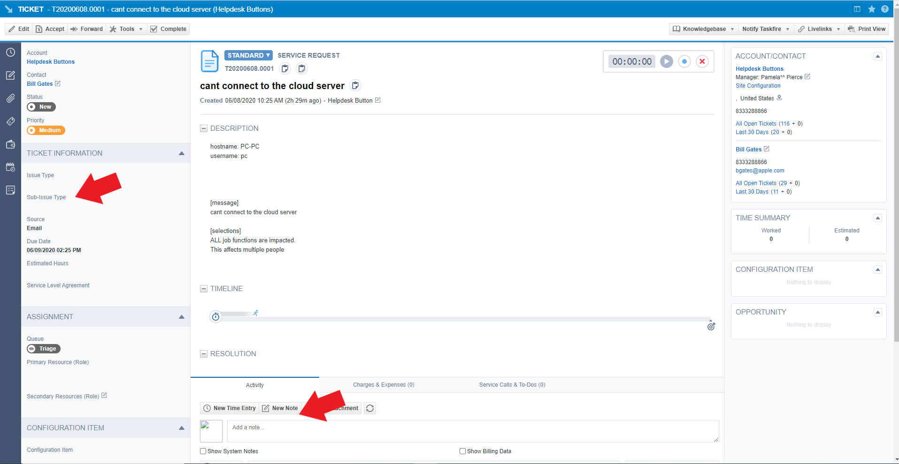

|
|

*contactName*
"""""""""""""

	**Refers to the client's name:**

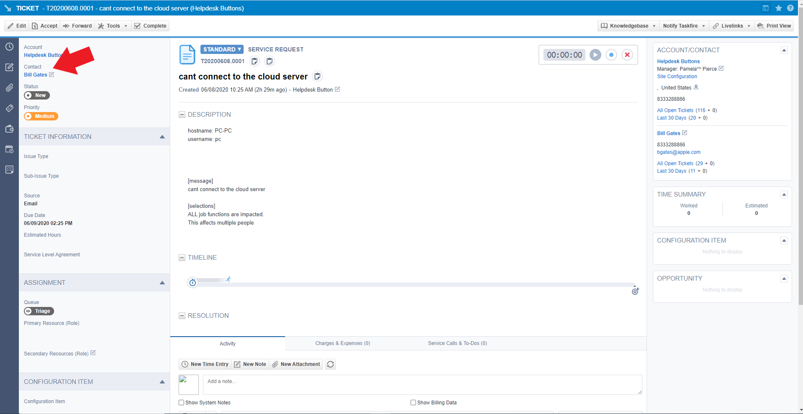

|
|

*issue*
"""""""

	**The primary ticket issue:**

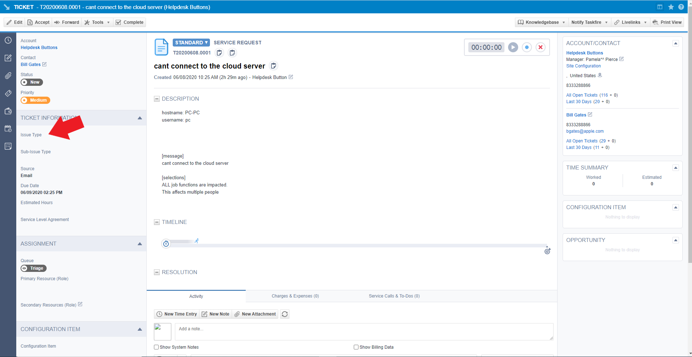

|
|

*subissue*
""""""""""

	**The secondary ticket issue:**

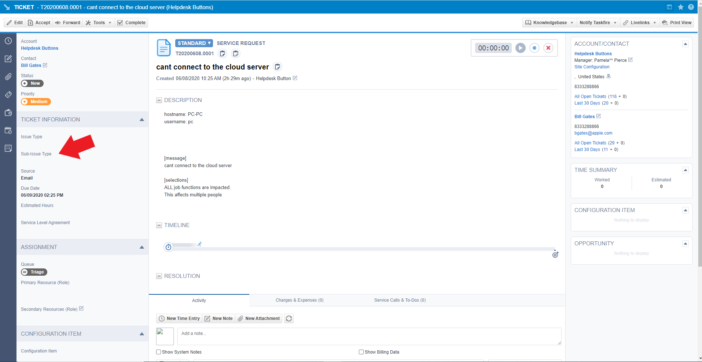

|
|

*worktype*
""""""""""

	**The worktype associated with the ticket:**

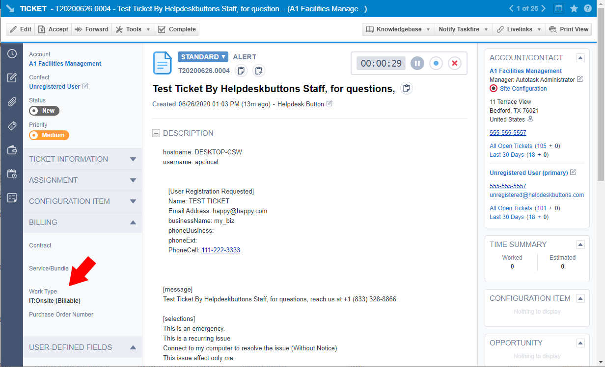
   
   
Worktype does not have an endpoint in the API yet, so customizing this needs to be based on the allocationCodeID. This id can be found when editing a work type in the URL. 
   
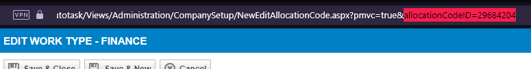

|
|

*other*
"""""""

There are additional variables which are common to all integrations. Those are documented 
:ref:`here <content/automations/dispatcher:Universally Available Variables>`

Setting up Webhooks
-----------------------------

Autotask does not yet have webhooks for ticket events, but we can simulate this functionality by setting up an Extension Callout and a couple of Workflow Rules.

Extension Callout
^^^^^^^^^^^^^^^^^^^^^^^^^^^^^^^^^^

First head to Admin -> Extension & Integrations -> Other Extensions & Tools -> Extensions Callout (Tickets)

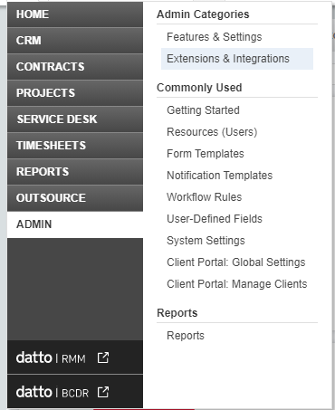

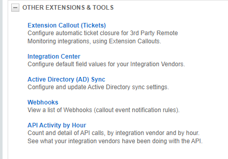

Click New Extension Callout

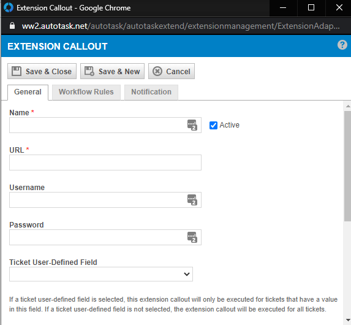

- Name the callout and make sure it is set to active.
- URL should be listed on your `Integration Settings Page. <https://dev.helpdeskbuttons.com/backend.php>`_ under the Ticket Notification section.
- No Username or Password is needed for our API
- HTTP Transport Method should be POST
- Data Format should be Name Value Pair
 
Workflow Rules
^^^^^^^^^^^^^^^^^^^^^^^^^^^^^^^^^^

Navigate to Admin -> Workflow Rules

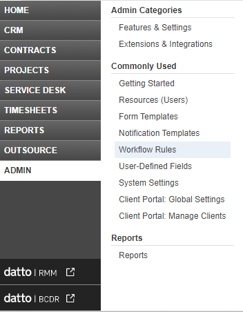

You will want to create two rules one for Ticket Creation and Update and another for Ticket Notes

New Ticket/Ticket Updated
"""""""""""""""""""""""""""""""""

Here is an example of a workflow that sends when a ticket is created/updated by anyone

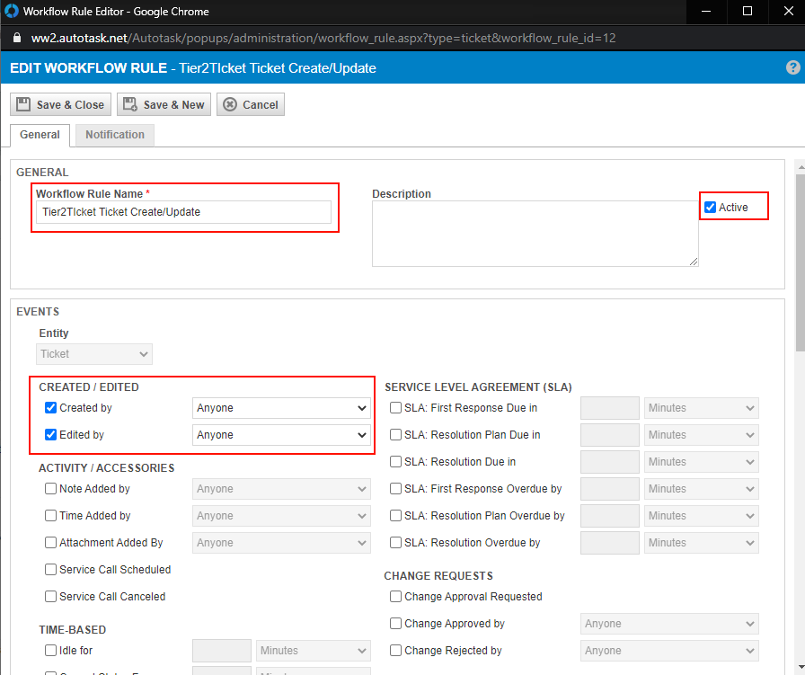

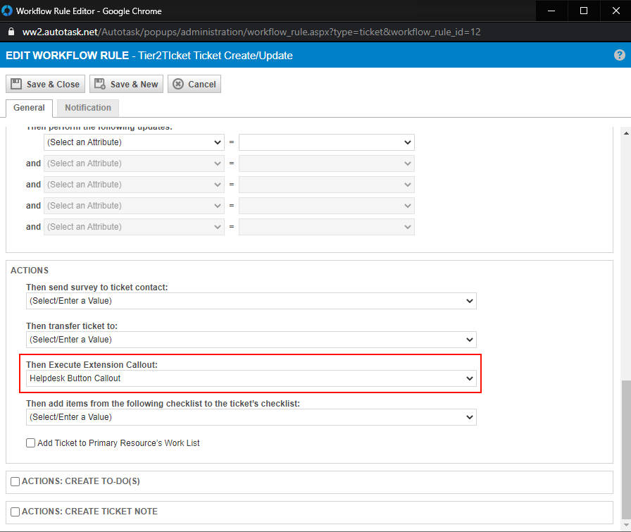

Note added to ticket
"""""""""""""""""""""""""""""""""

Create another workflow rule but for the EVENT select Note Created by anyone 

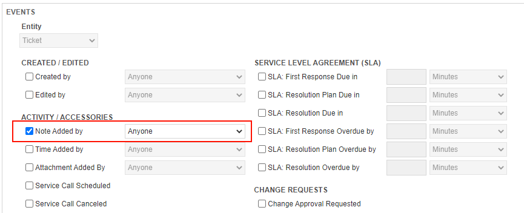

