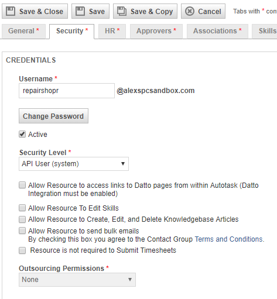

Autotask Integration
=====================
This guide will show you how to set up your new Helpdesk Buttons with Autotask. This process is quick and easy. You will need an administrative login for AutoTask. 

The first step involves configuring a Manager user in AutoTask. 

In the main AutoTask menu, select Admin and then Resources. 

.. image:: images/at-image-9.png
Click the ‘New’ button to open the new user window. 

Set up the account as normal. The key part of the account setup is to make sure that the Security Level is set to ‘Manager (system)’. Also take note of the username and the password since you will need them later. 

You will also have to create a contact for any unregistered users to show up as when they submit a ticket. 

Open the contacts page. 

.. image:: images/at-image-14.png
Click the ‘New’ button to create this contact. 

Set the First name to be ‘Unregistered’ and the last name to be ‘User’ like shown 

Also set the Email Address for this contact to be ‘unregistered@helpdeskbuttons.com’ like shown 

.. image:: images/at-image-10.png
When you are finished, click ‘Save and Close’. 

With that finished, now you will need to configure your information on the Helpdesk Button website. 

Log into your account and browse to Settings or go to https://account.helpdeskbuttons.com/settings.php 

Under the Ticket System dropdown, select AutoTask 

.. image:: images/at-image-13.png
Enter your Ticket System API endpoint as shown (it will automatically add https:// and the path after the url) 

Your Ticket System API key is in the format of ‘username@domain:password’ 

For instance in our example, the username for the API account we created earlier is  
repairshopr@alexspcsandbox.com and we set an incredibly secure password of 12345. 

This would result in the Ticket System API key being formatted like 

repairshopr@alexspcsandbox.com:12345 

Once you have entered this information, click Update. 

At this point, the integration is working. You can test this by pressing the button and submitting a ticket. 