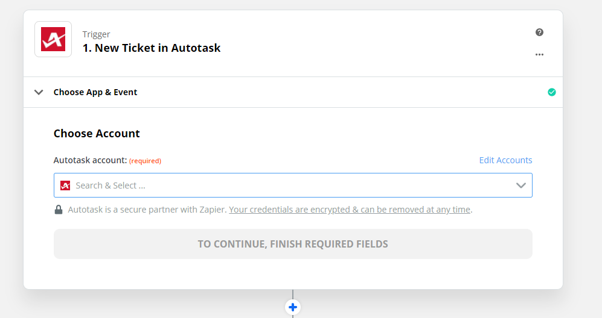
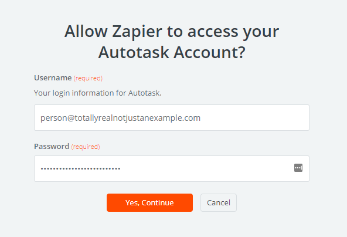
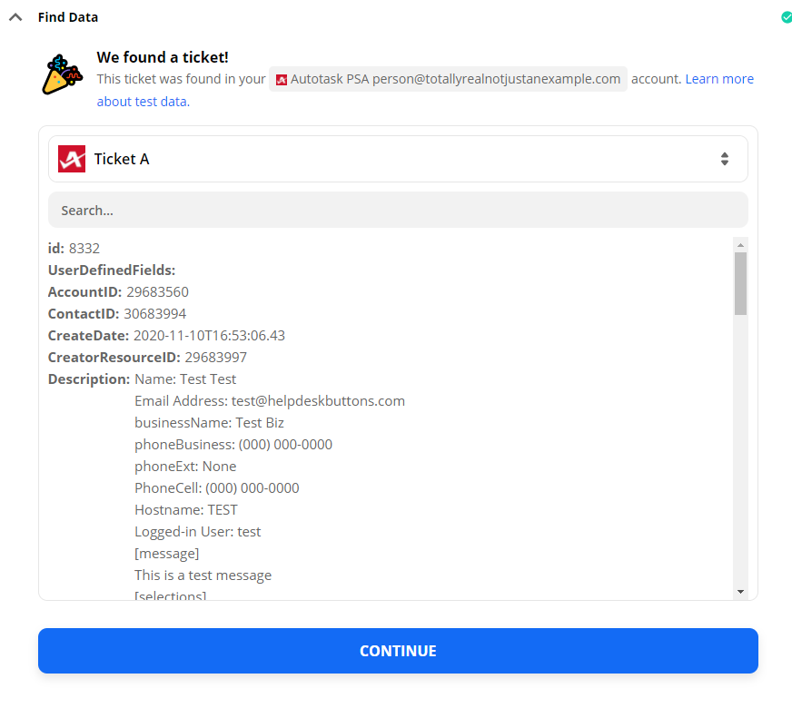
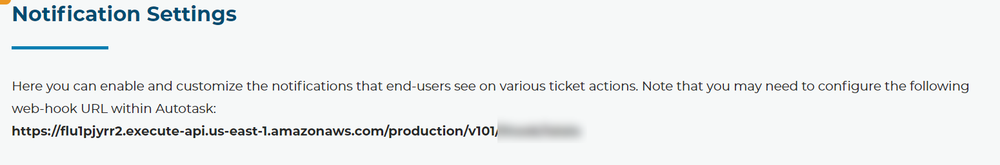
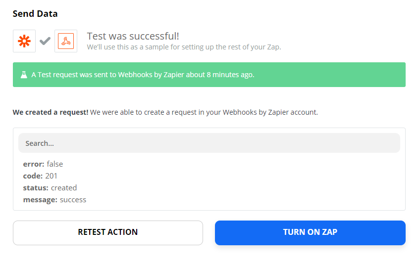
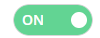

Autotask Documentation
=========================

This guide will show you how to set up your new Helpdesk Buttons with Autotask in as few as 15 minutes. You will need an administrative login for Autotask. 

Integration
--------------------------

Autotask integration requires three main parts:

`1) set up the API integration. <https://docs.tier2tickets.com/content/integration/autotask/#api-user>`_ 

`2) set up an unregistered user as a catchall account as a contact in your PSA <https://docs.tier2tickets.com/content/integration/autotask/#unregistered-user>`_

`3) configure helpdeskbuttons account. <https://docs.tier2tickets.com/content/integration/autotask/#helpdeskbuttons-com-settings>`_

Video Walkthrough
^^^^^^^^^^^^^^^^^^^^^^^^^^^^^^^^^^

.. raw:: html

    

        <iframe width="560" height="315" src="https://www.youtube.com/embed/096i4ZVAThQ" frameborder="0" allow="accelerometer; autoplay; encrypted-media; gyroscope; picture-in-picture" allowfullscreen></iframe>
    

1) API User
^^^^^^^^^^^^^^^^^^^^^^^^^^^^^^^^^^
The first step involves configuring an API user in Autotask. 

In the main Autotask menu, select Admin and then Resources. 

.. image:: images/at-image-9.png

Click the ‘New’ button to open the new user window.

Set up the account as normal. Make sure that the Security Level is set to 'API User (System)', and the Integration Vendor in the API Tracking Identifier section is set to 'Helpdesk Buttons - Tier2Tickets'. Also take note of the username and the password since you will need them later.

.. image:: images/at-image-04.png

2) Unregistered User
^^^^^^^^^^^^^^^^^^^^^^^^^^^^^^^^^^

You will also have to create a contact for any unregistered users to show up as when they submit a ticket.

Open the contacts page. 

.. image:: images/at-image-14.png

Click the ‘New’ button to create this contact.

Set the First name to be ‘Unregistered’ and the last name to be ‘User’ like shown 

Also set the Email Address for this contact to be ‘unregistered@helpdeskbuttons.com’ like shown 

.. image:: images/at-image-10.png

When you are finished, click ‘Save and Close’.

With that finished, now you will need to configure your information on the Helpdesk Button website. 

3) Helpdeskbuttons.com Settings
^^^^^^^^^^^^^^^^^^^^^^^^^^^^^^^^^^

Log into your account and browse to Settings or go to https://account.helpdeskbuttons.com/settings.php 

Under the Ticket System dropdown, select Autotask 

.. image:: images/at-image-13.png

Enter your Ticket System API endpoint as shown (do not add add https:// or the path after the url) 

Your Ticket System API key is in the format of ‘username@domain:password’ 

For instance in our example, the username for the API account we created earlier is tier2tickets@alexspcsandbox.com and we set the password to 1SuperSecurePassword@MG. 

This would result in the Ticket System API key being formatted like 

tier2tickets@alexspcsandbox.com:1SuperSecurePassword@MG

Once you have entered this information, click Update. 

At this point, the integration should be working. You can test this by pressing the button and submitting a ticket.

If you have trouble, give us a call and we can remote in and help you (833) 328-8866

API Access Settings
^^^^^^^^^^^^^^^^^^^^^^^^^^^^^^^^^^

For those of you who want to restrict the access the API user has, here is the security access we need: (a custom security level will need to be created and assigned to us with these permissions):

- CRM/Customer & Cancelations/Permission - All (For checking user and company data like address and email addresses)
- Service Desk/Tickets/View 	- All 
- Service Desk/Tickets/Add 	- Yes (Creating tickets)
- Service Desk/Tickets/Edit 	- Yes (Adding Notes to tickets)

Anti-Virus and AntiMalware
-----------------------------
It is not always necessary, but we recommend whitelisting the helpdeskbuttons installation folder (C:\\Program Files(x86)\\Helpdesk Button). We regularly submit our code through VirusTotal to make sure we are not getting flagged, but almost all AV/M interactions cause some sort of failure. `Webroot <https://docs.tier2tickets.com/content/general/firewall/#webroot>`_ in particular can cause issues with screenshots.  

Dispatcher Rules
-----------------------------------------------

This is the list of variables that can be accessed when using the :ref:`Dispatcher Rules <content/automations/dispatcher:*BETA* Dispatcher Rules>`.

+----------------------------------------------------+-----------------------------------------------------+
| Read/Write                                         | Read Only                                           |
+====================================================+=====================================================+
| :ref:`content/integration/autotask:*priority*`     | :ref:`content/automations/dispatcher:*selections*`  |
+----------------------------------------------------+-----------------------------------------------------+
| :ref:`content/integration/autotask:*ticketStatus*` | :ref:`content/integration/autotask:*contactName*`   |
+----------------------------------------------------+-----------------------------------------------------+
| :ref:`content/integration/autotask:*queue*`        | :ref:`content/automations/dispatcher:*email*`       |
+----------------------------------------------------+-----------------------------------------------------+
| :ref:`content/integration/autotask:*type*`         | :ref:`content/automations/dispatcher:*ip*`          |
+----------------------------------------------------+-----------------------------------------------------+
| :ref:`content/automations/dispatcher:*message*`    | :ref:`content/automations/dispatcher:*mac*`         |
+----------------------------------------------------+-----------------------------------------------------+
| :ref:`content/automations/dispatcher:*subject*`    | :ref:`content/automations/dispatcher:*hostname*`    | 
+----------------------------------------------------+-----------------------------------------------------+
| :ref:`content/automations/dispatcher:*append*`     |                                                     | 
+----------------------------------------------------+-----------------------------------------------------+
| :ref:`content/integration/autotask:*priv_append*`  |                                                     | 
+----------------------------------------------------+-----------------------------------------------------+
| :ref:`content/integration/autotask:*source*`       |                                                     | 
+----------------------------------------------------+-----------------------------------------------------+
| :ref:`content/integration/autotask:*issue*`        |                                                     | 
+----------------------------------------------------+-----------------------------------------------------+
| :ref:`content/integration/autotask:*subIssue*`     |                                                     |
+----------------------------------------------------+-----------------------------------------------------+ 

Rule Field Definitions
^^^^^^^^^^^^^^^^^^^^^^^^^^^^^^^^^^^^^^^^^^^^

*priority*
""""""""""

	**The ticket priority level (Urgent, Low, ect):**

.. image:: images/autotask-priority.png
   :target: https://docs.tier2tickets.com/_images/autotask-priority.png

|
|

*ticketStatus*
""""""""""""""""

	**The ticket status (New, In Progress, etc):**

.. image:: images/autotask-ticketStatus.png
   :target: https://docs.tier2tickets.com/_images/autotask-ticketStatus.png

|
|

*queue*
"""""""

	**The queue the ticket will be put in:**

.. image:: images/autotask-queue.png
   :target: https://docs.tier2tickets.com/_images/autotask-queue.png

|
|

*type*
""""""

	**The issue type (Service Request, Incident, Problem, Alert):**

.. image:: images/autotask-type.png
   :target: https://docs.tier2tickets.com/_images/autotask-type.png

|
|

*source*
""""""""

	**The ticket source (Web Portal, Phone, Other):**

.. image:: images/autotask-source.png
   :target: https://docs.tier2tickets.com/_images/autotask-source.png

|
|

*priv_append*
"""""""""""""

	**Allows you to append information to the internal ticket note:**

.. image:: images/autotask-priv_append.png
   :target: https://docs.tier2tickets.com/_images/autotask-priv_append.png

|
|

*contactName*
"""""""""""""

	**Refers to the client's name:**

.. image:: images/autotask-contactName.png
   :target: https://docs.tier2tickets.com/_images/autotask-contactName.png

|
|

*issue*
"""""""

	**The primary ticket issue:**

.. image:: images/autotask-issue.png
   :target: https://docs.tier2tickets.com/_images/autotask-issue.png

|
|

*subissue*
""""""""""

	**The secondary ticket issue:**

.. image:: images/autotask-subissue.png
   :target: https://docs.tier2tickets.com/_images/autotask-subissue.png

|
|

*worktype*
""""""""""

	**The worktype associated with the ticket:**

.. image:: images/autotask-worktype.png
   :target: https://docs.tier2tickets.com/_images/autotask-worktype.png

|
|

*other*
"""""""

There are additional variables which are common to all integrations. Those are documented :ref:`here <content/automations/dispatcher:Universally Available Variables>`

Setting up Webhooks
-----------------------------

Autotask does not yet have webhooks for ticket events, but we can simulate this functionality (with a delay of 30 minutes or so) by integrating your Autotask instance with Zapier. This will require a premium Zapier account. Once webhooks are implemented by Autotask for ticket events, we will be able to use them instead of this workaround.

These are Zaps you might need
^^^^^^^^^^^^^^^^^^^^^^^^^^^^^^^^^^^^^^

- `New Ticket Event <https://zapier.com/app/editor/template/375374>`_

- `Ticket Update Event <https://zapier.com/app/editor/template/375403>`_

- `Ticket Note Event <https://zapier.com/app/editor/template/375427>`_

For each of the Zaps you want to enable, you will have to perform simple steps. You will need access to our backend and Zapier.

Step By Step Instructions
^^^^^^^^^^^^^^^^^^^^^^^^^^^^^^^^^^^^^^^^^^

Connect Zapier to Autotask
"""""""""""""""""""""""""""""""""""""""""
- This is the first screen you should see once you are logged in. 

- If you already have a connection with your Autotask instance you can select it here. if not you will need to connect your Autotask instance to Zapier via a username and password.

- This is an optional step but it is recommended: Once you have chosen your connection, you can test that connection by clicking the test button and following the instructions, in this case they want you to put in a new test ticket. 

Give Zapier Your Webhook URL
""""""""""""""""""""""""""""""""""""""""""""

- Next you want to go to our back end and get the URL for your webhooks to go to. This will be on the `Notification <https://account.helpdeskbuttons.com/notifications.php>`_ page under Automations. It should be listed at the top of the page:

- In Zapier, click on the second Action (Post), Copy and paste the URL into the URL field in the section called Customize Request, and make sure the Payload type is Json:

.. image:: images/autotask_zapier/customize_request.gif

- This is an optional step but it is recommended: The Sent data section can test your setup by sending a hook to your url. Once you have made sure the request if set up, try sending the request to your url by clicking the test button. Hopefully you see a message indicating a successful test.

Turn on your Zap
"""""""""""""""""""""""""""""""

- Make sure to turn on your Zap by clicking either the toggle on the bottom of the screen or the one next to the share button at the top.

