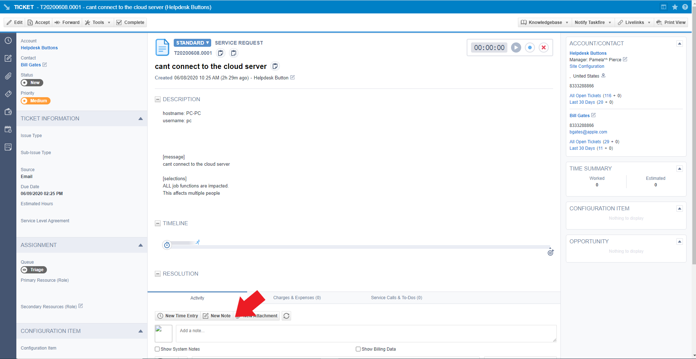

Autotask Integration
=====================
This guide will show you how to set up your new Helpdesk Buttons with Autotask. You will need an administrative login for Autotask. 

Video Walkthrough
-----------------------------

.. raw:: html

    

        <iframe width="560" height="315" src="https://www.youtube.com/embed/096i4ZVAThQ" frameborder="0" allow="accelerometer; autoplay; encrypted-media; gyroscope; picture-in-picture" allowfullscreen></iframe>
    

API User
----------
The first step involves configuring an API user in Autotask. 

In the main Autotask menu, select Admin and then Resources. 

.. image:: images/at-image-9.png

Click the ‘New’ button to open the new user window.

Set up the account as normal. Make sure that the Security Level is set to 'API User (System)', and the Integration Vendor in the API Tracking Identifier section is set to 'Helpdesk Buttons - Tier2Tickets'. Also take note of the username and the password since you will need them later.

Unregistered User
------------------

You will also have to create a contact for any unregistered users to show up as when they submit a ticket.

Open the contacts page. 

.. image:: images/at-image-14.png

Click the ‘New’ button to create this contact.

Set the First name to be ‘Unregistered’ and the last name to be ‘User’ like shown 

Also set the Email Address for this contact to be ‘unregistered@helpdeskbuttons.com’ like shown 

When you are finished, click ‘Save and Close’.

With that finished, now you will need to configure your information on the Helpdesk Button website. 

Helpdeskbuttons.com Settings
-----------------------------

Log into your account and browse to Settings or go to https://account.helpdeskbuttons.com/settings.php 

Under the Ticket System dropdown, select Autotask 

.. image:: images/at-image-13.png

Enter your Ticket System API endpoint as shown (do not add add https:// or the path after the url) 

Your Ticket System API key is in the format of ‘username@domain:password’ 

For instance in our example, the username for the API account we created earlier is tier2tickets@alexspcsandbox.com and we set the password to 1SuperSecurePassword@MG. 

This would result in the Ticket System API key being formatted like 

tier2tickets@alexspcsandbox.com:1SuperSecurePassword@MG

Once you have entered this information, click Update. 

At this point, the integration should be working. You can test this by pressing the button and submitting a ticket.

If you have trouble, give us a call and we can remote in you (833) 328-8866

API Access Settings
--------------------

For those of you who want to restrict the access the API user has, here is the security access we need: (a custom security level will need to be created and assigned to us with these permissions):

- CRM/Customer & Cancelations/Permission - All (For checking user and company data like address and email addresses)
- Service Desk/Tickets/View 	- All 
- Service Desk/Tickets/Add 	- Yes (Creating tickets)
- Service Desk/Tickets/Edit 	- Yes (Adding Notes to tickets)

Anti-Virus and AntiMalware
-----------------------------
It is not always necessary, but we recommend whitelisting the helpdeskbuttons installation folder (C:\\Program Files(x86)\\Helpdesk Button). We regularly submit our code through VirusTotal to make sure we are not getting flagged, but almost all AV/M interactions cause some sort of failure. `Webroot <https://docs.tier2tickets.com/content/general/firewall/#webroot>`_ in particular can cause issues with screenshots.  

Dispatcher Rules
-----------------------------------------------

This is the list of variables that can be accessed when using the :ref:`Dispatcher Rules <content/automations/dispatcher:*BETA* Dispatcher Rules>`.

+----------------------------------------------------+-----------------------------------------------------+
| Read/Write                                         | Read Only                                           |
+====================================================+=====================================================+
| :ref:`content/integration/autotask:*priority*`     | :ref:`content/automations/dispatcher:*selections*`  |
+----------------------------------------------------+-----------------------------------------------------+
| :ref:`content/integration/autotask:*ticketStatus*` | :ref:`content/integration/autotask:*contactName*`   |
+----------------------------------------------------+-----------------------------------------------------+
| :ref:`content/integration/autotask:*queue*`        | :ref:`content/automations/dispatcher:*email*`       |
+----------------------------------------------------+-----------------------------------------------------+
| :ref:`content/integration/autotask:*type*`         | :ref:`content/automations/dispatcher:*ip*`          |
+----------------------------------------------------+-----------------------------------------------------+
| :ref:`content/automations/dispatcher:*message*`    | :ref:`content/automations/dispatcher:*mac*`         |
+----------------------------------------------------+-----------------------------------------------------+
| :ref:`content/automations/dispatcher:*subject*`    | :ref:`content/automations/dispatcher:*hostname*`    | 
+----------------------------------------------------+-----------------------------------------------------+
| :ref:`content/automations/dispatcher:*append*`     |                                                     | 
+----------------------------------------------------+-----------------------------------------------------+
| :ref:`content/integration/autotask:*priv_append*`  |                                                     | 
+----------------------------------------------------+-----------------------------------------------------+
| :ref:`content/integration/autotask:*source*`       |                                                     | 
+----------------------------------------------------+-----------------------------------------------------+
| :ref:`content/integration/autotask:*issue*`        |                                                     | 
+----------------------------------------------------+-----------------------------------------------------+
| :ref:`content/integration/autotask:*subIssue*`     |                                                     |
+----------------------------------------------------+-----------------------------------------------------+ 

Field Definitions
^^^^^^^^^^^^^^^^^

*priority*
""""""""""

	**The ticket priority level (Urgent, Low, ect):**

.. image:: images/autotask-priority.png
   :target: https://docs.tier2tickets.com/_images/autotask-priority.png

|
|

*ticketStatus*
""""""""""""""""

	**The ticket status (New, In Progress, etc):**

.. image:: images/autotask-ticketStatus.png
   :target: https://docs.tier2tickets.com/_images/autotask-ticketStatus.png

|
|

*queue*
"""""""

	**The queue the ticket will be put in:**

|
|

*type*
""""""

	**The issue type (Service Request, Incident, Problem, Alert):**

|
|

*source*
""""""""

	**The ticket source (Web Portal, Phone, Other):**

.. image:: images/autotask-source.png
   :target: https://docs.tier2tickets.com/_images/autotask-source.png

|
|

*priv_append*
"""""""""""""

	**Allows you to append information to the internal ticket note:**

|
|

*contactName*
"""""""""""""

	**Refers to the client's name:**

.. image:: images/autotask-contactName.png
   :target: https://docs.tier2tickets.com/_images/autotask-contactName.png

|
|

*issue*
"""""""

	**The primary ticket issue:**

.. image:: images/autotask-issue.png
   :target: https://docs.tier2tickets.com/_images/autotask-issue.png

|
|

*subissue*
""""""""""

	**The secondary ticket issue:**

|
|

*worktype*
""""""""""

	**The worktype associated with the ticket:**

.. image:: images/autotask-worktype.png
   :target: https://docs.tier2tickets.com/_images/autotask-worktype.png

|
|

*other*
"""""""

There are additional variables which are common to all integrations. Those are documented :ref:`here <content/automations/dispatcher:Universally Available Variables>`
