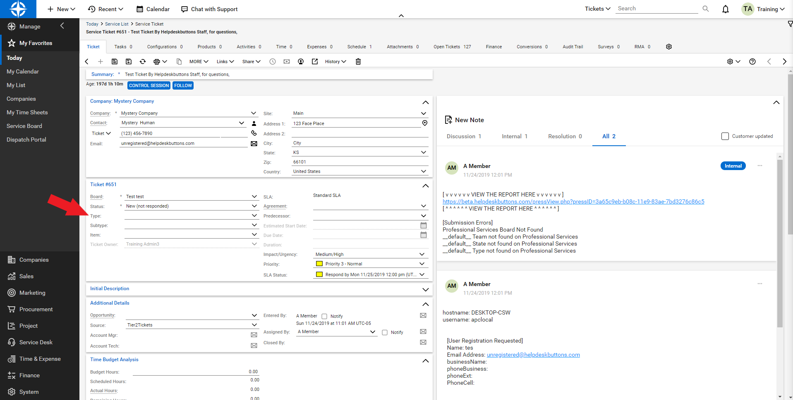

Connectwise Integration
========================
Setting up Connectwise Manage to work with Helpdesk Buttons is very easy. You will have to do some basic setup in your ConnectWise Manage system first though.

Unregistered User
-------------------

You will start off by logging into your ConnectWise Manage instance. The first step is to create a dummy company to catch tickets from unregistered users (If you already have a catch all that can submit tickets feel free to use that company). Fill out the required fields with your companies information and remember to click save.  You might name the company “unregistered users” or something to that effect.

.. image:: images/cw-image-10.png
  :width: 400
  :alt: Alternative text

Once the company has been created, select Company Finance

.. image:: images/cw-image-4.png

Set the newly created company to ‘Active’ and click ‘Save’.

.. image:: images/cw-image-8.png

Create an ‘Unregistered’ contact This must have the email address unregistered@helpdeskbuttons.com

.. image:: images/cw-image-9.png

This is the user which any Button Press tickets appear to come from if the user is unregistered. Remember to click save.

You are now done setting up your company and contact.

Get an API Key
------------------

Next step is to create an API key.

First you need your company name. This appears on the login screen.

.. image:: images/cw-image-5.png

Log into ConnectWise Manage and then select System and then Members

Select the ‘API Members’ tab.

.. image:: images/cw-image-6.png

Click on the ‘New’ button and set up the new API member

.. image:: images/cw-image-2.png

Enter a member ID and name which fits your organization. Select the appropriate System options according to how your ConnectWise Manage system is configured.

**Take note of the Service Defaults as they can effect the way tickets come into the system.**

Be sure to click ‘Save’ when everything looks correct.

Next, browse to the ‘API Keys’ tab.

Click ‘New’ and set an appropriate description.

Be sure to copy both the Public and Private Keys

Once this has been set up, you will have all the information required.

Helpdeskbuttons.com Settings
------------------------------

Log into your Helpdeskbuttons.com account. Select settings and then Backend Information

.. image:: images/cw-image-1.png

Select ‘Connectwise manage’ for the ticket system

For the Ticket System API endpoint you would use

yourconnectwiseinstance.com/v4_6_release

Do not Substitute the /v4_6_release part for your ConnectWise version, this is the API version, and should always be se to v4_6_release.

The Ticket System API Key format is as follows

Companyid+publickey:privatekey

For example

Comp_a+123asd4asabcd:asdf38judj234

Comp_a is the company ID normally entered on the login screen

123asd4asabcd is the example public key for the API

Asdf38judj234 is the example private key for the API

Make sure that there is a + between the company ID and a : between the public and private key.

Once you have entered the correct information on the Helpdeskbutton page, make to click Update so it saves the changes.

Test by submitting a ticket using the button.

Manage Configurations (BETA)
----------------------------

Our Software will attempt to attach configurations from the users company whose device id's match the hostname of the computer submitting the ticket.

API Access Settings
--------------------

For those of you who want to restrict the access the API user has, here is the security access we need: (a custom role will need to be created and assigned to us with these permissions):

- Companies/Company Maintenance/Inquire Level - All (For gathering company data like street addresses)
- Companies/Contacts/Inquire Level - All (For gathering contact data like email addresses)
- Service Desk/Service Ticket - Dependencies/ Add, Edit, Inquire Level - All (Adding/editing/reading notes and attachments on tickets)
- Service Desk/Service Ticket/ Add, Edit, Inquire Level - All (Adding/editing/reading tickets)

*New in version 6 (BETA)*

- Companies/Configurations/Inquire Level - All (For including configurations pertaining to the ticket)

The group is based on your company, but it can be tricky. We recommend leaving this as Admin as it the integration will require access to view contact information based on the clients input. To avoid errors, your staff would need to make sure that no one puts in an email address that corresponds to a contact that is not covered by the group to which this API user belongs. To be clear, the permissions don't need to be Admin, but the group does. This will allow us access to all of your customers, but only limited access to each.

Keep in mind that this list is based on the current feature set. With the expansion of the product, different security settings may need to be tweaked in the future.

Anti-Virus and AntiMalware
-----------------------------
It is not always necessary, but we recommend whitelisting the helpdeskbuttons installation folder (C:\\Program Files(x86)\\Helpdesk Button). We regularly submit our code through VirusTotal to make sure we are not getting flagged, but almost all AV/M interactions cause some sort of failure. `Webroot <https://docs.tier2tickets.com/content/general/firewall/#webroot>`_ in particular can cause issues with screenshots.

Advanced Integration Options
------------------------------

Defaults
^^^^^^^^^

Many of the fields can be set to "__default__"

Note: State, Team and Type are all related to the Board. For any customizations to those fields 
do not use the "__default__" Board. Please provide the Board by name (This also applies to Custom Rules).

Custom Rules
^^^^^^^^^^^^^

This is the list of variables that can be accessed when using the :ref:`Custom Rules <content/integration/advanced:Custom Rules>`. 

+-----------------+---------------+
| Read/Write      | Read Only     |
+=================+===============+
| priority        | selections    |
+-----------------+---------------+
| state           | name          |
+-----------------+---------------+
| team            | email         |
+-----------------+---------------+
| type            | ip            |
+-----------------+---------------+
| message         | mac           |
+-----------------+---------------+
| subject         | hostname      | 
+-----------------+---------------+
| source          |               | 
+-----------------+---------------+
| impact          |               | 
+-----------------+---------------+
| urgency         |               |
+-----------------+---------------+
| owner           |               | 
+-----------------+---------------+
| board           |               | 
+-----------------+---------------+
| append          |               | 
+-----------------+---------------+

Field Definitions
^^^^^^^^^^^^^^^^^

*priority*
""""""""""

refers to the ticket priority (Urgent, Low, ect)

*impact* and *urgency*
""""""""""""""""""""""

can set priority via the SLA priority matrix

*state*
"""""""

refers to the ticket status (New, In Progress, etc)

.. image:: images/cw-state.png
   :target: https://docs.tier2tickets.com/_images/cw-state.png

*team*
""""""

refers to the queue the ticket will be put in

.. image:: images/cw-team.png
   :target: https://docs.tier2tickets.com/_images/cw-team.png

*type*
""""""

refers to the issue type (Service Request, Incident, Problem, Alert)

*owner*
"""""""

refers to the agent that will be assigned this ticket

.. image:: images/cw-owner.png
   :target: https://docs.tier2tickets.com/_images/cw-owner.png

*source*
""""""""

refers to the ticket source (Web Portal, Etc)

.. image:: images/cw-source.png
   :target: https://docs.tier2tickets.com/_images/cw-source.png

*board*
""""""""

refers to the board the ticket will be put under 

*priv_append*
"""""""""""""

allows you to append information to the internal ticket note

.. image:: images/cw-priv_append.png
   :target: https://docs.tier2tickets.com/_images/cw-priv_append.png

*other*
"""""""

There are additional variables which are common to all integrations. Those are documented :ref:`here <content/integration/advanced:Universally Available Variables>`
