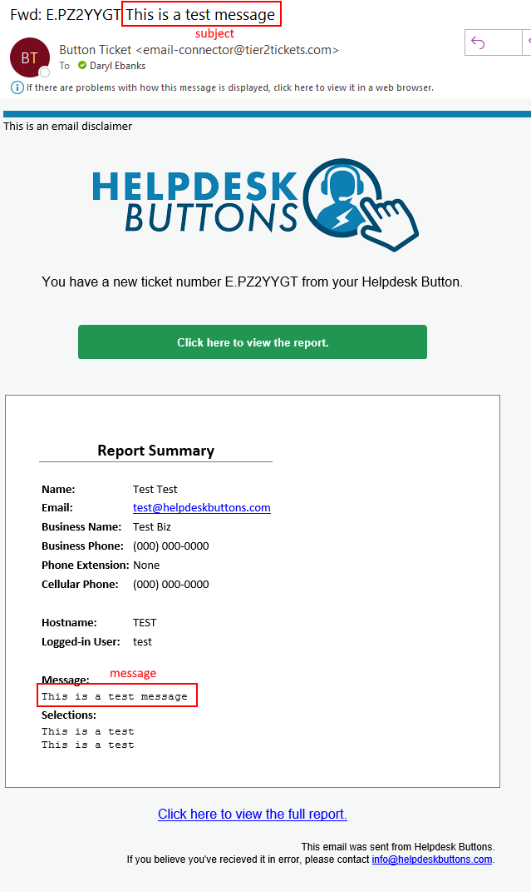
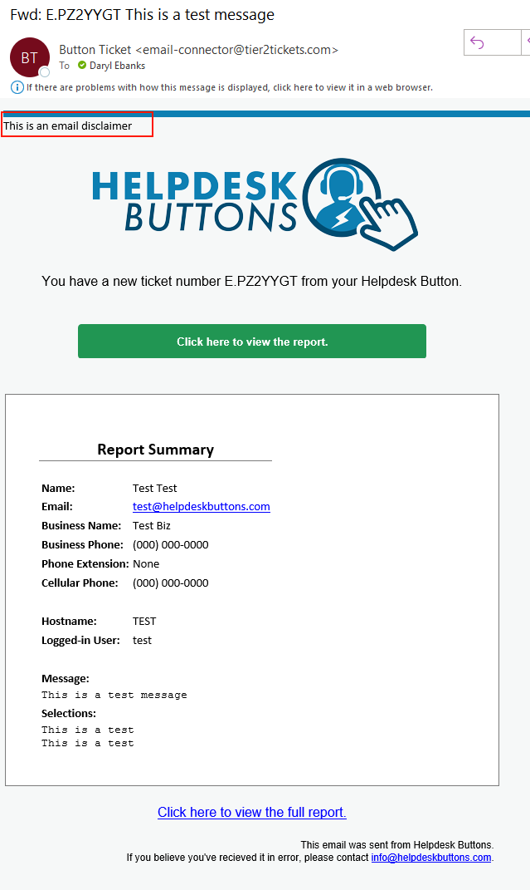
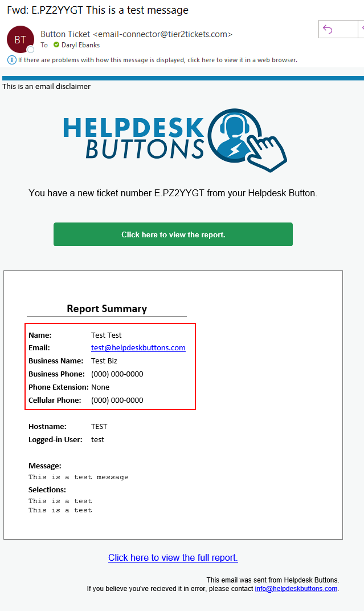

Email Documentation
======================================

The email connector is very simple to setup. The only thing to worry about is making sure the email address on the 
account matches the email address you would like the emails to go to. You can change your email address on the 
`Account Info page <https://account.helpdeskbuttons.com/account_info.php>`_

Anti-Virus and AntiMalware
----------------------------------------------------
It is not always necessary, but we recommend whitelisting the tier2tickets installation folder (C:\\Program Files(x86)\\tier2tickets). We regularly submit our code through VirusTotal to make sure we are not getting flagged, but almost all AV/M interactions cause some sort of failure. `Webroot <https://docs.tier2tickets.com/content/general/firewall/#webroot>`_ in particular can cause issues with screenshots.

Dispatcher Rules
----------------------------------------------------

This is the list of variables that can be accessed when using the :ref:`Dispatcher Rules <content/automations/dispatcher:Dispatcher Rules>`. 

+--------------------------------------------------------------+-------------------------------------------------------------+
| Read/Write                                                   | Read Only                                                   |
+==============================================================+=============================================================+
| :ref:`msg<content/integration/email:*subject and msg*>`      | :ref:`content/automations/dispatcher:*selections*`          |
+--------------------------------------------------------------+-------------------------------------------------------------+
| :ref:`subject<content/integration/email:*subject and msg*>`  | :ref:`content/automations/dispatcher:*hostname*`            |
+--------------------------------------------------------------+-------------------------------------------------------------+
| :ref:`content/integration/email:*email_disclaimer*`          | :ref:`content/automations/dispatcher:*name*`                |
+--------------------------------------------------------------+-------------------------------------------------------------+
|                                                              | :ref:`content/automations/dispatcher:*email*`               |
+--------------------------------------------------------------+-------------------------------------------------------------+
|                                                              | :ref:`content/automations/dispatcher:*ip*`                  |
+--------------------------------------------------------------+-------------------------------------------------------------+
|                                                              | :ref:`content/automations/dispatcher:*mac*`                 | 
+--------------------------------------------------------------+-------------------------------------------------------------+
|                                                              | .. raw:: html                                               |
|                                                              |                                                             |
|                                                              |    <i>                                                      |
|                                                              |                                                             |
|                                                              | :ref:`input_cell<content/integration/email:*input_**>`      | 
+--------------------------------------------------------------+-------------------------------------------------------------+
|                                                              | .. raw:: html                                               |
|                                                              |                                                             |
|                                                              |    <i>                                                      |
|                                                              |                                                             |
|                                                              | :ref:`input_phone<content/integration/email:*input_**>`     | 
|                                                              |                                                             |
+--------------------------------------------------------------+-------------------------------------------------------------+
|                                                              | .. raw:: html                                               |
|                                                              |                                                             |
|                                                              |    <i>                                                      |
|                                                              |                                                             |
|                                                              | :ref:`input_company<content/integration/email:*input_**>`   | 
+--------------------------------------------------------------+-------------------------------------------------------------+
|                                                              | .. raw:: html                                               |
|                                                              |                                                             |
|                                                              |    <i>                                                      |
|                                                              |                                                             |
|                                                              | :ref:`input_email<content/integration/email:*input_**>`     | 
+--------------------------------------------------------------+-------------------------------------------------------------+
|                                                              | .. raw:: html                                               |
|                                                              |                                                             |
|                                                              |    <i>                                                      |
|                                                              |                                                             |
|                                                              | :ref:`input_name<content/integration/email:*input_**>`      | 
+--------------------------------------------------------------+-------------------------------------------------------------+

Field Definitions
^^^^^^^^^^^^^^^^^

*subject and msg*
""""""""""""""""""""""""

	**the email subject and message from the ticket submission**
	

*email_disclaimer*
""""""""""""""""""""""""

	**Append something to the top of the body of the email message**
	

*input_**
""""""""""""""

	**Additional information provided in the body of the email**
	

*other*
"""""""

There may be additional variables which are common to all integrations. Those are documented :ref:`here <content/automations/dispatcher:Universally Available Variables>`

