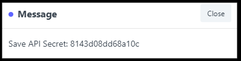

ERPNext Integration
===================
This guide will show you how to set up your new Helpdesk Buttons with ERPNext.

Video Walkthrough
-----------------------------
	
.. raw:: html

    

        <iframe width="560" height="315" src="https://www.youtube.com/embed/Q9R8TZD-3U8" frameborder="0" allow="accelerometer; autoplay; clipboard-write; encrypted-media; gyroscope; picture-in-picture" allowfullscreen></iframe>
    

Create an Unregistered User
------------------------------------

Create a Customer to recieve 'Catch All' tickets and add a Contact to that Customer with the email address 

*unregistered@helpdeskbuttons.com*

This is in case someone puts in an email that is not already in ERPNext, this will also prompt the GUI to ask for identifying information from the end user. 

Create an API KEY and SECRET
----------------------------------------------

To create the API KEY for ERPNext:

Click Settings -> My Settings -> API Access

You can create a key by clicking the "Generate Keys" Button.

Copy down the API Secret as it cannot be viewed again. 

If the API Key does not show up try logging out, then back in.

You should see something like this when you have successfully created a key pair.

Copy the API Key as you will need that to complete the integration. 

Helpdeskbuttons.com Settings
-------------------------------

Enter your Ticket System API endpoint as shown (do not add add https:// or the path after the url)

for cloudhosted instances: *business_name.erpnext.com*

Your API key is formatted as shown 

*api_key:api_secret*

Click Update and the Integration Test button to send a test ticket. 

Anti-Virus and AntiMalware
========================================================================
It is not always necessary, but we recommend whitelisting the helpdeskbuttons installation folder (C:\\Program Files(x86)\\Helpdesk Button). We regularly submit our code through VirusTotal to make sure we are not getting flagged, but almost all AV/M interactions cause some sort of failure. `Webroot <https://docs.tier2tickets.com/content/general/firewall/#webroot>`_ in particular can cause issues with screenshots.

Dispatcher Rules
========================================================================

This is the list of variables that can be accessed when using the :ref:`Dispatcher Rules <content/automations/dispatcher:*BETA* Dispatcher Rules>`. 

+---------------------------------------------------+-------------------------------------------------------------+
| Read/Write                                        | Read Only                                                   |
+===================================================+=============================================================+
| :ref:`content/integration/ERPNext:*priority*`     | :ref:`content/automations/dispatcher:*selections*`          |
+---------------------------------------------------+-------------------------------------------------------------+
| :ref:`content/integration/ERPNext:*issue_type*`   | :ref:`content/automations/dispatcher:*hostname*`            |
+---------------------------------------------------+-------------------------------------------------------------+
| :ref:`content/integration/ERPNext:*status*`       | :ref:`content/automations/dispatcher:*name*`                |
+---------------------------------------------------+-------------------------------------------------------------+
| :ref:`content/integration/ERPNext:*priv_append*`  | :ref:`content/automations/dispatcher:*email*`               |
+---------------------------------------------------+-------------------------------------------------------------+
| :ref:`content/automations/dispatcher:*message*`   | :ref:`content/automations/dispatcher:*ip*`                  |
+---------------------------------------------------+-------------------------------------------------------------+
| :ref:`content/automations/dispatcher:*subject*`   | :ref:`content/automations/dispatcher:*mac*`                 | 
+---------------------------------------------------+-------------------------------------------------------------+
|                                                   | .. raw:: html                                               |
|                                                   |                                                             |
|                                                   |    <i>                                                      |
|                                                   |                                                             |
|  :ref:`content/integration/ERPNext:*owner*`       | :ref:`input_cell<content/integration/ERPNext:*input_**>`    | 
+---------------------------------------------------+-------------------------------------------------------------+
|                                                   | .. raw:: html                                               |
|                                                   |                                                             |
|                                                   |    <i>                                                      |
|                                                   |                                                             |
|                                                   | :ref:`input_phone<content/integration/ERPNext:*input_**>`   | 
|                                                   |                                                             |
+---------------------------------------------------+-------------------------------------------------------------+
|                                                   | .. raw:: html                                               |
|                                                   |                                                             |
|                                                   |    <i>                                                      |
|                                                   |                                                             |
|                                                   | :ref:`input_company<content/integration/ERPNext:*input_**>` | 
+---------------------------------------------------+-------------------------------------------------------------+
|                                                   | .. raw:: html                                               |
|                                                   |                                                             |
|                                                   |    <i>                                                      |
|                                                   |                                                             |
|                                                   | :ref:`input_email<content/integration/ERPNext:*input_**>`   | 
+---------------------------------------------------+-------------------------------------------------------------+
|                                                   | .. raw:: html                                               |
|                                                   |                                                             |
|                                                   |    <i>                                                      |
|                                                   |                                                             |
|                                                   | :ref:`input_name<content/integration/ERPNext:*input_**>`    | 
+---------------------------------------------------+-------------------------------------------------------------+

Field Definitions
^^^^^^^^^^^^^^^^^

*priority*
""""""""""

	**The ticket priority level (Urgent, Low, ect):**
   

   
|
|

*status*
"""""""""""

	**Refers to the ticket status (New, In Progress, etc):**

|
|

*issue_type*
"""""""""""""""""""""""

	**The issue type (this will depend on the types you create):**

|
|

*owner*
""""""""""

	**The agent that will be assigned this ticket:**

|
|

*priv_append*
"""""""""""""

	**Allows you to append information to the internal ticket note:**

|
|

*input_**
""""""""""""""

	**Additional information provided if the user is not found in ERPNext**
	

*other*
"""""""

There are additional variables which are common to all integrations. Those are documented :ref:`here <content/automations/dispatcher:Universally Available Variables>`

Webhook Walkthrough
========================================================================

.. image:: images/coming_soon.png
