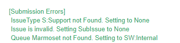
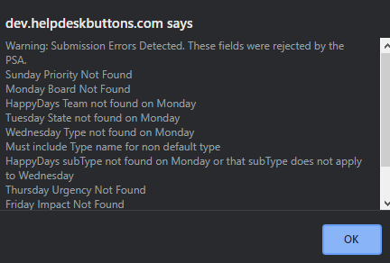

Integration Errors
====================================== 

If you happen to get some kind of error during the Integration Test, here is some more information to help get your integration up and running.

There was an error finding the contact.
-----------------------------------------
The ticket system reported that the contact matching "unregistered@helpdeskbuttons.com" was not found. Refer to the documentaion for your integration to fix this.

There was an error authenticating with the current credentials.
----------------------------------------------------------------
The API KEY was rejected by the PSA. Double check it was put in according to the documentation for your integration.

There was an error reading the response from the API endpoint.
---------------------------------------------------------------
The endpoint responded with something unexpected. This could be a malfunction of the ticket system API. Let us know if you see this error at support@tier2.tech.

API endpoint timed out.
------------------------
The endpoint took too long to respond to the to the request. This could be a malfunction of the ticket system API. Let us know if you see this error at support@tier2.tech.

There was an error accessing the API endpoint.
-----------------------------------------------
The endpoint was not found at the url provided in the API ENDPOINT field. (You don't need the https:\\)

There was an error involving permissions in your PSA.
------------------------------------------------------
The endpoint refused to process a request due to insufficient access. Double check the API KEY provided has the correct permissions according to the documentation for your integration.

There was an error validating input.
-------------------------------------
There may be something causing an issue on the page itself. Check your browser extenstions. Let us know if you see this error at support@tier2.tech.

There was an Unknown Error.
-----------------------------
Let us know if you see this error at support@tier2.tech.

Uncaught Exception!
----------------------------
Let us know if you see this error at support@tier2.tech.

General Error:
----------------
Custom Errors that don't apply to the standard categories above. The message will describe the issue.

Submission Error
^^^^^^^^^^^^^^^^^^^
This is a special type of error that only occurs on an Integration Test. If any of the fields on the ticket are rejected by the ticket system a message will pop up saying what is wrong. If a ticket is put in
via a normal method, our system will attempt to choose values that the ticket system will accept. This message will then be appended to the ticket as an internal/private note (if the ticket system supports such notes)

This is what submission errors might look like in a ticket:

This is what submission errors look like during an Integration Test:

