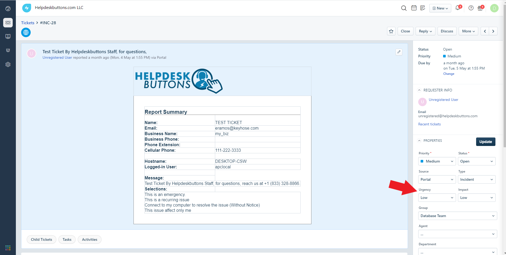
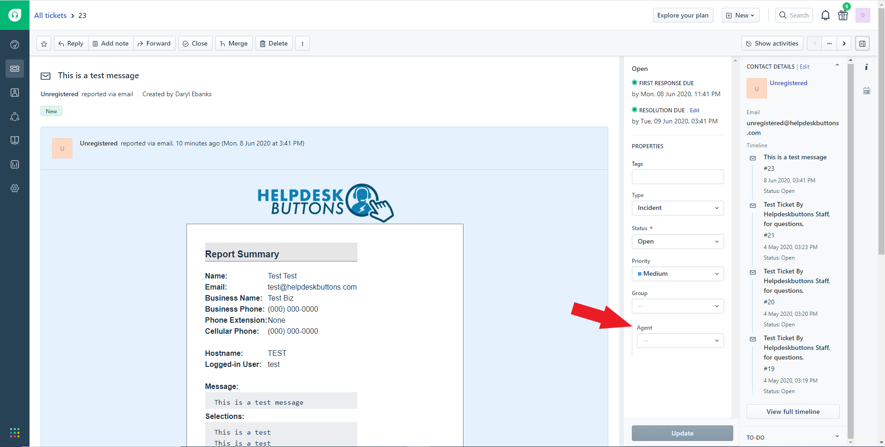

Freshdesk / Freshservice Integration
=====================================
This guide will show you how to set up FreshDesk / FreshService to work with your new Helpdesk Buttons.

Unregistered User
-------------------
By default, our software attempts to pair users with their contact information by checking with Freshdesk/Freshservice. If the user is not already found in the system
a catch all account submits the ticket instead. This can be disabled for PSA's that allow users to create accounts on ticket submission. Look at the  :ref:`Advanced Integration Options <content/integration/freshdesk:Advanced Integration Options>` below.

This guide assumes you want to use the catch all contact: 
To start you will need to set up a contact that uses the email address of “unregistered@helpdeskbuttons.com”  for the purposes of catching any unregistered users.  You can name the account whatever you want. In our system it’s “Mystery Human”.

Getting an API Key
--------------------
On the left of your screen, click the admin button.

.. image:: images/fd-image-1.png

Scroll down and select Agents

Click ‘New Agent

.. image:: images/fd-image-4.png

And then fill out the information needed. This account needs the Administrator and Agent Roles roles.

After you have created that account, sign into it and go to the profile.  You can get there by clicking your account picture and then selecting profile.

In the upper right, you will see ‘Your API Key’

Please take note of this API Key, you will need it in a little bit.

Helpdeskbuttons.com Setup 
---------------------------

The next step is to sign into your Helpdeskbuttons.com account and enter this information under Settings->Backend Information

.. image:: images/fd-image-3.png

Enter your Ticket System API endpoint and the Ticket System API Key. Your Ticket System API endpoint is the main URL that you use to log into FreshDesk / FreshService. In this instance

.. image:: images/fd-image-6.png

Click update once you are done. At this point, your Freshdesk / FreshService instance will be ready to go with your Helpdesk Buttons.

Access Restrictions
--------------------

As of 0.5.x: The agent needs to have Administrator and Agent Roles.

Anti-Virus and AntiMalware
-----------------------------
It is not always necessary, but we recommend whitelisting the helpdeskbuttons installation folder (C:\\Program Files(x86)\\Helpdesk Button). We regularly submit our code through VirusTotal to make sure we are not getting flagged, but almost all AV/M interactions cause some sort of failure. `Webroot <https://docs.tier2tickets.com/content/general/firewall/#webroot>`_ in particular can cause issues with screenshots.

Advanced Integration Options
------------------------------

Defaults
^^^^^^^^^
The "auto_reg" flag allows users to be auto_registered by thier email address instead of added to an unregistered/catch all user. Keep in mind that if a user mistypes their email they will create a user.

Rules
^^^^^^

This is the list of variables that can be accessed when using the :ref:`Custom Rules <content/integration/advanced:Custom Rules>`. 

FreshDesk

+-----------------+---------------+
| Read/Write      | Read Only     |
+=================+===============+
| priority_       | selections_   |
+-----------------+---------------+
| status_         | name_         |
+-----------------+---------------+
| group_          | email_        |
+-----------------+---------------+
| type_           | ip_           |
+-----------------+---------------+
| message_        | mac_          |
+-----------------+---------------+
| subject_        | hostname_     | 
+-----------------+---------------+
| source_         |               | 
+-----------------+---------------+
| agent_          |               | 
+-----------------+---------------+
| append_         |               |
+-----------------+---------------+

Freshservice

+-----------------+---------------+
| Read/Write      | Read Only     |
+=================+===============+
| priority_       | selections_   |
+-----------------+---------------+
| status_         | name_         |
+-----------------+---------------+
| department_     | email_        |
+-----------------+---------------+
| agent_          | ip_           |
+-----------------+---------------+
| message_        | mac_          |
+-----------------+---------------+
| subject_        | hostname_     | 
+-----------------+---------------+
| source_         |               | 
+-----------------+---------------+
| impact_         |               | 
+-----------------+---------------+
| urgency_        |               |
+-----------------+---------------+
| append_         |               |
+-----------------+---------------+
| group_          |               |
+-----------------+---------------+
| priv_append_    |               |
+-----------------+---------------+

.. _priority:  https://docs.tier2tickets.com/content/integration/freshdesk/#priority
.. _status:  https://docs.tier2tickets.com/content/integration/freshdesk/#status
.. _department:  https://docs.tier2tickets.com/content/integration/freshdesk/#department
.. _agent:  https://docs.tier2tickets.com/content/integration/freshdesk/#agent
.. _source:  https://docs.tier2tickets.com/content/integration/freshdesk/#source
.. _impact:  https://docs.tier2tickets.com/content/integration/freshdesk/#impact-and-urgency
.. _urgency:  https://docs.tier2tickets.com/content/integration/freshdesk/#impact-and-urgency
.. _group:  https://docs.tier2tickets.com/content/integration/freshdesk/#group
.. _type:  https://docs.tier2tickets.com/content/integration/freshdesk/#type
.. _priv_append:  https://docs.tier2tickets.com/content/integration/freshdesk/#priv-append
.. _message:  https://docs.tier2tickets.com/content/integration/advanced/#message
.. _subject:  https://docs.tier2tickets.com/content/integration/advanced/#subject
.. _append:  https://docs.tier2tickets.com/content/integration/advanced/#append
.. _selections:  https://docs.tier2tickets.com/content/integration/advanced/#selections
.. _hostname:  https://docs.tier2tickets.com/content/integration/advanced/#hostname
.. _name:  https://docs.tier2tickets.com/content/integration/advanced/#name
.. _email:  https://docs.tier2tickets.com/content/integration/advanced/#email
.. _ip:  https://docs.tier2tickets.com/content/integration/advanced/#ip
.. _mac:  https://docs.tier2tickets.com/content/integration/advanced/#mac

Field Definitions
^^^^^^^^^^^^^^^^^

*priority*
""""""""""

	**The ticket priority level (Urgent, Low, ect):**

FreshDesk:

|

FreshService:

|
|

*impact* and *urgency*
""""""""""""""""""""""

	**Can set priority via the SLA priority matrix:**

FreshService:

	Impact:

|
   
	Urgency:

|
|

*status*
""""""""

	**The ticket status (New, In Progress, etc):**

FreshDesk:

|

FreshService:

|
|

*group*
"""""""

	**The group the ticket will be put in:**

FreshDesk:

|
   
FreshService:

|
|

*type*
""""""

	**Refers to the issue type (Service Request, Incident, Problem, Alert):**
	
FreshDesk:

|
|

*department*
""""""""""""

	**The department the ticket will be put in:**

FreshService:

|
|

*agent*
"""""""

	**The agent that will be assigned this ticket:**

FreshDesk:

|
   
FreshService:

|
|

*source*
""""""""

	**The ticket source (Web Portal, Etc):**

FreshDesk:

|
   
FreshService:

|
|

*priv_append*
"""""""""""""

	**Allows you to append information to the internal ticket note:**

FreshDesk:

|

FreshService:

|
|

*other*
"""""""

There are additional variables which are common to all integrations. Those are documented :ref:`here <content/integration/advanced:Universally Available Variables>`
