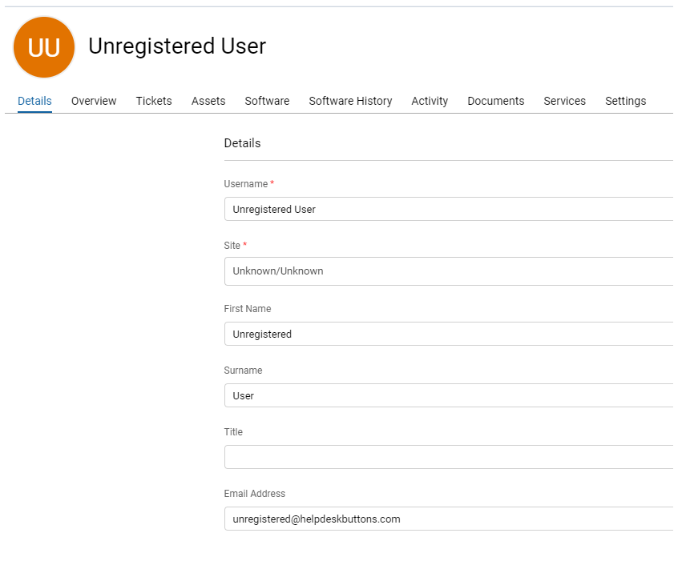
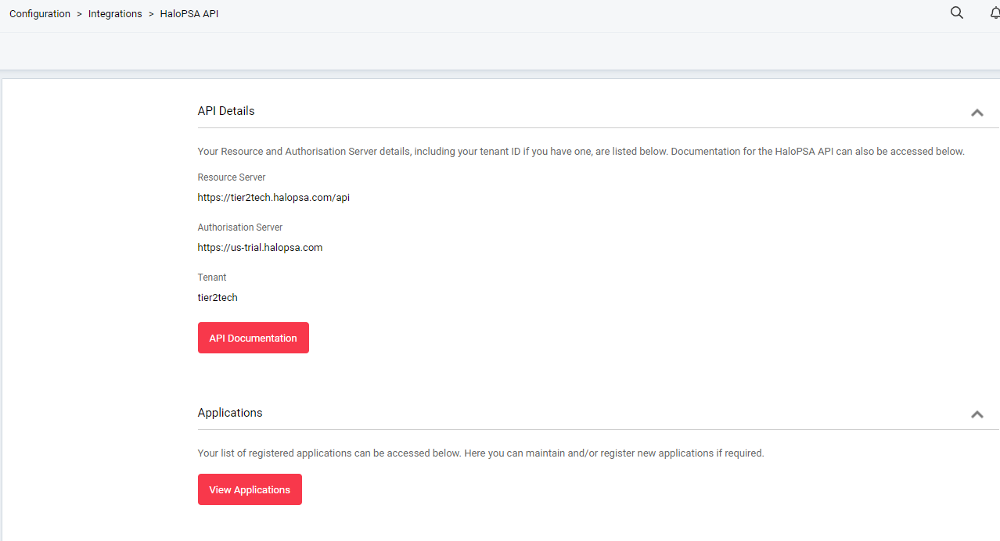
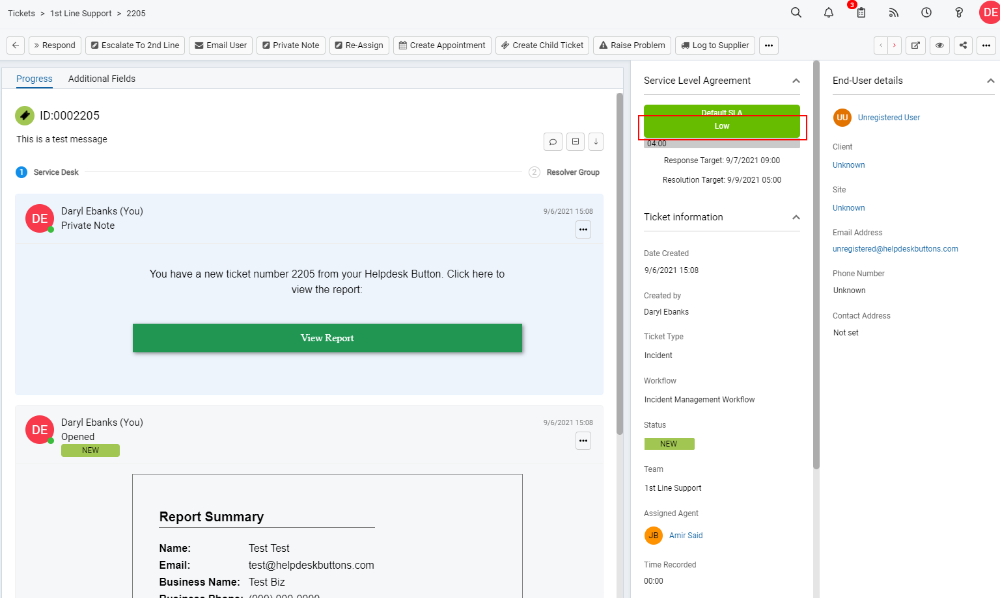
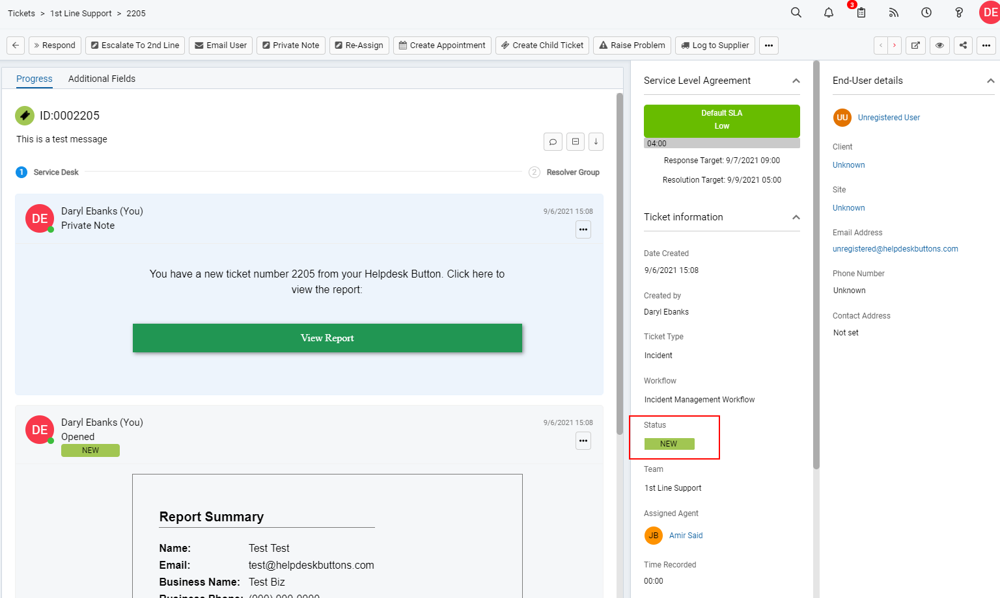
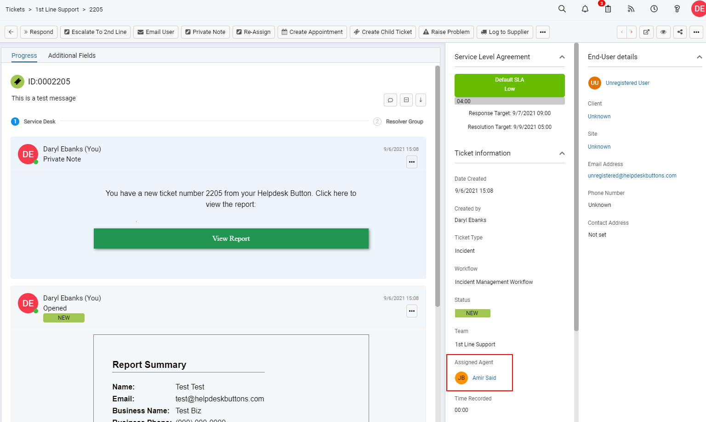
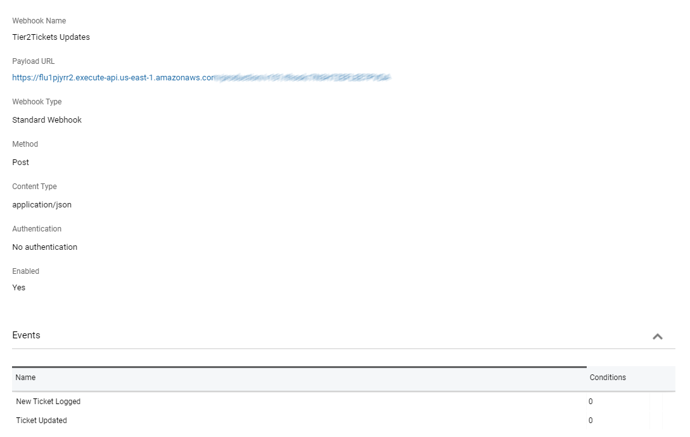

HaloPSA/ITSM Documentation
======================================

This guide will show you how to set up your new Helpdesk Buttons with HaloPSA/ITSM in as few as 15 minutes.

Integration
--------------------------

HaloPSA/HaloITSM integration requires three main parts:

`1) set up an unregistered user as a catchall account as a contact in your PSA <https://docs.tier2tickets.com/content/integration/halo/#unregistered-user>`_

`2) set up the API integration. <https://docs.tier2tickets.com/content/integration/halo/#get-an-api-key>`_

`3) configure helpdeskbuttons account. <https://docs.tier2tickets.com/content/integration/halo/#helpdeskbuttons-com-settings>`_

Video Walkthrough
^^^^^^^^^^^^^^^^^^^^^^^^^^^^^^^^^^

.. raw:: html

    <!--

        <iframe width="560" height="315" src="https://www.youtube.com/embed/ip2IhU8EqPQ" frameborder="0" allow="accelerometer; autoplay; encrypted-media; gyroscope; picture-in-picture" allowfullscreen></iframe>
    
-->
    
.. image:: images/coming_soon.png

1) Unregistered User
^^^^^^^^^^^^^^^^^^^^^^^^^^^^^^^^^^

You will start off by logging into your HaloPSA/ITSM instance. 

Create an ‘Unregistered’ contact This must have the email address unregistered@helpdeskbuttons.com. You can add this contact to the default Unknown Company/Site

This is the user which any Button Press tickets appear to come from if the user is unregistered. Remember to click save.

You are now done setting up your company and contact.

2) Get an API Key
^^^^^^^^^^^^^^^^^^^^^^^^^^^^^^^^^^

Next step is to create an API key. Navigate to Configuration > Integrations > Halo(PSA/ITSM) API

Here you can find most of the information you need as well as create a new application key
You will need the tenant, resource server and authentication server from this first screen.

Now click Applications, then New at the top right corner. You can name the key whatever you like, but make sure to collect Client ID and Secret as the Method.

Make sure the key is set to be active.

For permissions we will need at least the following five (5) selections:

* read:tickets
* edit:tickets
* read:customers
* read:crm
* read:assets

The Login Type should be Agent. and select an Agent that the tickets will be put into the system as (if none is selected several lookups will fail preventing the integration from working properly)

When you save, you should be given a Client ID and a Client Secret. Keep them in a safe place as the secret cannot be viewed again (a new one can be generated)

Once this has been set up, you will have all the information required.

3) Helpdeskbuttons.com Settings
^^^^^^^^^^^^^^^^^^^^^^^^^^^^^^^^^^

Log into your Helpdeskbuttons.com account. Select Software Management > Integration Settings. 

Select ‘HaloPSA/HaloITSM’ for the ticket system. Select if you are using an On-Prem or Cloud Hosted instance. 

Provide the authentication server and API server information. Copy and paste them as they are shown in the API Details.

The "Resource Server" should go in the Ticket System API endpoint slot and the "Authorisation Server" goes into the Ticket System Authorization Server slot.

Finally put in the API key in the following form depending on your instance type whether `On-Prem <https://docs.tier2tickets.com/content/integration/halo/#on-prem>`_ or `Cloud Hosted <https://docs.tier2tickets.com/content/integration/halo/#cloud-hosted>`_:

Cloud Hosted
"""""""""""""""""""""""""""""""""""""""""""

*tenant+client_id:client_secret*

Here are the components and what they mean:

Comp_a+123asd4asabcd:asdf38judj234

Comp_a is the tenant shown in Halo

123asd4asabcd is the example client_id for the API

asdf38judj234 is the example client_secret for the API

Make sure that there is a + between the tenant and a : between the client id and client secret.

On Prem
"""""""""""""""""""""""""""""""""""""""""""

*client_id:client_secret*

Here are the components and what they mean:

123asd4asabcd:asdf38judj234

123asd4asabcd is the example client_id for the API

asdf38judj234 is the example client_secret for the API

Make sure that there is a : between the client id and client secret.

Once you have entered the correct information on the Helpdesk Buttons page, make to click Update so it saves the changes.

Integration Defaults
"""""""""""""""""""""""""""""""""""""""""""

For most integrations you can leave these blank and the PSA/Ticket System will fill in some defaults. For HALO specifically setting the agent to Unassigned will stop the agent set in the integration from being assigned every ticket by default.
Newer Halo instances have impact and urgency fields that are mandatory. Set these to an integer that increases in severity the lower it is. By default setting both these to 3 will default to LOW. If your instance also needs the Category set, you fill this out
in category_1. You can type out the name of a category in the first entry in the Categorization section: Hardware>Desktop is normally a good default.

If you have custom fields, you can set them in the customfield section. Just make sure to use this form 

id : value

You can also ignore validation of fields by setting _novalidate to true

Note Permission Issues
"""""""""""""""""""""""""""""""""""""""""""
If you are getting an error message about Note Permissions or your tickets are coming in without the private note with a report attachced check this setting: "Tickets with the default Client/Site must be moved before working on the Ticket". This setting under New Ticket settings will most likely need to be unchecked to allow us to edit unregistered user tickets.

Anti-Virus and AntiMalware
----------------------------------------------------
It is not always necessary, but we recommend whitelisting the tier2tickets installation folder (C:\\Program Files(x86)\\tier2tickets). We regularly submit our code through VirusTotal to make sure we are not getting flagged, but almost all AV/M interactions cause some sort of failure. `Webroot <https://docs.tier2tickets.com/content/general/firewall/#webroot>`_ in particular can cause issues with screenshots.

Dispatcher Rules
--------------------------

This is the list of variables that can be accessed when using the :ref:`Dispatcher Rules <content/automations/dispatcher:Dispatcher Rules>`. 

+----------------------------------------------------------------------+----------------------------------------------------+
| Read/Write                                                           |  Read Only                                         |
+======================================================================+====================================================+
| :ref:`content/integration/halo:*priority*`                           | :ref:`content/automations/dispatcher:*selections*` |
+----------------------------------------------------------------------+----------------------------------------------------+
| :ref:`content/integration/halo:*state*`                              | :ref:`content/automations/dispatcher:*name*`       |
+----------------------------------------------------------------------+----------------------------------------------------+
| :ref:`content/integration/halo:*team*`                               | :ref:`content/automations/dispatcher:*email*`      |
+----------------------------------------------------------------------+----------------------------------------------------+
| :ref:`content/integration/halo:*ticketType*`                         | :ref:`content/automations/dispatcher:*ip*`         |
+----------------------------------------------------------------------+----------------------------------------------------+
| :ref:`content/automations/dispatcher:*msg*`                          | :ref:`content/automations/dispatcher:*mac*`        |
+----------------------------------------------------------------------+----------------------------------------------------+
| :ref:`content/automations/dispatcher:*msg*`                          | :ref:`content/automations/dispatcher:*hostname*`   | 
+----------------------------------------------------------------------+----------------------------------------------------+
| :ref:`content/integration/halo:*agent*`                              |                                                    | 
+----------------------------------------------------------------------+----------------------------------------------------+
| :ref:`content/automations/dispatcher:*append*`                       |                                                    | 
+----------------------------------------------------------------------+----------------------------------------------------+
| :ref:`content/integration/halo:*category_#*`                         |                                                    | 
+----------------------------------------------------------------------+----------------------------------------------------+

Field Definitions
^^^^^^^^^^^^^^^^^

*priority*
""""""""""

	**The ticket priority level (Urgent, Low, etc.):**

|
|

*state*
"""""""

	**Refers to the ticket status (New, In Progress, etc):**

|
|

*team*
""""""

	**Refers to the queue the ticket will be put in:**

|
|

*ticketType*
""""""""""""""""""

	**The issue type (Service Request, Incident, Problem, Alert):**

|
|

*agent*
"""""""

	**Refers to the agent that will be assigned this ticket:**

|
|

*priv_append*
"""""""""""""

	**Allows you to append information to the internal ticket note:**

|
|

*category_#*
""""""""""

	**Halo has 4 categories that can be customized to be required that are not "custom fields"**

*other*
"""""""

There are additional variables which are common to all integrations. Those are documented :ref:`here <content/automations/dispatcher:Universally Available Variables>`

Setting up a Webhook
----------------------------------------------------

To configure the webhooks for Notifications, navigate to the webhook section of Halo. (Configuration > Integration > Webhooks)

Create a new webhook and name it whatever you like. 

Copy and paste the Ticket Notification url from your Tier2Tickets/Helpdeskbuttons Integration or Notification page into the Payload URL.

The dropdown settings should be as follows:

 - Webhook Type : Standard Webhook
 - Method: POST
 - Content Type: application/json
 - Authentication: No authentication
 - Enabled: Yes
 
Finally add two events to trigger the hooks: New Ticket Logged and Ticket Updated. Neither of these events require conditions so just hit save after selecting the event. 

Once you double check that all the settings are correct, click save and you should be all set. Here is an image of a webhook with all the settings filled in. 

