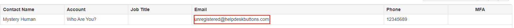
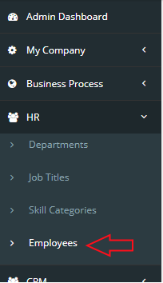
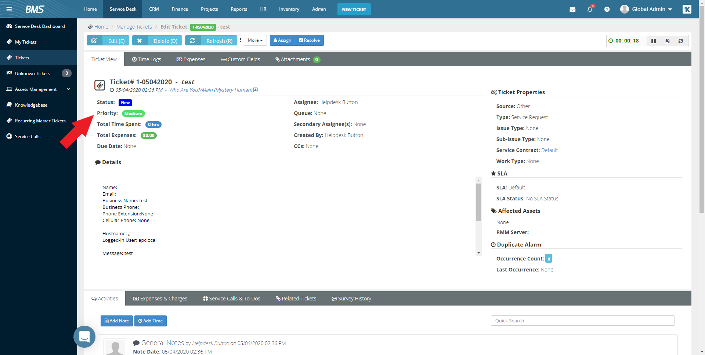
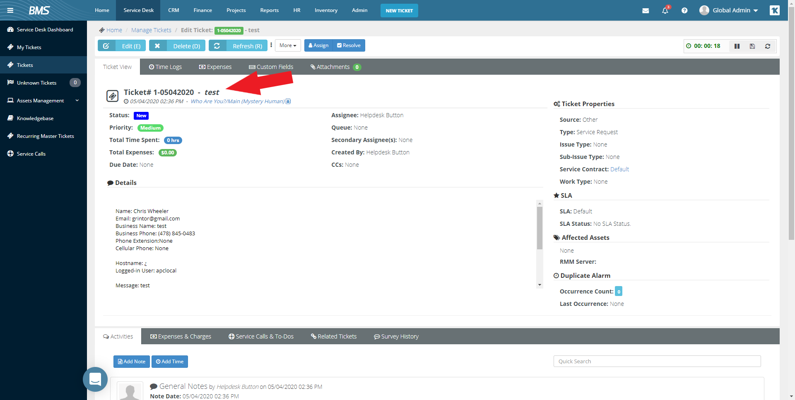
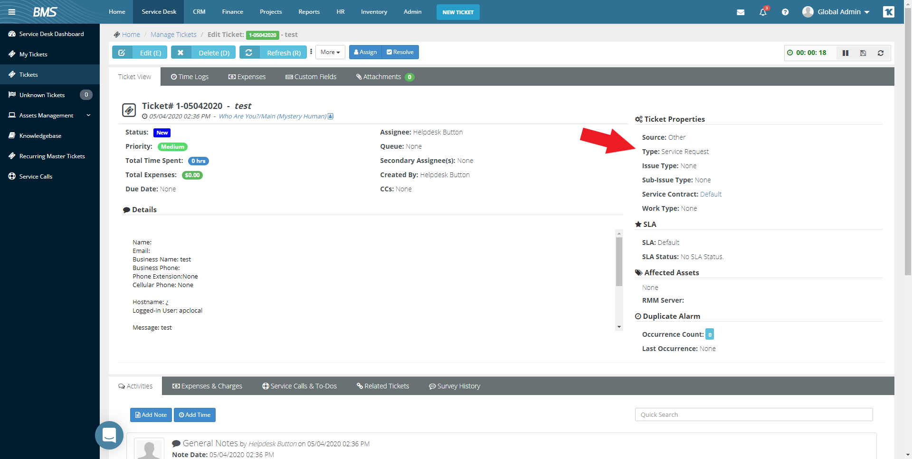
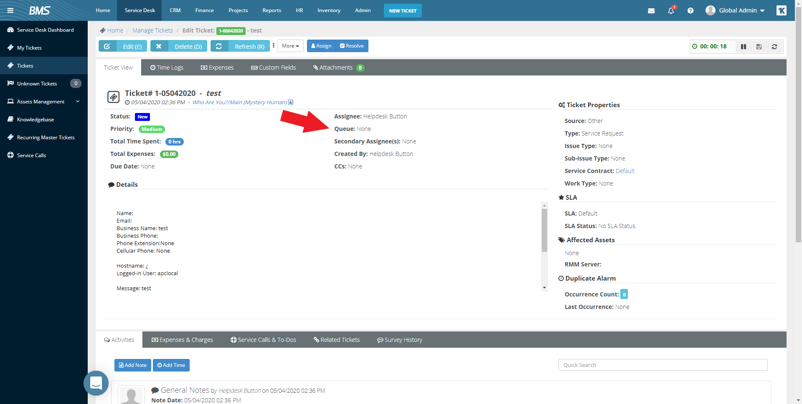
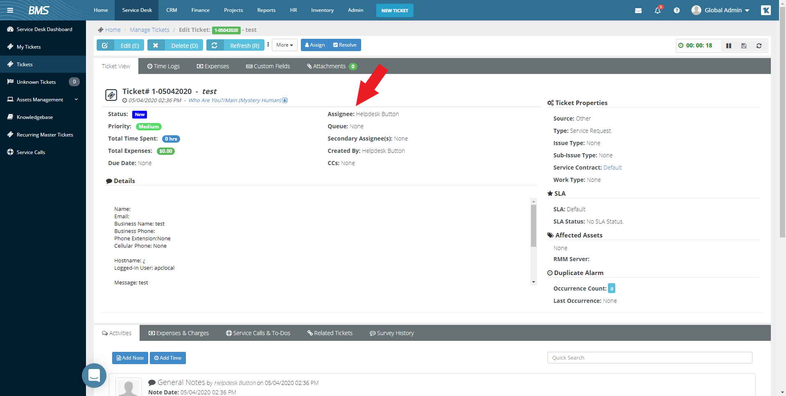
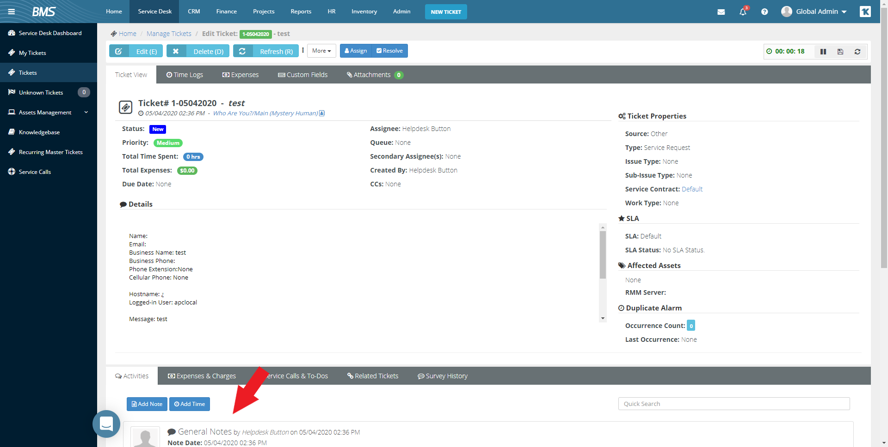
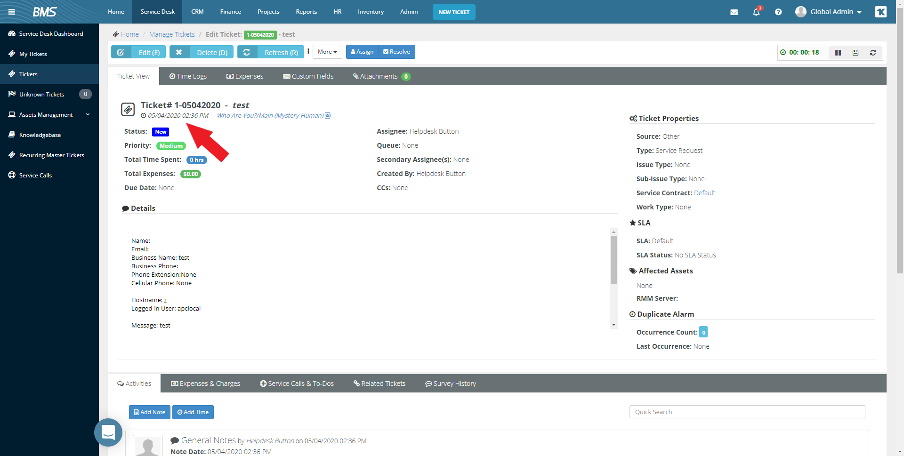

Kaseya Documentation
================================

This guide will show you how to set up your new Helpdesk Buttons with Kaseya BMS in as few as 15 minutes.

Integration
--------------------------

Kaseya integration requires three main parts:

`1) set up an unregistered user as a catchall account as a contact in your PSA <https://docs.tier2tickets.com/content/integration/kaseya/#unregistered-user>`_

`2) set up the API integration. <https://docs.tier2tickets.com/content/integration/kaseya/#create-an-api-user>`_

`3) configure helpdeskbuttons account. <https://docs.tier2tickets.com/content/integration/kaseya/#helpdeskbutton-com-settings>`_

Video Walkthrough
^^^^^^^^^^^^^^^^^^^^^^^^^^^^^^^^^^

.. raw:: html

    

        <iframe width="560" height="315" src="https://www.youtube.com/embed/Rvc9DO60VBU" frameborder="0" allow="accelerometer; autoplay; encrypted-media; gyroscope; picture-in-picture" allowfullscreen></iframe>
    

1) Unregistered User
^^^^^^^^^^^^^^^^^^^^^^^^^^^^^^^^^^

First we need to make a contact in a catch all company, this contact will put tickets in on behalf of users that are not currently in the system.

This is our contact. Feel free to use whatever data you would like, but make sure the email address is *unregistered@helpdeskbuttons.com*

2) Create an API User
^^^^^^^^^^^^^^^^^^^^^^^^^^^^^^^^^^

Navigate to the Employee window:

It is probably best to create a new user, but an existing user with the correct permissions can work. This guide will assume you create a new user.

Click New and create the user with whatever data you may like. The Security Role is the only important part of this process. To start out put it as Administrator. You will need the email address to be something that can receive the password. Once that is complete an email will be sent to the address specified with the login credentials we need.

3) Helpdeskbutton.com Settings
^^^^^^^^^^^^^^^^^^^^^^^^^^^^^^^^^^

Once we have that email, plug the info into the Settings page after selecting Kaseya BMS as the Ticket System. The format is:

Company+username:password

Once you click update you should be good to go. 

Integration Defaults
^^^^^^^^^^^^^^^^^^^^^^^^^^^^^^^^^^

Kaseya requires a lot of information to submit a ticket. We have chosen some defaults that will allow tickets to go into the system for most users. 

Please note that either queue, assignee, or both must be set for this integration to work properly.

API Access Settings
^^^^^^^^^^^^^^^^^^^^^^^^^^^^^^^^^^

For those of you who want to restrict the access the API user has, here is the security access we need: (a custom security role will need to be created and assigned to us with these permissions):

- Service Desk/My Tickets:		View and Modify - For Creating and editing tickets
- Service Desk/Tickets:			View and Modify	- For Creating and editing tickets
- Service Desk/Unknown Tickets:	View and Modify	- For Creating and editing tickets
- CRM/Accounts					View			- For gathering location data (addresses)
- CRM/Contacts					View			- For Matching tickets with contacts
- Admin/Special Features: Has API Access		- To access the API

Anti-Virus and AntiMalware
----------------------------------------------------
It is not always necessary, but we recommend whitelisting the tier2tickets installation folder (C:\\Program Files(x86)\\tier2tickets). We regularly submit our code through VirusTotal to make sure we are not getting flagged, but almost all AV/M interactions cause some sort of failure. `Webroot <https://docs.tier2tickets.com/content/general/firewall/#webroot>`_ in particular can cause issues with screenshots.

Dispatcher Rules
----------------------------------------------------

This is the list of variables that can be accessed when using the :ref:`Dispatcher Rules <content/automations/dispatcher:*BETA* Dispatcher Rules>`. 

+--------------------------------------------------+----------------------------------------------------+
| Read/Write                                       | Read Only                                          |
+==================================================+====================================================+
| :ref:`content/integration/kaseya:*priority*`     | :ref:`content/automations/dispatcher:*selections*` |
+--------------------------------------------------+----------------------------------------------------+
| :ref:`content/integration/kaseya:*ticketStatus*` | :ref:`content/automations/dispatcher:*name*`       |
+--------------------------------------------------+----------------------------------------------------+
| :ref:`content/integration/kaseya:*queue*`        | :ref:`content/automations/dispatcher:*email*`      |
+--------------------------------------------------+----------------------------------------------------+
| :ref:`content/integration/kaseya:*ticketType*`   | :ref:`content/automations/dispatcher:*ip*`         |
+--------------------------------------------------+----------------------------------------------------+
| :ref:`content/automations/dispatcher:*msg*`      | :ref:`content/integration/kaseya:*openDate*`       |
+--------------------------------------------------+----------------------------------------------------+
| :ref:`content/integration/kaseya:*title*`        | :ref:`content/automations/dispatcher:*hostname*`   | 
+--------------------------------------------------+----------------------------------------------------+
| :ref:`content/integration/kaseya:*ticketSource*` | :ref:`content/automations/dispatcher:*mac*`        | 
+--------------------------------------------------+----------------------------------------------------+
| :ref:`content/integration/kaseya:*assignee*`     |                                                    | 
+--------------------------------------------------+----------------------------------------------------+
| :ref:`content/integration/advanced:*append*`     |                                                    | 
+--------------------------------------------------+----------------------------------------------------+

Field Definitions
^^^^^^^^^^^^^^^^^

*priority*
""""""""""

	**The ticket priority level (Urgent, Low, etc.):**

|
|

*ticketStatus*
""""""""""""""

	**The ticket status (New, In Progress, etc):**

|
|

*title*
"""""""

	**A short description of the ticket issue:**

|
|

*ticketType*
""""""""""""

	**The issue type in Kaseya (Helpdesk, Internal, etc):**

|
|

*queue*
"""""""

	**The queue the ticket will be assigned to:**

|
|

*assignee*
""""""""""

	**The agent the ticket will be assigned to:**

|
|

*ticketSource*
""""""""""""""

	**The source of the ticket (Client portal, Phone, Other):**

|
|

*priv_append*
"""""""""""""

	**Allows you to append information to the internal ticket note:**

|
|

*openDate*
""""""""""

	**The date the ticket was created:**

|
|

*other*
"""""""

There are additional variables which are common to all integrations. Those are documented :ref:`here <content/automations/dispatcher:Universally Available Variables>`

Webhook Walkthrough
----------------------------------------------------

Kaseya BMS does not support webhooks. We are looking into another system for enabling notifications for this ticket system.