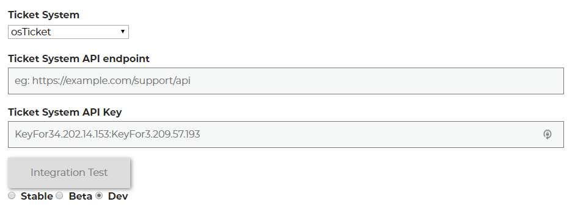

osTicket Integration
=====================
This guide will show you how to set up osTicket to work with your new Helpdesk Buttons.

Create Your API Keys
-----------------------

Once you are logged in as an Admin. Click on Admin Panel in the top-right. 

.. image:: images/os-image-1.png

Now click API Keys under the Manage tab.

We will need to create two API Keys. For each key, click Add New API Key and fill out the form

.. image:: images/os-image-3.png

osTicket requires API Keys be paired with IP addresses. Helpdesk Buttons servers are located at:

- 34.202.14.153
- 3.209.57.193

Let's Label these as Key1 (34.202.14.153) and Key2 (3.209.57.193)

Helpdeskbutton.com Settings
------------------------------

Once you have your API Keys and you put in the url for osTicket put the keys into the appropriate space on Settings page in this format:

Key1:Key2

That should be it. Hit update and test the integration with the Integration Test button.

Anti-Virus and AntiMalware
-----------------------------
It is not always necessary, but we recommend whitelisting the helpdeskbuttons installation folder (C:\\Program Files(x86)\\Helpdesk Button). We regularly submit our code through VirusTotal to make sure we are not getting flagged, but almost all AV/M interactions cause some sort of failure. `Webroot <https://docs.tier2tickets.com/content/general/firewall/#webroot>`_ in particular can cause issues with screenshots.

Advanced Integration Options
-----------------------------

This is the list of variables that can be accessed when using the :ref:`Custom Rules <content/integration/advanced:Custom Rules>`. 

+-----------------+---------------+
| Read/Write      | Read Only     |
+=================+===============+
| priority        | selections    |
+-----------------+---------------+
| alert           | name          |
+-----------------+---------------+
| auto_respond    | email         |
+-----------------+---------------+
| message         | hostname      |
+-----------------+---------------+
| subject         | mac           | 
+-----------------+---------------+
| append          | ip            | 
+-----------------+---------------+

Field Definitions
^^^^^^^^^^^^^^^^^

*priority*
""""""""""

refers to the ticket priority (Urgent, Low, ect) 

*alert*
"""""""

alerts staff to ticket creation or not

*other*
"""""""

There are additional variables which are common to all integrations. Those are documented :ref:`here <content/integration/advanced:Universally Available Variables>`

