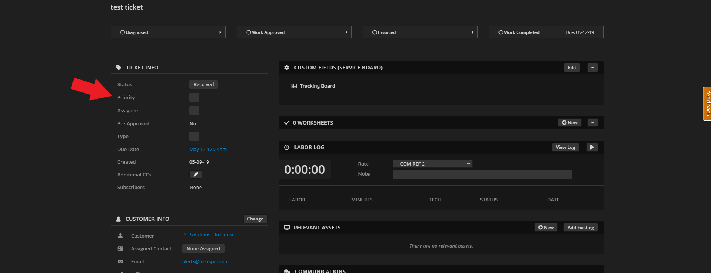
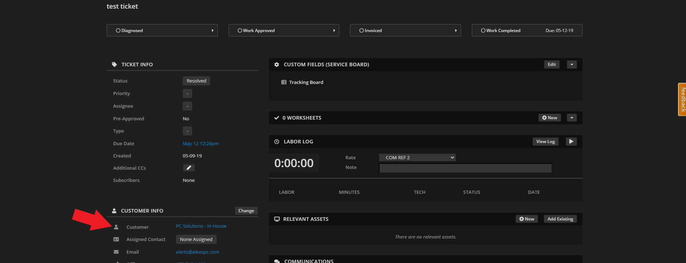

Repairshopr / Syncro Documentation
=========================================

Setting up Helpdesk Buttons with Repairshopr or Syncro is easy and can be done in as few as 15 minutes. 

Integration
--------------------------

Repairshopr / Syncro integration requires two main parts:

`1) set up an unregistered user as a catchall account as a Contact in your PSA <https://docs.tier2tickets.com/content/integration/repairshopr/#unregistered-user>`_

`2) set up the API integration. <https://docs.tier2tickets.com/content/integration/repairshopr/#get-your-api-key>`_

`3) configure Helpdesk Buttons account. <https://docs.tier2tickets.com/content/integration/repairshopr/#helpdeskbuttons-com-settings>`_

Video Walkthrough
^^^^^^^^^^^^^^^^^^^^^^^^^^^^^^^^^^

.. raw:: html

    

        <iframe width="560" height="315" src="https://www.youtube.com/embed/PA6yZ8b5Wec" frameborder="0" allow="accelerometer; autoplay; clipboard-write; encrypted-media; gyroscope; picture-in-picture" allowfullscreen></iframe>
    

	

1) Unregistered User
^^^^^^^^^^^^^^^^^^^^^^^^^^^^^^^^^^

To start you will need to set up a Contact that uses the email address of “unregistered@helpdeskbuttons.com” for the purposes of catching any unregistered users. 

You can name the account whatever you want. In our system it’s “Mystery Human”.

This can be a Customer or a Contact under a Customer.

Multiple Contacts per client
""""""""""""""""""""""""""""""""""""""""""""""""""

In case you don't have Contacts enabled and you want individuals to be able to put in tickets, this is how you do it: 

Click Admin on the top bar

Click General Preferences on the left

.. image:: images/rs-admin2.png

Click Customer Settings and check the box labeled, enable multiple contacts on customers.

Note: This is no longer strictly necessary, but users will have to put in the email address that matches the same Domain as the Customer.

If Contact is not in Syncro
""""""""""""""""""""""""""""""""""""""""""""""""""

If a user is not a Contact for a Customer in Syncro, Tier2Tickets will attempt to match the Contact based on the domain of the email address used to submit the ticket. If the domain matches the domain for the email address assigned to a Customer, the ticket will be submitted underneath the Customer email address, but it will leave the Contact as Not Assigned.

2) Get your API Key
^^^^^^^^^^^^^^^^^^^^^^^^^^^^^^^^^^

Next you will need to create a Repairshopr or Syncro API key.

You can do this in the Admin Menu > API > API Tokens

.. image:: images/rs-image-1.png

Once you are there, click on the New Token button and Custom Permissions

Fill out the name as you like, and we recommend leaving the expiration blank to make a key that does not have to be recreated/renewed.

You will have to add the permissions of the key explicitly. The permissions the key will need are as follows:

API Access Settings
""""""""""""""""""""""""""""""""""""""""""""""""""
- Assets - View Details : For scanning company asset data for automatically adding them to tickets
- Assets - List/Search: For searching through company assets for automatically adding them to tickets
- Customers List/Search: For gathering company data like street addresses from companies
- Customers View Details: For gathering contact data like email addresses from contacts
- Ticket Comments - New: For adding public notes to tickets
- Tickets Create: For creating tickets
- Tickets Edit: For adding private notes

Keep in mind that this list is based on the current feature set. With the expansion of the product, different security settings may need to be tweaked in the future. 

Once you have created the key copy it for the next step.

3) Helpdeskbuttons.com Settings
^^^^^^^^^^^^^^^^^^^^^^^^^^^^^^^^^^

Once you have the API key, you will need to adjust your settings in the Helpdesk Buttons website.

http://www.helpdeskbuttons.com

On the navigation bar on the left select Settings, then Backend Information. 

And scroll down to the backend information part. 

.. image:: images/rs-image-2.png

Select ‘RepairShopr / Syncro’ for the Ticket System 

Enter the register URL that you use.

The Ticket System API endpoint is  

example.repairshopr.com

Or the equivalent for Syncro. Be sure to *omit* the prefix (i.e. `https://`) and *omit* the suffix (i.e. `/customers?api_key=`)

Under Ticket System API Key, enter the API key that you used earlier. Once you have entered that information, click Update and it will save the information.

Anti-Virus and AntiMalware
-----------------------------
It is not always necessary, but we recommend whitelisting the tier2tickets installation folder (C:\\Program Files(x86)\\tier2tickets). We regularly submit our code through VirusTotal to make sure we are not getting flagged, but almost all AV/M interactions cause some sort of failure. `Webroot <content/general/firewall:#webroot>`_ in particular can cause issues with screenshots.

Dispatcher Rules
-----------------------------------------------

This is the list of variables that can be accessed when using the :ref:`Dispatcher Rules <content/automations/dispatcher:*BETA* Dispatcher Rules>`. 

+----------------------------------------------------------+--------------------------------------------------------+
| Read/Write                                               | Read Only                                              |
+==========================================================+========================================================+
| :ref:`content/integration/repairshopr:*priority*`        | :ref:`content/automations/dispatcher:*selections*`     |
+----------------------------------------------------------+--------------------------------------------------------+
| :ref:`content/integration/repairshopr:*status*`          | :ref:`content/automations/dispatcher:*name*`           |
+----------------------------------------------------------+--------------------------------------------------------+
| :ref:`content/integration/repairshopr:*comment_subject*` | :ref:`content/automations/dispatcher:*email*`          |
+----------------------------------------------------------+--------------------------------------------------------+
| :ref:`content/integration/repairshopr:*problem_type*`    | :ref:`content/integration/repairshopr:*business_name*` |
+----------------------------------------------------------+--------------------------------------------------------+
| :ref:`content/automations/dispatcher:*msg*`              | :ref:`content/automations/dispatcher:*hostname*`       |
+----------------------------------------------------------+--------------------------------------------------------+
| :ref:`content/automations/dispatcher:*subject*`          | :ref:`content/automations/dispatcher:*ip*`             |
+----------------------------------------------------------+--------------------------------------------------------+
| :ref:`content/automations/dispatcher:*append*`           | :ref:`content/automations/dispatcher:*mac*`            | 
+----------------------------------------------------------+--------------------------------------------------------+
| :ref:`content/integration/repairshopr:*priv_append*`     |                                                        | 
+----------------------------------------------------------+--------------------------------------------------------+

Field Definitions
^^^^^^^^^^^^^^^^^

*priority*
""""""""""

	**The ticket priority level (Urgent, Low, etc.):**

|
|

*status*
""""""""

	**The ticket status (New, In Progress, etc):**

.. image:: images/rs-status.png
   :target: https://docs.tier2tickets.com/_images/rs-status.png

|
|

*comment_subject*
"""""""""""""""""

	**Refers to the subject line of the first comment:**

.. image:: images/rs-comment_subject.png
   :target: https://docs.tier2tickets.com/_images/rs-comment_subject.png

|
|

*problem_type*
""""""""""""""

	**The problem type  in RepairShopr (Helpdesk, Internal, etc):**

|
|

*priv_append*
"""""""""""""

	**Allows you to append information to the internal ticket note:**

.. image:: images/rs-priv_append.png
   :target: https://docs.tier2tickets.com/_images/rs-priv_append.png

|
|

*business_name*
"""""""""""""""

	**The clients business name:**

|
|

*other*
"""""""

There are additional variables which are common to all integrations. Those are documented :ref:`here <content/automations/dispatcher:Universally Available Variables>`

Set Up a Webhook
-----------------------------------

To do this in Syncro/RepairShopr, go to Admin -> Notification Center

You will want to create a new Notification set.

Name it whatever you like and set the URL to the one on the Notification Page in the Helpdesk Buttons portal.

Scroll through the list of events and enable webhooks for:
	
	- Ticket : Someone replied to any ticket
	- Ticket : Status was changed
	
*Status changes already include creating a new ticket and resolving a ticket.*

Make sure you save your changes.

