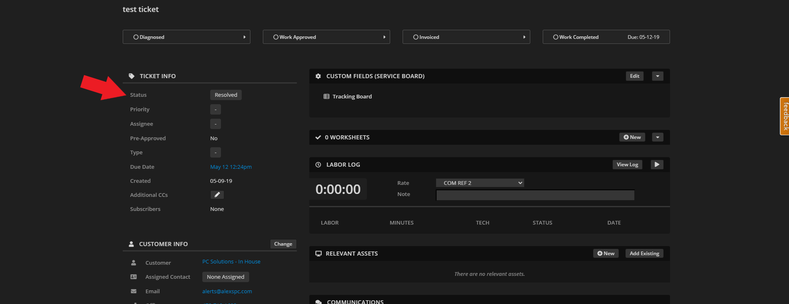

Repairshopr / Syncro Integration
================================
Setting up Helpdesk Buttons with Repairshopr or Syncro is easy. 

Unregistered User
--------------------

To start you will need to set up a contact that uses the email address of “unregistered@helpdeskbuttons.com” for the purposes of catching any unregistered users. 

You can name the account whatever you want. In our system it’s “Mystery Human”.

This can be a customer or a contact under a customer.

Multiple Contacts per client
^^^^^^^^^^^^^^^^^^^^^^^^^^^^^

Note: This is no longer strictly necessary, but users will have to put in the email address of the customer instead of thier own address.

In case you don't have contacts enabled and you want individuals to be able to put in tickets, this is how you do it: 

Click Admin on the top bar

.. image:: images/rs-admin.png

Click General Preferences on the left

Click Customer Settings and check the box labeled, enable multiple contacts on customers.

.. image:: images/rs-admin3.png

Get your API Key
----------------------

Next you will need your Repairshopr or Syncro API key.

You can go get your API key on your profile page.

.. image:: images/rs-image-1.png

Helpdeskbuttons.com Settings
------------------------------

Once you have the API key, you will need to adjust your settings in the Helpdeskbutton website.

http://www.helpdeskbuttons.com

On the navigation bar on the left select Settings, then Backend Information. 

And scroll down to the backend information part. 

.. image:: images/rs-image-2.png

Select ‘RepairShopr / Syncro’ for the Ticket System 

Enter the register URL that you use.

The Ticket System API endpoint is  

example.repairshopr.com

Or the equivalent for Syncro. Be sure to *omit* the prefix (i.e. `https://`) and *omit* the suffix (i.e. `/customers?api_key=`)

Under Ticket System API Key, enter the API key that you used earlier. Once you have entered that information, click Update and it will save the information.

API Access Settings
--------------------

For those of you who want to restrict the access the API user has, here is the security access we need: (a custom security group will need to be created and assigned to us with these permissions):

- Customers List/Search: For gathering company data like street addresses from companies
- Customers View Details: For gathering contact data like email addresses from contacts
- Ticket Comments - New: For adding public notes to tickets
- Tickets Create: For creating tickets
- Tickets Edit: For adding private notes

Keep in mind that this list is based on the current feature set. With the expansion of the product, different security settings may need to be tweaked in the future.

Anti-Virus and AntiMalware
-----------------------------
It is not always necessary, but we recommend whitelisting the helpdeskbuttons installation folder (C:\\Program Files(x86)\\Helpdesk Button). We regularly submit our code through VirusTotal to make sure we are not getting flagged, but almost all AV/M interactions cause some sort of failure. `Webroot <content/general/firewall:#webroot>`_ in particular can cause issues with screenshots.

Advanced Integration Options
------------------------------

This is the list of variables that can be accessed when using the :ref:`Custom Rules <content/integration/advanced:Custom Rules>`. 

+-----------------+---------------+
| Read/Write      | Read Only     |
+=================+===============+
| priority        | selections    |
+-----------------+---------------+
| status          | name          |
+-----------------+---------------+
| comment_subject | email         |
+-----------------+---------------+
| issue_type      | business_name |
+-----------------+---------------+
| message         | ip            |
+-----------------+---------------+
| subject         | mac           | 
+-----------------+---------------+
| append          | hostname      | 
+-----------------+---------------+
| priv_append     |               | 
+-----------------+---------------+

Field Definitions
^^^^^^^^^^^^^^^^^

*priority*
""""""""""

	**The ticket priority level (Urgent, Low, ect):**

.. image:: images/rs-priority.png
   :target: https://docs.tier2tickets.com/_images/rs-priority.png

|
|

*status*
""""""""

	**The ticket status (New, In Progress, etc):**

|
|

*comment_subject*
"""""""""""""""""

	**Refers to the subject line of the first comment:**

|
|

*issue_type*
""""""""""""

	**The issue type  in RepairShopr (Helpdesk, Internal, etc):**

|
|

*priv_append*
"""""""""""""

	**Allows you to append information to the internal ticket note:**

|
|

*business_name*
"""""""""""""""

	**The clients business name:**

.. image:: images/rs-business_name.png
   :target: https://docs.tier2tickets.com/_images/rs-business_name.png

|
|

*other*
"""""""

There are additional variables which are common to all integrations. Those are documented :ref:`here <content/integration/advanced:Universally Available Variables>`