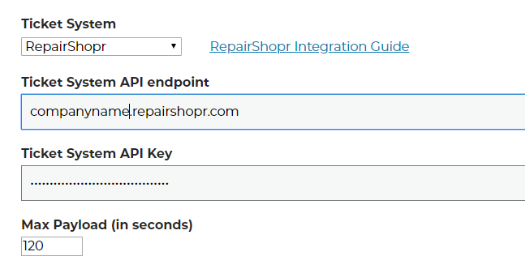

Repairshopr Integration
========================
Setting up Helpdesk Buttons with Repairshopr is easy. 

To start you will need to set up a contact that uses the email address of “unregistered@helpdeskbuttons.com”  for the purposes of catching any unregistered users.  You can name the account whatever you want. in our system it’s “Mystery Human”

You will need your Repairshopr API key.

You can go get your API key on your profile page.

.. image:: images/rs-image-1.png

Once you have the API key, you will need to adjust your settings in the Helpdeskbutton website.

http://www.helpdeskbuttons.com/account/settings.php

And scroll down to the backend information part. 

Select ‘RepairShopr’ for the Ticket System 

Enter the register URL that you use. 

The Ticket System API endpoint is  

https://example.repairshopr.com/api/v1/customers?api_key=

Or if you use a customer domain it would be

https://example.com/api/v1/customers?api_key=

Under Ticket System API Key, enter the API key that you used earlier. Once you have entered that information, click Update and it will save the information.