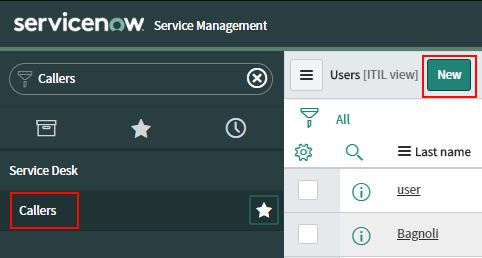
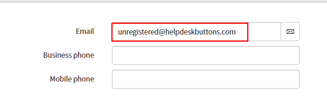
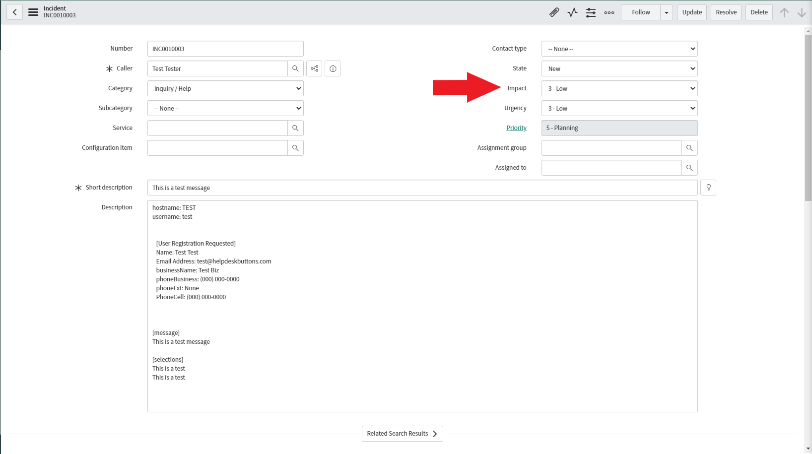
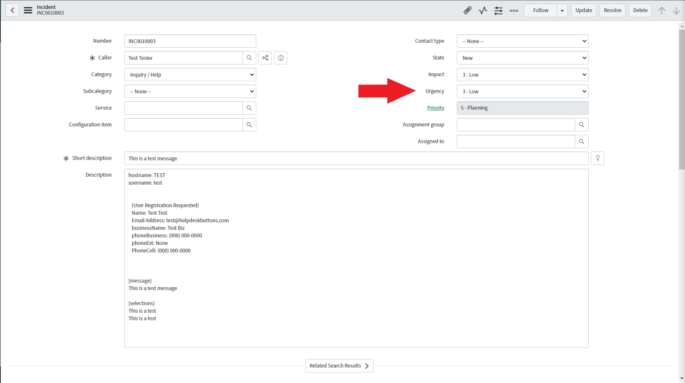
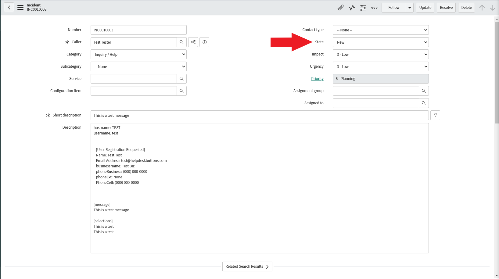
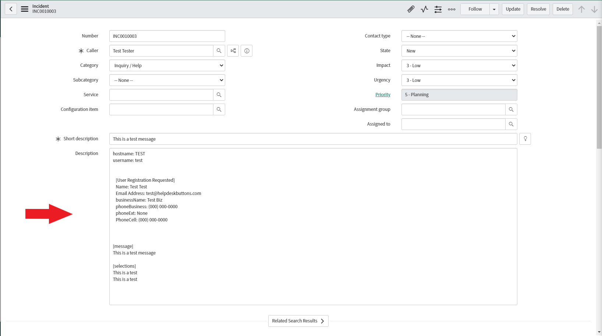
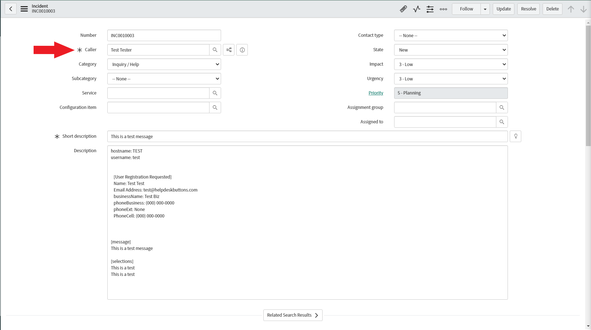
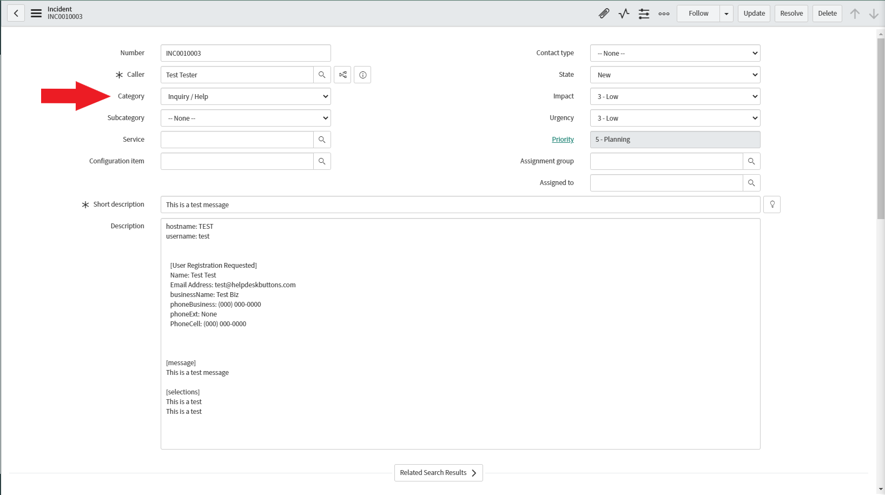
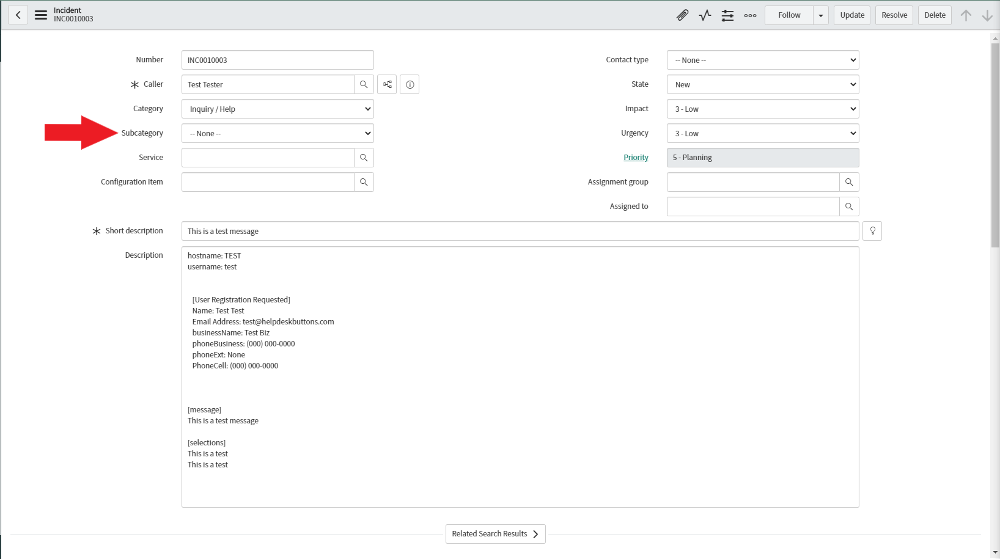

ServiceNow Documentation
============================

This guide will show you how to set up your new Helpdesk Buttons with Service Now in as few as 15 minutes.

Integration
--------------------------

ServiceNow integration requires two main parts:

`1) set up an unregistered user as a catchall account as a contact in your PSA <https://docs.tier2tickets.com/content/integration/servicenow/#unregistered-user>`_

`2) configure helpdeskbuttons account. <https://docs.tier2tickets.com/content/integration/servicenow/#helpdeskbuttons-com-settings>`_

Video Walkthrough
^^^^^^^^^^^^^^^^^^^^^^^^^^^^^^^^^^

.. raw:: html

    

        <iframe width="560" height="315" src="https://www.youtube.com/embed/TgebXvaQgjs" frameborder="0" allow="accelerometer; autoplay; clipboard-write; encrypted-media; gyroscope; picture-in-picture" allowfullscreen></iframe>
    

1) Unregistered User
^^^^^^^^^^^^^^^^^^^^^^^^^^^^^^^^^^

To start you will need to set up a contact that uses the email address of “unregistered@helpdeskbuttons.com” for the purposes of catching any unregistered users.

Navigate to Callers and Click New

The only really important part is the email address. Feel free to name it anything you feel comfortable with.

2) Helpdeskbuttons.com Settings
^^^^^^^^^^^^^^^^^^^^^^^^^^^^^^^^^^
On the Settings page of Helpdesk Buttons, put in the endpoint and a username:password combo as the API Key.

Click update and the Integration Test button. 

Let us know how to get in touch with your development team for feature requests and additional customizations! We are happy to get you set up with customized software.

Anti-Virus and AntiMalware
----------------------------------------------------------

It is not always necessary, but we recommend whitelisting the tier2tickets installation folder (C:\\Program Files(x86)\\tier2tickets). We regularly submit our code through VirusTotal to make sure we are not getting flagged, but almost all AV/M interactions cause some sort of failure. `Webroot <https://docs.tier2tickets.com/content/general/firewall/#webroot>`_ in particular can cause issues with screenshots.

Dispatcher Rules
----------------------------------------------------------

This is the list of variables that can be accessed when using the :ref:`Dispatcher Rules <content/automations/dispatcher:Dispatcher Rules>`. 

+-------------------------------------------------------------------------+----------------------------------------------------+
| Read/Write                                                              | Read Only                                          |
+=========================================================================+====================================================+
| :ref:`impact<content/integration/servicenow:*impact & urgency*>`        | :ref:`content/automations/dispatcher:*selections*` |
+-------------------------------------------------------------------------+----------------------------------------------------+
| :ref:`urgency<content/integration/servicenow:*impact & urgency*>`       | :ref:`content/automations/dispatcher:*hostname*`   |
+-------------------------------------------------------------------------+----------------------------------------------------+
| :ref:`content/integration/servicenow:*incidentState*`                   | :ref:`content/automations/dispatcher:*name*`       |
+-------------------------------------------------------------------------+----------------------------------------------------+
| :ref:`content/integration/servicenow:*priv_append*`                     | :ref:`content/automations/dispatcher:*email*`      |
+-------------------------------------------------------------------------+----------------------------------------------------+
| :ref:`content/automations/dispatcher:*msg*`                             | :ref:`content/automations/dispatcher:*ip*`         |
+-------------------------------------------------------------------------+----------------------------------------------------+
| :ref:`content/automations/dispatcher:*subject*`                         | :ref:`content/automations/dispatcher:*mac*`        | 
+-------------------------------------------------------------------------+----------------------------------------------------+
| :ref:`content/automations/dispatcher:*append*`                          | :ref:`content/integration/servicenow:*callerID*`   | 
+-------------------------------------------------------------------------+----------------------------------------------------+

Field Definitions
^^^^^^^^^^^^^^^^^

*impact & urgency*
""""""""""""""""""""""

	**Set priority via the SLA priority matrix:**

Impact:

|

Urgency:

|
|

*incidentState*
"""""""""""""""

	**Refers to the ticket status (New, In Progress, etc):**

|
|

*priv_append*
"""""""""""""

	**Allows you to append information to the internal ticket note:**

|
|

*callerID*
""""""""""

	**Refers to the client's name:**

|
|

*issue*
"""""""

	**The primary ticket issue:**

|
|

*subissue*
""""""""""

	**The secondary ticket issue:**

|
|

*other*
"""""""

There are additional variables which are common to all integrations. Those are documented :ref:`here <content/automations/dispatcher:Universally Available Variables>`

Webhook Walkthrough
----------------------------------------------------------

