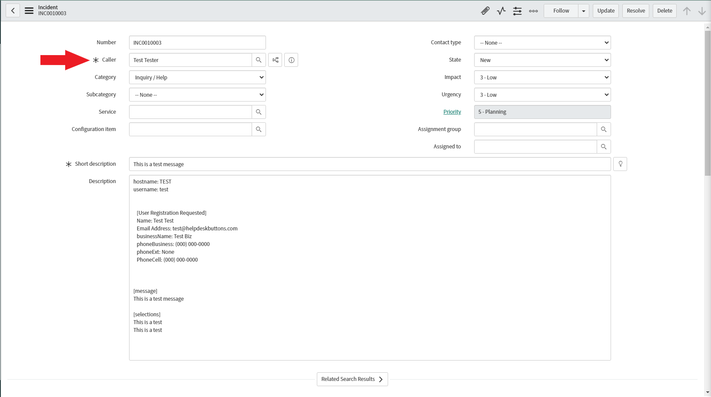

ServiceNow Integration
========================

Unregistered User
------------------

To start you will need to set up a contact that uses the email address of “unregistered@helpdeskbuttons.com” for the purposes of catching any unregistered users.

Navigate to Callers and Click New

.. image:: images/sn-image-1.png

The only really important part is the email address. Feel free to name it anything you feel comfortable with.

.. image:: images/sn-image-2.png

Helpdeskbuttons.com Settings
-------------------------------

On the Settings page of helpdeskbuttons, put in the endpoint and a username:password combo as the API Key.

Click update and the Integration Test button. 

Let us know how to get in touch with your development team for feature requests and additional customizations! We are happy to get you set up with customized software.

Anti-Virus and AntiMalware
-----------------------------
It is not always necessary, but we recommend whitelisting the helpdeskbuttons installation folder (C:\\Program Files(x86)\\Helpdesk Button). We regularly submit our code through VirusTotal to make sure we are not getting flagged, but almost all AV/M interactions cause some sort of failure. `Webroot <https://docs.tier2tickets.com/content/general/firewall/#webroot>`_ in particular can cause issues with screenshots.

Advanced Integration Options
------------------------------

This is the list of variables that can be accessed when using the :ref:`Custom Rules <content/integration/advanced:Custom Rules>`. 

+-------------------+---------------+
| Read/Write        | Read Only     |
+===================+===============+
| impact            | selections    |
+-------------------+---------------+
| urgency           | hostname      |
+-------------------+---------------+
| incidentState     | name          |
+-------------------+---------------+
| priv_append       | email         |
+-------------------+---------------+
| message           | ip            |
+-------------------+---------------+
| subject           | mac           | 
+-------------------+---------------+
| append            | callerID      | 
+-------------------+---------------+

Field Definitions
^^^^^^^^^^^^^^^^^

*impact* and *urgency*
""""""""""""""""""""""

set priority via the SLA priority matrix

Impact:

.. image:: images/sn-impact.png
   :target: https://docs.tier2tickets.com/_images/sn-impact.png

Urgency:

.. image:: images/sn-urgency.png
   :target: https://docs.tier2tickets.com/_images/sn-urgency.png

*incidentState*
"""""""""""""""

refers to the ticket status (New, In Progress, etc)

.. image:: images/sn-incidentState.png
   :target: https://docs.tier2tickets.com/_images/sn-incidentState.png

*priv_append*
"""""""""""""

allows you to append information to the internal ticket note

.. image:: images/sn-priv_append.png
   :target: https://docs.tier2tickets.com/_images/sn-priv_append.png

*contactName*
"""""""""""""

refers to the client's name

*issue*
"""""""

refers to the primary ticket issue

.. image:: images/sn-issue.png
   :target: https://docs.tier2tickets.com/_images/sn-issue.png

*subissue*
""""""""""

refers to the secondary ticket issue

.. image:: images/sn-subissue.png
   :target: https://docs.tier2tickets.com/_images/sn-subissue.png

*other*
"""""""

There are additional variables which are common to all integrations. Those are documented :ref:`here <content/integration/advanced:Universally Available Variables>`