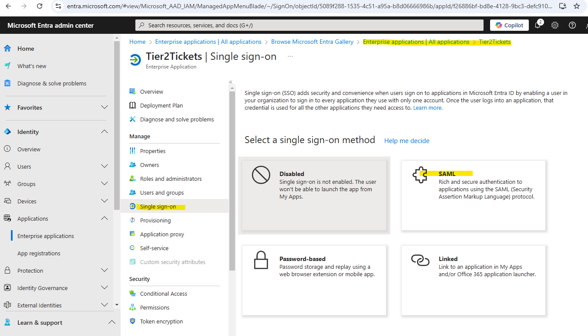
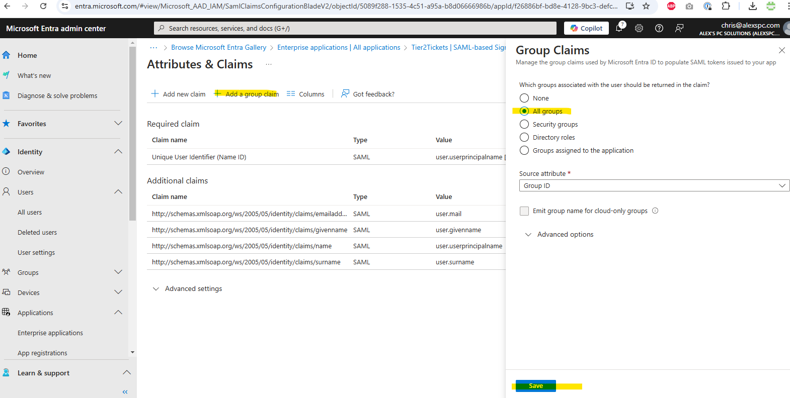
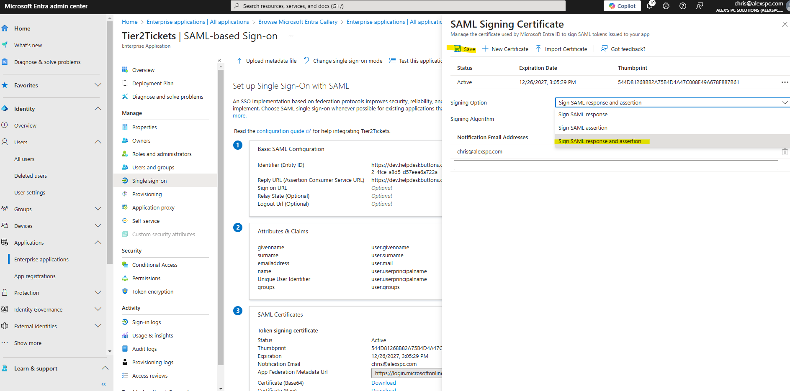

SSO Documentation
======================================

This guide will explain and demonstrate how to set up SSO (using Microsofts SAML implementation)

*This is an optional step, but once it is enabled all subaccounts will be expected to use SSO for logging in. The superuser account will always have the option of using the standard username/password authentication method just in case there is some issue with the identity provider.* 

Introduction to Permissions, Groups, and Claims 
----------------------------------------------------

Let's define some terms and then show some examples:

Groups: The Foundation of Permissions 
^^^^^^^^^^^^^^^^^^^^^^^^^^^^^^^^^^^^^^^^

Groups are used to assign permissions to users and they are defined and set on the identity provider side. Each group represents a set of permissions, and a user can belong to multiple groups depending on their role. 

Some groups can stack, meaning users in multiple groups inherit permissions from all the groups they belong to. 

This also means groups can stand alone, when users only need the permissions of that specific group. 

 

Claims: The Connection Between Groups and Permissions 
^^^^^^^^^^^^^^^^^^^^^^^^^^^^^^^^^^^^^^^^^^^^^^^^^^^^^^^^^^

Claims are the mechanism Microsoft SSO uses to communicate your group-based permissions to apps. Each claim represents a specific permission linked to a specific group. 

This you will create a claim for each permission as defined by the system you are logging into and link it to the group manually. The claim will link the permissions defined by our system to your groups. These mappings can be changed at anytime and it does not require resetting up anything on our side.
 

Example Scenario: Groups and Permissions 
^^^^^^^^^^^^^^^^^^^^^^^^^^^^^^^^^^^^^^^^^^^^^^

You can set up your permission structure however you chose, but most best practices use a system where permissions vary by role. Many users would be in multiple groups so there is no need to duplicate permissions.

Here’s an example of how such a system could work using permissions defined by our system: 

Standard User Group: 
Nearly everyone in the system belongs to this group, as these are basic permissions. 

Technicians Group: 
Technicians get more advanced capabilities. 

Admins Group: 
Admins have access to the most restricted areas of the system. 

Billing Only Group Permissions: 
The permissions you would want to create for this system might look like this:

- Standard:
	- ticket-reports
	- ticket-dashboard

- Technicians:  
	- software-core
	- software-adv
	- remote-access
	- device-management
	- automations

- Admins:     
	- administration

- Billing:    
	- billing

A technician in this structure is an extension of the standard user so they are in both the standard and technician groups thereby getting all those permissions.
Similarly admins are an extension of technicians so they are in standard user, technician, billing, and admin groups getting all permissions.
The billing group would be in either only the billing group or the billing and standard group so they dont get the administration or technician permissions.

You dont necessarially need to have this permission mapping on paper before hand, but you will want to know which permissions should go to which groups based on how users are grouped in your identity provider.

Permission List
^^^^^^^^^^^^^^^^^^^^^^

Here is the full list of permissions given to subaccounts in alphabetical order:

- administration :  Administration pages other than billing 
- automations :  Most Automations (Tier2Assists, Dispatcher Rules, Tier2Forms)
- billing :  Billing Pages
- device-management	:  Device Management page and attached functions
- software-adv		:  Integration Settings and Tier2Script Automations
- software-core		:  Download and Deploy, Branding, User Interface settings
- ticket-dashboard	:  Ticket Dashboard
- ticket-reports :  Reports and Instant Replay
- remote-access : Remote Access pages (Loginwith.me, Command Line tools, Remote Diganostics)

Setting up your SSO 
----------------------------------------------------

0) Add info from our SAML page to your dns records (in this case its cloudflare) 
^^^^^^^^^^^^^^^^^^^^^^^^^^^^^^^^^^^^^^^^^^^^^^^^^^^^^^^^^^^^^^^^^^^^^^^^^^^^^^^^^^^^^^^^^^^^^^^^^^^^^^^^^^^^^^^^^^^^^^^^
This is not technically part of the process, but it helps by linking our service to yours so it can all be managed on one side:
JIT (Just-In-Time) Provisioning makes the account management easier, so that you don't have to create the account on both Microsoft and HDB, it can just be done entirely in Microsoft

Once that is saved you can test it is working by doing an nslookup on _tier2tech.yourdomain in a command prompt

.. image:: images/sso/Picture2.png
    :target: /_images/Picture2.png
 
1) Log into your Identity Provider and create and Application (Microsoft in this case):
^^^^^^^^^^^^^^^^^^^^^^^^^^^^^^^^^^^^^^^^^^^^^^^^^^^^^^^^^^^^^^^^^^^^^^^^^^^^^^^^^^^^^^^^^^^^^^^^^^^^^^^^^^^^^^^^^^^^^^^^

 
2) Select your application, single sign on and select SAML as your method.
^^^^^^^^^^^^^^^^^^^^^^^^^^^^^^^^^^^^^^^^^^^^^^^^^^^^^^^^^^^^^^^^^^^^^^^^^^^^^^^^^^^^^^^^^^^^^^^^^^^^^^^^^^^^^^^^^^^^^^^^

3) Download the metadata file from our SAML page and upload it into your SSO application.
^^^^^^^^^^^^^^^^^^^^^^^^^^^^^^^^^^^^^^^^^^^^^^^^^^^^^^^^^^^^^^^^^^^^^^^^^^^^^^^^^^^^^^^^^^^^^^^^^^^^^^^^^^^^^^^^^^^^^^^^

4) Set up the Configuration. 
^^^^^^^^^^^^^^^^^^^^^^^^^^^^^^^^^^^^^^^^^^^^^^^^^^^^^^^^^^^^^^^^^^^^^^^^^^^^^^^^

a) Edit the Attributes and Claims section and add a new group claim.
""""""""""""""""""""""""""""""""""""""""""""""""""""""""""""""""""""" 

5) Find/Create the groups you want.
^^^^^^^^^^^^^^^^^^^^^^^^^^^^^^^^^^^^^^^^ 

a)	For each group you will need to add the permissions that apply to each group. For example we will add the ticket-report permission to the all user group. Copy the objectId on the group you want to add a permission to. 
""""""""""""""""""""""""""""""""""""""""""""""""""""""""""""""""""""""""""""""""""""""""""""""""""""""""""""""""""""""""""""""""""""""""""""""""""""""""""""""""""""""""""""""""""""""""""""""""""""""""""""""""""""""""""""""

b)	Create a claim
"""""""""""""""""""

 
c)	Make the name of the claim perm:permission and paste the ObjectId from the group to link them. 
"""""""""""""""""""""""""""""""""""""""""""""""""""""""""""""""""""""""""""""""""""""""""""""""""""

Each perm:permission mapping should be added one at a time to the group to which they apply 

d)	Repeat until you have all the permissions matched to the groups you need. 
""""""""""""""""""""""""""""""""""""""""""""""""""""""""""""""""""""""""""""""

6) SAML Signing Certificate
^^^^^^^^^^^^^^^^^^^^^^^^^^^^^^^^^^^^^^^^

Set the cert to sign SAML response and assertion
""""""""""""""""""""""""""""""""""""""""""""""""""""""""""""""""""""""""""""""""""
 

 
7) SAML Properties
^^^^^^^^^^^^^^^^^^^^^^^^^^^^^^^^^^^^^^^^

Navigate to Enterprise Applications> Tier2Tickets> Properties. Set assignment required to "No"
""""""""""""""""""""""""""""""""""""""""""""""""""""""""""""""""""""""""""""""""""""""""""""""

 
8) Upload the Federation XML file to complete setup (Enterprise applications> Tier2Tickets> Single Sign-on). 
^^^^^^^^^^^^^^^^^^^^^^^^^^^^^^^^^^^^^^^^^^^^^^^^^^^^^^^^^^^^^^^^^^^^^^^^^^^^^^^^^^^^^^^^^^^^^^^^^^^^^^^^^^^^^^^^^

a) Download from the Identity Provider
"""""""""""""""""""""""""""""""""""""""""""""""

b) Upload to your account at the bottom of the Administration > SAML page
"""""""""""""""""""""""""""""""""""""""""""""""""""""""""""""""""""""""""""

Your SSO should be functional once the upload is complete. You can test it by using a login connected to the groups for which you set permissions. If you created new groups you can create a new user and assign the groups you want to test with to that user account in your identity provider. Just make sure you log out from your Tier2Tickets login before you test it out!

*Remember: Once SAML SSO is enabled, all subaccounts will be expected to use SSO for logging in. The superuser account will always have the option of using the standard username/password authentication method just in case there is some issue with the identity provider.*   