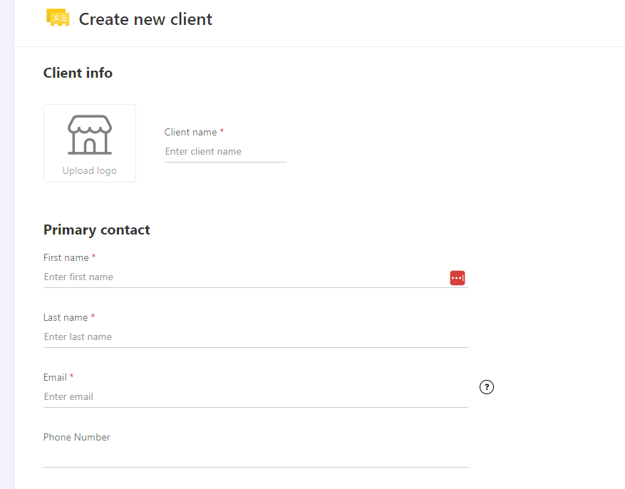
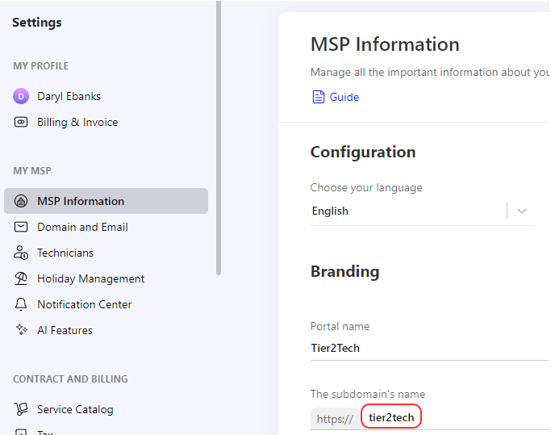
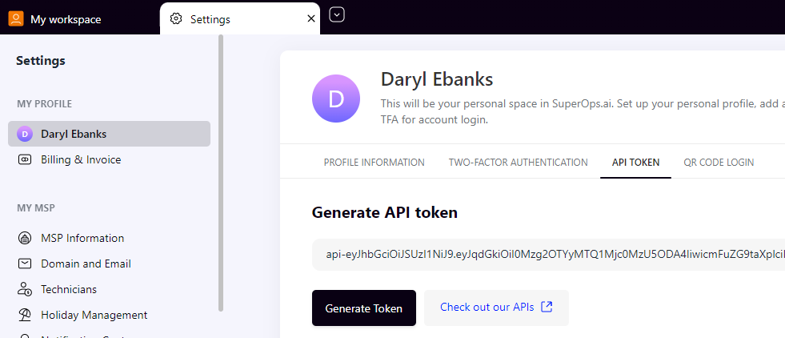
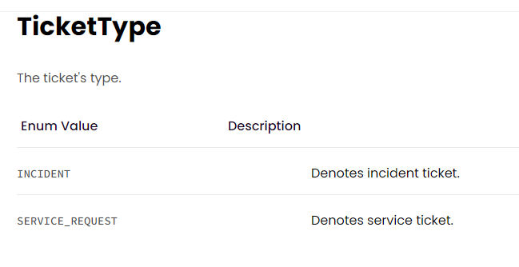
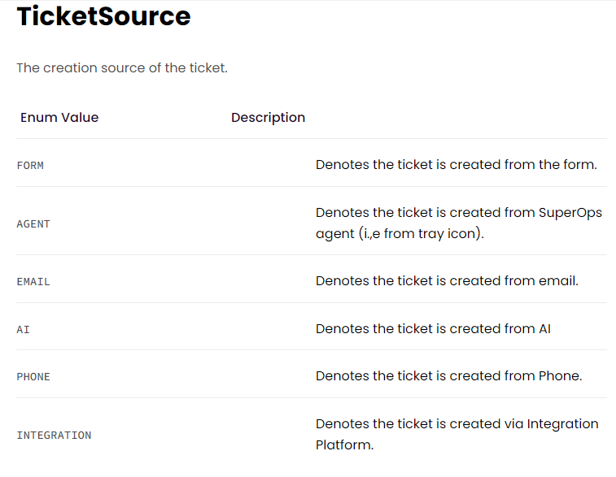
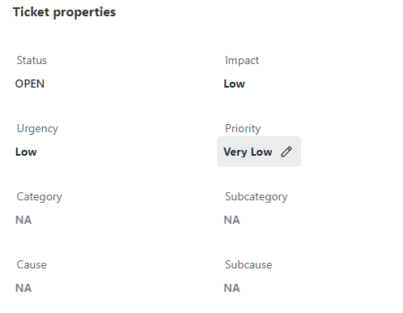

SuperOps Documentation
======================================

This guide will show you how to set up your new Helpdesk Buttons with SuperOps in as few as 15 minutes.

Integration
--------------------------

SuperOps integration requires three main parts:

`1) set up an unregistered user as a catchall account as a contact in your PSA <https://docs.tier2tickets.com/content/integration/superops/#unregistered-user>`_

`2) set up the API integration. <https://docs.tier2tickets.com/content/integration/superops/#get-an-api-key>`_

`3) configure helpdeskbuttons account. <https://docs.tier2tickets.com/content/integration/su/#helpdeskbuttons-com-settings>`_

Video Walkthrough
^^^^^^^^^^^^^^^^^^^^^^^^^^^^^^^^^^

.. raw:: html

    <!--

        <iframe width="560" height="315" src="https://www.youtube.com/embed/n7gDwhauMbY" frameborder="0" allow="accelerometer; autoplay; encrypted-media; gyroscope; picture-in-picture" allowfullscreen></iframe>
    
-->

.. image:: images/coming_soon.png

1) Unregistered User
^^^^^^^^^^^^^^^^^^^^^^^^^^^^^^^^^^

You will start off by logging into your SuperOps instance. The first step is to create a dummy company to catch tickets from unregistered users. Feel free to use a catch all that you already have can submit ticket or your company; The important point is that the company can submit tickets and its clear that this company is submitting tickets on behalf of another. You might name the company “unregistered users” or something to that effect for clarity.

2) Get an API Key
^^^^^^^^^^^^^^^^^^^^^^^^^^^^^^^^^^

Next step is to create an API key.

First, you need your company name. This appears on the MSP Information screen.

Second, you need to generate an apikey. Navigate to your profile, API Token then click Generate Token.
The token is quite long so you will need to click the copy icon. You can always come back here to copy your key or generate a new one. 

3) Helpdeskbuttons.com Settings
^^^^^^^^^^^^^^^^^^^^^^^^^^^^^^^^^^

Log into your Helpdeskbuttons.com account. Select settings and then Integration Settings

Select ‘SuperOps’ for the ticket system

For the Ticket System API endpoint you would use most likely use

api.superops.ai/msp

The Ticket System API Key format is as follows

Companyid:apikey

For example

Comp_a:api-asdf38judj234...

Comp_a is the company ID we got from the MSP information

asdf38judj234... is the example apikey generated on the Superops API page

Make sure that there is a : between the company ID and and apikey.

Once you have entered the correct information on the Helpdesk Buttons page, make to click Update so it saves the changes.

Test by submitting a ticket using the button.

Integration Defaults
"""""""""""""""""""""""""""""""""""""""""""

For most integrations you can leave many of these blank and the PSA/Ticket System will fill in some defaults.

For Superops, ticketType and source must be filled in and they must be one of these values (CaSe SeNsItIvE):

Anti-Virus and AntiMalware
----------------------------------------------------
It is not always necessary, but we recommend whitelisting the tier2tickets installation folder (C:\\Program Files(x86)\\tier2tickets). We regularly submit our code through VirusTotal to make sure we are not getting flagged, but almost all AV/M interactions cause some sort of failure. `Webroot <https://docs.tier2tickets.com/content/general/firewall/#webroot>`_ in particular can cause issues with screenshots.

Dispatcher Rules
--------------------------

This is the list of variables that can be accessed when using the :ref:`Dispatcher Rules <content/automations/dispatcher:Dispatcher Rules>`. 

+----------------------------------------------------------------------+----------------------------------------------------+
| Read/Write                                                           |  Read Only                                         |
+======================================================================+====================================================+
| priority                                                             |  selections                                        |
+----------------------------------------------------------------------+----------------------------------------------------+
| status                                                               |  name                                              |
+----------------------------------------------------------------------+----------------------------------------------------+
| subject                                                              |  email                                             |
+----------------------------------------------------------------------+----------------------------------------------------+
| ticketType                                                           |  ip                                                |
+----------------------------------------------------------------------+----------------------------------------------------+
| category                                                             |  mac                                               |
+----------------------------------------------------------------------+----------------------------------------------------+
| subcategory                                                          |  hostname                                          |
+----------------------------------------------------------------------+----------------------------------------------------+
| cause                                                                |                                                    |
+----------------------------------------------------------------------+----------------------------------------------------+
| subcause                                                             |                                                    |
+----------------------------------------------------------------------+----------------------------------------------------+
| msg                                                                  |                                                    |
+----------------------------------------------------------------------+----------------------------------------------------+
| source                                                               |                                                    |
+----------------------------------------------------------------------+----------------------------------------------------+
| impact and urgency                                                   |                                                    |
+----------------------------------------------------------------------+----------------------------------------------------+
| priv_append                                                          |                                                    |
+----------------------------------------------------------------------+----------------------------------------------------+

Field Definitions
^^^^^^^^^^^^^^^^^
Most of the fields are visible on the ticket directly:

*priv_append*
"""""""""""""

	**Allows you to append information to the internal ticket note:**

*other*
"""""""

There are additional variables which are common to all integrations. Those are documented :ref:`here <content/automations/dispatcher:Universally Available Variables>`