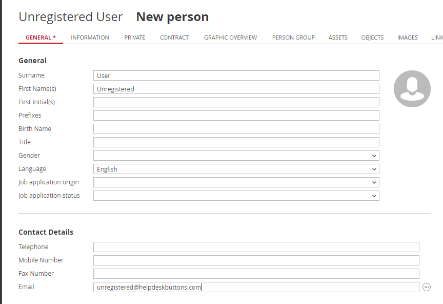
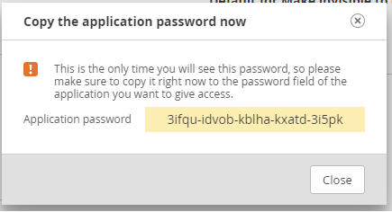

Topdesk Documentation
======================================

This guide will show you how to set up your new Helpdesk Buttons with Topdesk in as few as 15 minutes.

Integration
--------------------------

Topdesk integration requires three main parts:

`1) set up an unregistered user as a catchall account as a contact in your PSA <https://docs.tier2tickets.com/content/integration/topdesk/#unregistered-user>`_

`2) set up the API integration. <https://docs.tier2tickets.com/content/integration/topdesk/#get-an-api-key>`_

`3) configure helpdeskbuttons account. <https://docs.tier2tickets.com/content/integration/topdesk/#helpdeskbuttons-com-settings>`_

Video Walkthrough
^^^^^^^^^^^^^^^^^^^^^^^^^^^^^^^^^^

.. raw:: html

    <!--

        <iframe width="560" height="315" src="https://www.youtube.com/embed/ip2IhU8EqPQ" frameborder="0" allow="accelerometer; autoplay; encrypted-media; gyroscope; picture-in-picture" allowfullscreen></iframe>
    
-->

.. image:: images/coming_soon.png

1) Unregistered User
^^^^^^^^^^^^^^^^^^^^^^^^^^^^^^^^^^

We will want to create a catchall contact so we will be able to create tickets even if your users mistype thier email address. One way to do this is via the caller card option in the Main Menu

Once on this page click the bubble beside the caller selection field and select New Person.

The next window can be filled out however you like, but the email address of this user needs to be *unregistered@helpdeskbuttons.com*
    

2) Get an API Key
^^^^^^^^^^^^^^^^^^^^^^^^^^^^^^^^^^
    
This step requires that we create an API Key for your account. To do this click on the top left corner icon and select My Settings. 

At the bottom of the page there should be a section that shows information about the API keys connected to your account. Click Add to create a new key.

The next window allows you to name your key and requires you to set an expiration date for this key. Once you do so the key will be shown on the screen. Make sure to copy this down for the final step.

3) Helpdeskbuttons.com Settings
^^^^^^^^^^^^^^^^^^^^^^^^^^^^^^^^^^
Enter your Ticket System API endpoint as shown (do not add add https:// or the path after the url)

eg. europe-demo-24.topdesk.net

The api key will be of this form:

account:generated_application_key

Once you have entered the correct information on the Helpdesk Buttons page, make to click Update so it saves the changes.

Test by submitting a ticket using the button.

Integration Defaults
^^^^^^^^^^^^^^^^^^^^^^^^^^^^^^^^^^

You can customize your integration by setting some defaults for the ticket fields.

Anti-Virus and AntiMalware
----------------------------------------------------
It is not always necessary, but we recommend whitelisting the tier2tickets installation folder (C:\\Program Files(x86)\\tier2tickets). We regularly submit our code through VirusTotal to make sure we are not getting flagged, but almost all AV/M interactions cause some sort of failure. `Webroot <https://docs.tier2tickets.com/content/general/firewall/#webroot>`_ in particular can cause issues with screenshots.

Dispatcher Rules
--------------------------

This is the list of variables that can be accessed when using the :ref:`Dispatcher Rules <content/automations/dispatcher:Dispatcher Rules>`. 

+---------------------------------------------------------------------------+----------------------------------------------------+
| Read/Write                                                                |  Read Only                                         |
+===========================================================================+====================================================+
| :ref:`content/integration/topdesk:*priority*`                             | :ref:`content/automations/dispatcher:*selections*` |
+---------------------------------------------------------------------------+----------------------------------------------------+
| :ref:`content/integration/topdesk:*processingStatus*`                     | :ref:`content/automations/dispatcher:*name*`       |
+---------------------------------------------------------------------------+----------------------------------------------------+
| :ref:`content/integration/topdesk:*entryType*`                            | :ref:`content/automations/dispatcher:*email*`      |
+---------------------------------------------------------------------------+----------------------------------------------------+
| :ref:`content/integration/topdesk:*callType*`                             | :ref:`content/automations/dispatcher:*ip*`         |
+---------------------------------------------------------------------------+----------------------------------------------------+
| :ref:`content/automations/dispatcher:*msg*`                               | :ref:`content/automations/dispatcher:*mac*`        |
+---------------------------------------------------------------------------+----------------------------------------------------+
| :ref:`content/integration/advanced:*subject*`                             | :ref:`content/automations/dispatcher:*hostname*`   | 
+---------------------------------------------------------------------------+----------------------------------------------------+
| :ref:`impact<content/integration/topdesk:*impact & urgency*>`             |                                                    | 
+---------------------------------------------------------------------------+----------------------------------------------------+
| :ref:`urgency<content/integration/topdesk:*impact & urgency*>`            |                                                    |
+---------------------------------------------------------------------------+----------------------------------------------------+
| :ref:`content/integration/topdesk:*operator*`                             |                                                    | 
+---------------------------------------------------------------------------+----------------------------------------------------+
| :ref:`content/integration/advanced:*append*`                              |                                                    | 
+---------------------------------------------------------------------------+----------------------------------------------------+
| :ref:`content/integration/topdesk:*callStatus*`                           |                                                    | 
+---------------------------------------------------------------------------+----------------------------------------------------+
| :ref:`category<content/integration/topdesk:*category & subcategory*>`     |                                                    | 
+---------------------------------------------------------------------------+----------------------------------------------------+
| :ref:`subcategory<content/integration/topdesk:*category & subcategory*>`  |                                                    | 
+---------------------------------------------------------------------------+----------------------------------------------------+

Field Definitions
^^^^^^^^^^^^^^^^^

*priority*
""""""""""

	**The ticket priority level (Urgent, Low, etc.):**

|
|

*impact & urgency*
""""""""""""""""""""

	**Can set priority via the SLA priority matrix:**

|
|

*processingStatus*
""""""""""""""""""""

	**Refers to the ticket status (New, In Progress, etc):**

|
|

*callStatus*
"""""""""""""""""""

	**If the call is first or second line**

|
|

*callType*
"""""""""""""""""""

	**The issue type (Service Request, Incident, Problem, Alert):**

|
|

*operator*
""""""""""""""""""""

	**Refers to the agent that will be assigned this ticket:**

|
|

*entryType*
"""""""""""""""""""""

	**The ticket source (Web Portal, Etc):**

|
|

*category & subcategory*
"""""""""""""""""""""""""""""""""

	**Classify tickets with more detailed categories:**

|
|

*priv_append*
"""""""""""""

	**Allows you to append information to the internal ticket note:**

|
|

*other*
"""""""""""""""""""

There are additional variables which are common to all integrations. Those are documented :ref:`here <content/automations/dispatcher:Universally Available Variables>`

Setting up a Callback (Webhook)
----------------------------------------------------

.. image:: images/coming_soon.png

