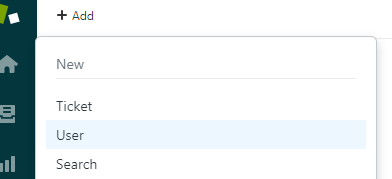
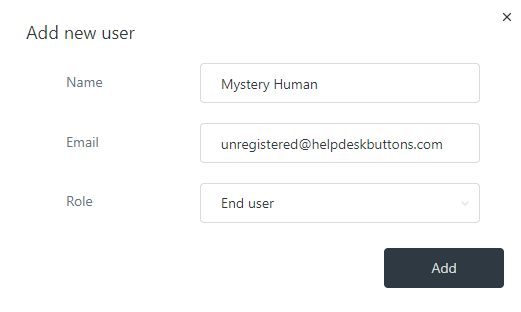
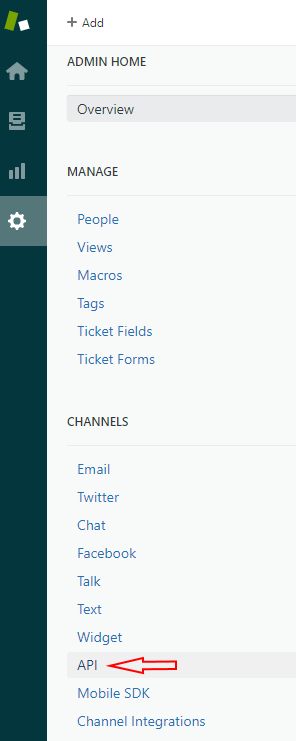
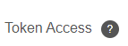
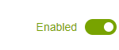

Zendesk Integration
========================

Unregistered User
------------------

To start you will need to set up a "Catch all" contact for users not aleady in your system.

Hover over Add and click User

The only really important part is the email address. It needs to be “unregistered@helpdeskbuttons.com” Feel free to name it anything you feel comfortable with.

Enable API Access and Create a new Key
---------------------------------------

You may need to enable API access into users by API token.

To do this click the Admin gear and click API under CHANNELS

You will want to enable this line.

Click the plus sign to add a new key. 

You can label it anything you want, but make sure to put that key somewhere safe, it only appears once. 

Helpdeskbuttons.com Settings
-------------------------------

Enter your Ticket System API endpoint as shown (do not add add https:// or the path after the url)

Yout API key is formatted as shown 

username:apikey

Click update and the Integration Test button. 

Let us know how to get in touch with your development team for feature requests and additional customizations! We are happy to get you set up with customized software.

Anti-Virus and AntiMalware
-----------------------------
It is not always necessary, but we recommend whitelisting the helpdeskbuttons installation folder (C:\\Program Files(x86)\\Helpdesk Button). We regularly submit our code through VirusTotal to make sure we are not getting flagged, but almost all AV/M interactions cause some sort of failure. `Webroot <https://docs.tier2tickets.com/content/general/firewall/#webroot>`_ in particular can cause issues with screenshots.

Advanced Integration Options
------------------------------

Custom Rules
^^^^^^^^^^^^^

This is the list of variables that can be accessed when using the :ref:`Custom Rules <content/integration/advanced:Custom Rules>`. 

+-------------------+---------------+
| Read/Write        | Read Only     |
+===================+===============+
| priority          | selections    |
+-------------------+---------------+
| type              | hostname      |
+-------------------+---------------+
| status            | name          |
+-------------------+---------------+
| priv_append       | email         |
+-------------------+---------------+
| message           | ip            |
+-------------------+---------------+
| subject           | mac           | 
+-------------------+---------------+
| append            |*input_cell*   | 
+-------------------+---------------+
|                   |*input_phone*  | 
+-------------------+---------------+
|                   |*input_company*| 
+-------------------+---------------+
|                   |*input_email*  | 
+-------------------+---------------+
|                   |*input_name*   | 
+-------------------+---------------+

Field Definitions
^^^^^^^^^^^^^^^^^

- *priority* refers to the ticket priority
- *status* refers to the ticket status (New, In Progress, etc)
- *type* refers to the issue type (Service Request, Incident, Problem, Alert)
- *message* refers to the message the client typed when making the ticket
- *subject* refers to the ticket title
- *append* refers to the information appended to the HDB report
- *priv_append* allows you to append information to the internal ticket note
- *selections* refers to the checkboxes/radio buttons the client chose when creating the ticket
- *name* refers to the client's name
- *email* refers to the client's email
- *ip* refers to the client's external ip address
- *mac* refers to the client's MAC address
- *hostname* refers to the client's hostname

The fields labeled input_* contain information typed by the user only in the event that they are not found in the PSA