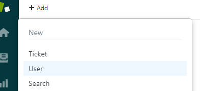
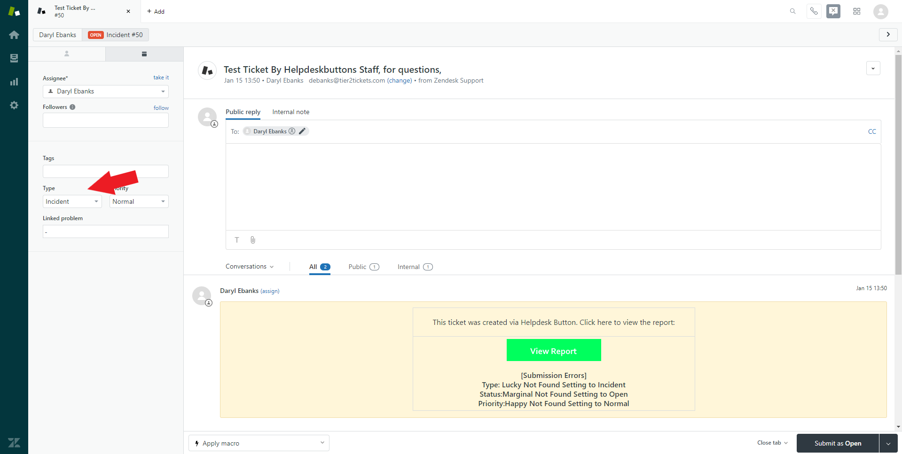
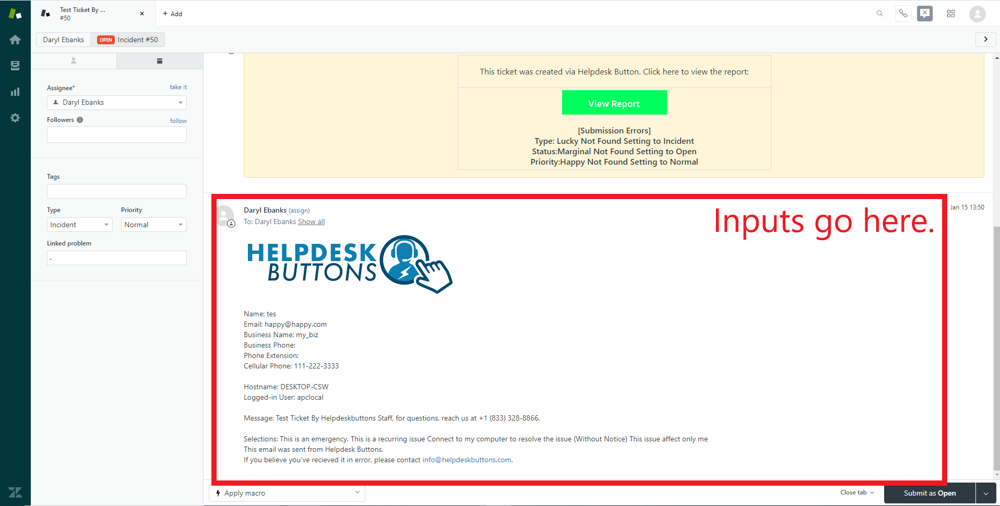

Zendesk Documentation
========================

This guide will show you how to set up your new Helpdesk Buttons with Zendesk in as few as 15 minutes.

Integration
--------------------------

Zendesk integration requires three main parts:

`1) set up an unregistered user as a catchall account as a contact in your PSA <https://docs.tier2tickets.com/content/integration/zendesk/#unregistered-user>`_

`2) set up the API integration. <https://docs.tier2tickets.com/content/integration/zendesk/#enable-api-access-and-create-a-new-key>`_

`3) configure helpdeskbuttons account. <https://docs.tier2tickets.com/content/integration/zendesk/#helpdeskbuttons-com-settings>`_

Video Walkthrough
^^^^^^^^^^^^^^^^^^^^^^^^^^^^^^^^^^

.. raw:: html

    

        <iframe width="560" height="315" src="https://www.youtube.com/embed/rRK2_tzN4y8" frameborder="0" allow="accelerometer; autoplay; clipboard-write; encrypted-media; gyroscope; picture-in-picture" allowfullscreen></iframe>
    

1) Unregistered User
^^^^^^^^^^^^^^^^^^^^^^^^^^^^^^^^^^

To start you will need to set up a "Catch all" contact for users not already in your system.

Hover over Add and click User

The only really important part is the email address. It needs to be “unregistered@helpdeskbuttons.com” Feel free to name it anything you feel comfortable with.

.. image:: images/zd-image4.png

2) Enable API Access and Create a new Key
^^^^^^^^^^^^^^^^^^^^^^^^^^^^^^^^^^^^^^^^^^^^^^^^^^^^^^^^^^^^^^^^^^^^

You may need to enable API access into users by API token.

To do this click the Admin gear and click API under CHANNELS

.. image:: images/zd-image1.png

You will want to enable this line.

.. image:: images/zd-image2.png
.. image:: images/zd-image5.png

Click the plus sign to add a new key. 

You can label it anything you want, but make sure to put that key somewhere safe, it only appears once. 

3) Helpdeskbuttons.com Settings
^^^^^^^^^^^^^^^^^^^^^^^^^^^^^^^^^^^^^^^^^^^^^^^^^^^^^^^^^^^^^^^^^^^^

Enter your Ticket System API endpoint as shown (do not add add https:// or the path after the url)

Your API key is formatted as shown 

username:apikey

Click update and the Integration Test button. 

Let us know how to get in touch with your development team for feature requests and additional customizations! We are happy to get you set up with customized software.

Anti-Virus and AntiMalware
----------------------------------------------------
It is not always necessary, but we recommend whitelisting the tier2tickets installation folder (C:\\Program Files(x86)\\tier2tickets). We regularly submit our code through VirusTotal to make sure we are not getting flagged, but almost all AV/M interactions cause some sort of failure. `Webroot <https://docs.tier2tickets.com/content/general/firewall/#webroot>`_ in particular can cause issues with screenshots.

Dispatcher Rules
--------------------------

This is the list of variables that can be accessed when using the :ref:`Dispatcher Rules <content/automations/dispatcher:*BETA* Dispatcher Rules>`. 

+--------------------------------------------------+-------------------------------------------------------------+
| Read/Write                                       | Read Only                                                   |
+==================================================+=============================================================+
| :ref:`content/integration/zendesk:*priority*`    | :ref:`content/automations/dispatcher:*selections*`          |
+--------------------------------------------------+-------------------------------------------------------------+
| :ref:`content/integration/zendesk:*type*`        | :ref:`content/automations/dispatcher:*hostname*`            |
+--------------------------------------------------+-------------------------------------------------------------+
| :ref:`content/integration/zendesk:*status*`      | :ref:`content/automations/dispatcher:*name*`                |
+--------------------------------------------------+-------------------------------------------------------------+
| :ref:`content/integration/zendesk:*priv_append*` | :ref:`content/automations/dispatcher:*email*`               |
+--------------------------------------------------+-------------------------------------------------------------+
| :ref:`content/automations/dispatcher:*msg*`      | :ref:`content/automations/dispatcher:*ip*`                  |
+--------------------------------------------------+-------------------------------------------------------------+
| :ref:`content/automations/dispatcher:*subject*`  | :ref:`content/automations/dispatcher:*mac*`                 | 
+--------------------------------------------------+-------------------------------------------------------------+
|                                                  | .. raw:: html                                               |
|                                                  |                                                             |
|                                                  |    <i>                                                      |
|                                                  |                                                             |
| :ref:`content/automations/dispatcher:*append*`   | :ref:`input_cell<content/integration/zendesk:*input_**>`    | 
+--------------------------------------------------+-------------------------------------------------------------+
|                                                  | .. raw:: html                                               |
|                                                  |                                                             |
|                                                  |    <i>                                                      |
|                                                  |                                                             |
|                                                  | :ref:`input_phone<content/integration/zendesk:*input_**>`   | 
+--------------------------------------------------+-------------------------------------------------------------+
|                                                  | .. raw:: html                                               |
|                                                  |                                                             |
|                                                  |    <i>                                                      |
|                                                  |                                                             |
|                                                  | :ref:`input_company<content/integration/zendesk:*input_**>` | 
+--------------------------------------------------+-------------------------------------------------------------+
|                                                  | .. raw:: html                                               |
|                                                  |                                                             |
|                                                  |    <i>                                                      |
|                                                  |                                                             |
|                                                  | :ref:`input_email<content/integration/zendesk:*input_**>`   | 
+--------------------------------------------------+-------------------------------------------------------------+
|                                                  | .. raw:: html                                               |
|                                                  |                                                             |
|                                                  |    <i>                                                      |
|                                                  |                                                             |
|                                                  | :ref:`input_name<content/integration/zendesk:*input_**>`    | 
+--------------------------------------------------+-------------------------------------------------------------+

Field Definitions
^^^^^^^^^^^^^^^^^

*priority*
""""""""""

	**The ticket priority level (Urgent, Low, etc.):**

.. image:: images/zd-priority.png
   :target: https://docs.tier2tickets.com/_images/zd-priority.png

|
|

*status*
""""""""

	**The ticket status (New, In Progress, etc):**

.. image:: images/zd-status.png
   :target: https://docs.tier2tickets.com/_images/zd-status.png

|
|

*type*
""""""

	**Refers to the issue type (Service Request, Incident, Problem, Alert):**

|
|

*priv_append*
"""""""""""""

	**Allows you to append information to the internal ticket note:**

.. image:: images/zd-priv_append.png
   :target: https://docs.tier2tickets.com/_images/zd-priv_append.png

|
|

*input_**
"""""""""

|
|

*other*
"""""""

There are additional variables which are common to all integrations. Those are documented :ref:`here <content/automations/dispatcher:Universally Available Variables>`

The fields labeled input_* contain information typed by the user only in the event that they are not found in the PSA

Webhook Walkthrough
----------------------------------------------------

This will take 2 steps:

1) Create a Target for the webhook:
^^^^^^^^^^^^^^^^^^^^^^^^^^^^^^^^^^^^^^^^^^^^^

Navigate to Admin -> Settings -> Extensions.

Click add target and then HTTP Target

- Name the Target
- URL should be listed on your `Integration Settings Page. <https://dev.helpdeskbuttons.com/backend.php>`_ under the Ticket Notification section.
- Select POST as the request type
- Set Content type to JSON

.. image:: images/zendesk-webhook3.png

2)Setup a Trigger in Zendesk: 
^^^^^^^^^^^^^^^^^^^^^^^^^^^^^^^^^^^^^^^^^^^^^

Zendesk is phasing out their webhook service this year so these instructions will no longer work. We will look into using the partners they have recommended in this article explaining the 
shift.  https://support.zendesk.com/hc/en-us/articles/360056379854-Removal-of-Zendesk-Connect

Navigate to Admin -> Triggers.

Click Add Trigger.

- Name the Trigger
- Set Ticket is Updated as the condition

- Select the Action Notify Target
- Select the webhook target created in the previous step
- Add this code into the JSON body of the action
	
.. code-block:: python

	{
		"actor":"{{current_user.name}}",
		"role":"{{current_user.role}}",
		"assigned_to":"{{ticket.assignee.name}}",
		"message":"{{ticket.verbatim_description}}",
		"ticket_id":"{{ticket.id}}",
		"name":"{{ticket.requester.name}}",
		"company":"{{ticket.organization.name}}",
		"status":"{{ticket.status}}",
		"subject":"{{ticket.title}}",
		"comment":"{{ticket.latest_public_comment_rich}}",
		"email":"{{ticket.requester.email}}",
		"phone":"{{ticket.requester.phone}}"
	}

